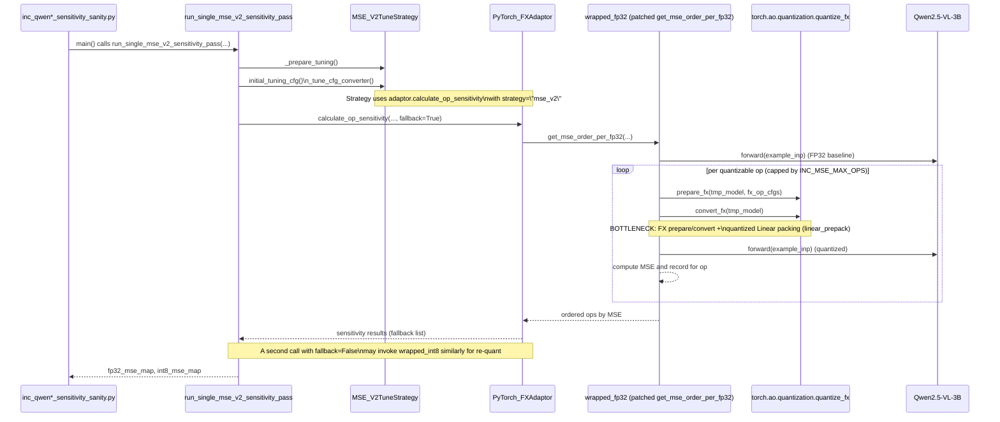

# Status: Open

Issue: INC MSE_V2 layer sensitivity is very slow on Qwen2.5‑VL‑3B (and likely other LLMs)
=========================================================================================

Context
-------

- Task: Use Intel Neural Compressor (INC) as a *sensitivity oracle* for Qwen2.5‑VL‑3B‑Instruct W8A8 (CPU, PyTorch FX backend), not as a production quantizer.
- Scripts and helpers:
  - `scripts/qwen/inc_qwen2_5_vl_3b_sensitivity.py`
  - `scripts/qwen/inc_qwen2_5_vl_3b_sensitivity_sanity.py`
  - `src/auto_quantize_model/inc_pytorch_mse_patching.py`
- Strategy: `mse_v2` via `MSE_V2TuneStrategy` and adaptor-level `calculate_op_sensitivity`.
- Environment:
  - CPU-only PTQ, model on `torch.float32`.
  - Tiny calibration set (3 COCO captions), small eval set (8 prompts).
  - Threads: `torch.set_num_threads(cpu_count - 2)` and `set_num_interop_threads(...)`.
  - Per-op scoring capped by `INC_MSE_MAX_OPS` env (wired to `--max-mse-ops`).


Symptoms / Impact
-----------------

- Even with **3 calibration samples** and **`--max-mse-ops 4`**, the sanity script:
  - `pixi run python -m cProfile -o tmp/profiles/inc_mse_v2_sanity.prof scripts/qwen/inc_qwen2_5_vl_3b_sensitivity_sanity.py --max-calib-samples 3 --max-mse-ops 4`
  - takes ~5–6 minutes on a high-end CPU.
- With slightly larger `max_mse_ops` (8), runs approach ~9–10 minutes.
- This is significantly slower than desired for interactive experimentation; we only get MSE for a handful of ops in that time.
- The bottleneck is clearly *inside* the MSE_V2 sensitivity flow, not in data loading or model initialization.


Reproduction
------------

1. Ensure the Qwen2.5‑VL‑3B snapshot is bootstrapped under:
   - `models/qwen2_5_vl_3b_instruct/checkpoints/Qwen2.5-VL-3B-Instruct`
2. Run the sanity sensitivity script with profiling:
   ```bash
   pixi run python -m cProfile \
     -o tmp/profiles/inc_mse_v2_sanity.prof \
     scripts/qwen/inc_qwen2_5_vl_3b_sensitivity_sanity.py \
       --max-calib-samples 3 \
       --max-mse-ops 4
   ```
3. Inspect the profile:
   ```bash
   pixi run python - << 'PY'
   import pstats
   from pstats import SortKey
   stats = pstats.Stats("tmp/profiles/inc_mse_v2_sanity.prof")
   stats.strip_dirs().sort_stats(SortKey.CUMULATIVE).print_stats(40)
   PY
   ```
4. Observe:
   - ~322 s total, with ~303 s under `run_single_mse_v2_sensitivity_pass(...)`.
   - Only 3–4 ops end up with MSE entries in the sanity JSON.


What the profiler shows
-----------------------

Top cumulative callers (abridged):

- `inc_qwen2_5_vl_3b_sensitivity_sanity.py:main` → `run_single_mse_v2_sensitivity_pass` (~302.7 s).
- `neural_compressor.adaptor.pytorch.PyTorch_FXAdaptor.calculate_op_sensitivity` → `get_fallback_order` → our `wrapped_fp32` (~302.7 s).

Inside `wrapped_fp32` (the patched `get_mse_order_per_fp32`), the heavy hitters are:

- FX conversion and backend lowering per op:
  - `torch.ao.quantization.quantize_fx.convert_fx` / `_convert_fx` / `convert`:
    - ~209 s cumulative.
  - `torch.ao.quantization.quantize_fx._lower_to_fbgemm.lower_to_fbgemm` and `_lower_to_native_backend`:
    - ~150 s cumulative.
  - `torch.ao.nn.quantized.modules.linear.Linear.from_reference` + `set_weight_bias`:
    - ~115 s cumulative in `torch._ops.quantized.linear_prepack`.
- Model forward passes during scoring:
  - `neural_compressor.adaptor.torch_utils.util.simple_inference`:
    - ~28 s cumulative for the few calibration passes needed.
  - Qwen2.5‑VL forward stack (`modeling_qwen2_5_vl.py`):
    - ~27–28 s cumulative.

In other words, **the dominant cost is repeatedly preparing and converting FX graphs, and (re)packing quantized Linear weights for each candidate op**, plus a smaller but still noticeable cost from full model forwards.


Pseudocode of the MSE_V2 sensitivity loop (with bottlenecks)
-----------------------------------------------------------

Below is a simplified view of what our forced sensitivity pass is doing, aligned with INC’s `MSE_V2TuneStrategy` and the patched `get_mse_order_per_fp32`. The **per-op loop** (hot path) is called out explicitly.

```python
def run_single_mse_v2_sensitivity_pass(model, conf, calib_loader, confidence_batches):
    # 1. Wrap HF model in INC Model + internal config
    nc_model = NcModel(model, conf=conf)
    strategy = MSE_V2TuneStrategy(model=nc_model, conf=internal_conf, q_dataloader=calib_loader, ...)
    strategy._prepare_tuning()  # builds adaptor, capability, tuning space

    # 2. Build initial tuning config
    _, _, op_tuning_cfg = strategy.initial_tuning_cfg()
    op_tuning_cfg["calib_sampling_size"] = len(calib_loader.dataset)
    base_tune_cfg = strategy._tune_cfg_converter(op_tuning_cfg)

    with capture_mse_v2_sensitivity() as (fp32_mse_map, int8_mse_map):
        # 3. Fallback phase: calls patched get_mse_order_per_fp32(...)
        strategy.adaptor.calculate_op_sensitivity(
            model=strategy.model,
            dataloader=calib_loader,
            tune_cfg=deepcopy(base_tune_cfg),
            output_op_names=None,
            confidence_batches=confidence_batches,
            fallback=True,
        )

        # 4. Re-quant phase: calls patched get_mse_order_per_int8(...)
        strategy.adaptor.calculate_op_sensitivity(
            model=strategy.model,
            dataloader=calib_loader,
            tune_cfg=deepcopy(base_tune_cfg),
            output_op_names=None,
            confidence_batches=confidence_batches,
            fallback=False,
            requantize_cfgs=deepcopy(base_tune_cfg["op"]),
        )
    return fp32_mse_map, int8_mse_map
```

The hot inner loop lives inside our `wrapped_fp32` (patched `get_mse_order_per_fp32`):

```python
def wrapped_fp32(adaptor, model, example_inp, tune_cfg):
    # run once to get FP32 reference outputs
    fp32_out = run_model_forward(model, example_inp)  # relatively cheap

    op_cfgs = _cfg_to_qconfig(tune_cfg, tune_cfg["approach"])

    # MAIN per-op loop (hot path):
    # iterate over each quantizable op and build a new
    # FX-quantized model variant just to score that op.
    for idx, (op_name, qconfig) in enumerate(op_cfgs.items()):
        if idx >= INC_MSE_MAX_OPS:  # our safety cap
            break
        if op_name == "bf16_ops_list":
            continue

        tmp_model = deepcopy(model)
        if not qconfig:
            continue

        # *** Bottleneck 1: per-op FX prepare/convert ***
        #   - builds FX graph
        #   - lowers to fbgemm backend
        #   - constructs quantized Linear modules
        #   - calls torch._ops.quantized.linear_prepack many times
        fx_op_cfgs = _cfgs_to_fx_cfgs(..., tune_cfg["approach"])
        if adaptor.sub_module_list is None:
            tmp_model = prepare_fx(tmp_model, fx_op_cfgs, example_inp)
        else:
            PyTorch_FXAdaptor.prepare_sub_graph(...)
        simple_inference(tmp_model, example_inp)        # calibration passes
        if adaptor.sub_module_list is None:
            tmp_model = convert_fx(tmp_model)          # heavy in profile
        else:
            PyTorch_FXAdaptor.convert_sub_graph(...)

        # *** Bottleneck 2: forward on quantized model ***
        q_out = run_model_forward(tmp_model, example_inp)

        # *** MSE computation itself is cheap ***
        mse = ((fp32_out - dequantize_if_needed(q_out)) ** 2).sum()
        record_mse_for_op(op_name, mse)

    return sorted_ops_by_mse()
```

Key points called out in the comments:

- *Bottleneck 1* is where we see most of the time in the profiler:
  - `prepare_fx` / `convert_fx` → `_lower_to_native_backend` → `Linear.from_reference` → `linear_prepack`.
- *Bottleneck 2* is the quantized forward passes (`simple_inference` and subsequent model calls), noticeable but smaller.
- The final MSE calculation is negligible compared to FX graph work and quantized Linear packing.


High-level sequence diagram (where the bottleneck lives)
--------------------------------------------------------

The following Mermaid UML sequence diagram shows the major components involved in the forced MSE_V2 sensitivity pass and highlights the bottleneck region.




Why this happens (root cause)
-----------------------------

- INC’s PyTorch FX MSE_V2 flow computes per-op sensitivity by:
  1. Building an op-wise qconfig map (`_cfg_to_qconfig`).
  2. For each candidate op:
     - Deep-copying the model.
     - Adjusting qconfig to quantize/skip that op.
     - Running `prepare_fx` + `convert_fx` (or equivalent subgraph paths).
     - Running calibration forward passes on the quantized graph.
     - Comparing outputs vs. the original FP32 graph to get MSE.
- Our monkeypatch (`wrapped_fp32` / `wrapped_int8`) follows this pattern but adds:
  - Extra book-keeping to record per-op MSE into maps.
  - An optional `INC_MSE_MAX_OPS` cap, but **no reuse** of prepared/quantized modules across ops.
- For large LLMs like Qwen2.5‑VL‑3B:
  - There are hundreds of quantizable ops.
  - Even when we cap `INC_MSE_MAX_OPS` to small values (4–8), each scored op still pays the full cost of:
    - FX graph preparation and conversion.
    - Quantized Linear construction and `linear_prepack`.
    - At least one calibration forward pass.
  - This dominates runtime and makes the sensitivity pass inherently expensive.


Current mitigations and workarounds
-----------------------------------

Already implemented in this repo:

- **Tiny calibration set**:
  - `QwenCalibConfig.max_samples = 3` and `--max-calib-samples` default to 3.
- **Threading constraints**:
  - `torch.set_num_threads(cpu_count - 2)` and `set_num_interop_threads(...)` to use most CPU cores but leave some headroom.
- **Op count cap for MSE**:
  - Environment variable `INC_MSE_MAX_OPS` is honored by both:
    - `wrapped_fp32` and `wrapped_int8` in `inc_pytorch_mse_patching.py`.
    - CLI flags `--max-mse-ops` in:
      - `scripts/qwen/inc_qwen2_5_vl_3b_sensitivity.py`
      - `scripts/qwen/inc_qwen2_5_vl_3b_sensitivity_sanity.py`
  - This lets us trade off coverage vs. runtime (e.g., 4–8 ops for quick spot checks).
- **Accuracy-agnostic flow**:
  - We bypass `quantization.fit` and call `calculate_op_sensitivity` directly via `run_single_mse_v2_sensitivity_pass`, so we at least *always* get a sensitivity report, even if tuning would normally “fail”.

These mitigations keep the runs from exploding in time, but they **do not solve the fundamental cost model** of FX-based per-op sensitivity on a 3B‑parameter model.


Impact on the overall plan
--------------------------

- INC MSE_V2 sensitivity is feasible but:
  - Only practical for **small subsets of ops** (e.g., 4–16 ops at a time) if we want runtimes in the “minutes” range.
  - Not practical to sweep all quantizable ops on Qwen2.5‑VL‑3B in one go on CPU.
- For the main plan (`plan-inc-op-sensitivity-qwen2_5-vl-3b-w8a8-spectrum`):
  - INC can serve as a **partial sensitivity oracle** (top‑K most/least sensitive ops), not a cheap full-layer sensitivity scanner.
  - Cross-framework comparisons (ModelOpt vs INC) need to account for this runtime and coverage limitation.


Next steps / Open questions
---------------------------

- Investigate whether parts of the INC MSE_V2 flow can be short-circuited for “sensitivity-only” runs:
  - Reuse a single prepared FX graph when scoring multiple ops instead of re-running `prepare_fx` + `convert_fx` for each op.
  - Avoid re-packing Linear weights when only a small subset of ops changes between trials.
- Explore coarse-grained sensitivity heuristics:
  - Score one representative op per block or per layer type, rather than all ops.
  - Combine INC MSE_V2 data with cheaper proxies (e.g., activation norms, ModelOpt’s own sensitivity metrics).
- Consider GPU-backed or lighter-weight sensitivity engines for future LLMs (e.g., ModelOpt’s internal sensitivity tools, HAWQ-style approximations) and reserve INC MSE_V2 for targeted case studies only.
