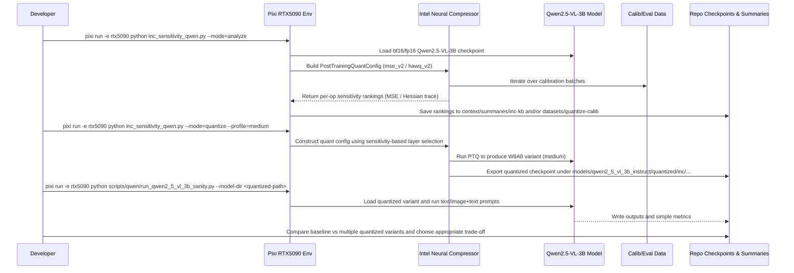

# Plan: INC Op Sensitivity and Quantization Spectrum for Qwen2.5-VL-3B-Instruct

## HEADER
- **Purpose**: Use Intel Neural Compressor to analyze per-layer sensitivity of Qwen2.5-VL-3B-Instruct and derive a family of quantized models ranging from fp16/bf16 baseline to increasingly aggressive W8A8 INT8 configurations with different numbers of quantized layers, primarily as a **comparison point** against the existing ModelOpt FP8 / W8A8 flows.
- **Status**: Canceled
- **Date**: 2025-12-08
- **Dependencies**:
  - `models/qwen2_5_vl_3b_instruct/` (baseline checkpoint bootstrap + quantized variants)
  - `scripts/qwen/run_qwen2_5_vl_3b_sanity.py`
  - `context/plans/cancel/plan-quantize-qwen2_5-vl-3b-w8a8-modelopt.md`
  - `extern/neural-compressor/` (INC source and docs)
  - `context/summaries/inc-kb/intro-inc-w8a8-quantization-fp8-int8.md`
  - `context/summaries/inc-kb/howto-inc-layer-sensitivity-for-mixed-precision.md`
- **Target**: Auto-quantize-model developers and AI assistants designing mixed-precision quantization schemes for Qwen2.5-VL-3B-Instruct and similar LLM/VLMs.

---

## 1. Purpose and Outcome

We want a repeatable workflow that uses Intel Neural Compressor (INC) to:
- Run **op/layer sensitivity analysis** on the Qwen2.5-VL-3B-Instruct model (or its language-model submodule), using MSE-based and/or Hessian-based strategies.
- Translate the sensitivity information into several **quantization configurations** that span a spectrum:
  - **Min quantization**: fp16/bf16 baseline (no int8), plus possibly a “light quantization” variant where only the least sensitive layers are W8A8.
  - **Intermediate**: multiple W8A8 INT8 variants with increasing numbers of quantized layers, guided by sensitivity (e.g., bottom 25%, 50%, 75% of layers by sensitivity).
  - **Max quantization**: most aggressive W8A8 INT8 configuration that still meets a specified accuracy / quality budget, optionally close to full W8A8.
- Evaluate and compare these checkpoints against:
  - A small but meaningful **sanity/quality suite** (text-only prompts, image+text prompts).
  - Simple resource metrics (VRAM usage, latency per token or per sample where feasible).

The outcome should be:
- A set of documented INC configs and scripts to:
  - Run sensitivity analysis on Qwen2.5-VL-3B-Instruct.
  - Generate multiple quantized HF-style checkpoints along the fp16→W8A8 spectrum.
- Notes on how to reuse this analysis for other LLMs (and potentially non-LLMs such as ViT) in this repo.

This complements the existing ModelOpt-based W8A8 pipeline by giving us an INC-based, sensitivity-driven view of where quantization hurts and where we can be more aggressive.

## 1.1 Requirements

To keep this plan aligned with the ModelOpt AutoQuant experiments (and to treat INC as another framework under test rather than a production pipeline), the tools and scripts we build here must satisfy:

- **Framework parity and isolation**
  - Reuse the same **baseline checkpoint**, calibration captions, and sanity prompts as the ModelOpt plans wherever possible.
  - Keep INC-specific wiring confined to `scripts/qwen/inc_*` and small helpers under `src/auto_quantize_model/`, so that swapping frameworks (ModelOpt vs INC) does not require touching model assets or datasets.

- **Machine-readable sensitivity outputs**
  - Always emit **JSON** (and optionally Markdown) artifacts that capture:
    - Per-op MSE-based sensitivity rankings (and later HAWQ-style scores if used).
    - Enough metadata (backend, device, config, sample counts) to interpret results days or weeks later.
  - Place stable copies under `context/summaries/inc-kb/` in addition to transient files under `tmp/`.

- **Configurable, time-bounded runs**
  - Expose knobs to bound runtime on large models:
    - Calibration/eval sample counts and batch sizes.
    - `confidence_batches`, `max_trials`, and (if needed) simple “max ops” caps in the sensitivity path.
  - Default configs should complete on a single RTX 5090 box in **minutes**, not hours, even if this reduces absolute accuracy.

- **Accuracy-agnostic sensitivity extraction (must-have)**
  - The pipeline **must** produce a per-layer / per-op sensitivity report even when:
    - No quantized configuration meets INC’s default accuracy criterion.
    - The tuning loop terminates early due to `max_trials` or other limits.
  - Scripts should treat INC primarily as a **layer analysis oracle**:
    - It is acceptable to bypass or relax the built-in tuning objective (e.g., by invoking `calculate_op_sensitivity(...)` directly or using trivial accuracy criteria) so that `mse_v2`/`hawq_v2` still yield ranked op lists.
    - Lack of a “good” quantized model must **not** be treated as a failure for this plan as long as the layer-wise sensitivity report is produced.

- **Profile definitions consumable by other tools**
  - Quantization profiles derived from INC sensitivity must be:
    - Encoded in a small, versioned config file (JSON/YAML/Markdown) under `context/summaries/inc-kb/`.
    - Expressed in terms of op names / types or layer indices that can be mapped into both INC PTQ configs and, where useful, ModelOpt / ONNX export flows.

- **Non-intrusive to existing pipelines**
  - No changes to `models/qwen2_5_vl_3b_instruct/quantized/*` produced by ModelOpt.
  - No dependence on vendored `extern/neural-compressor` sources at runtime beyond what the installed `neural_compressor` package provides; monkeypatching must remain local to this repo.

## 1.2 Research focus and relationship to other frameworks

This plan is **exploratory** and treats INC as one of several quantization frameworks we are evaluating, not as the canonical deployment path:

- Primary goals:
  - Understand how INC’s MSE_V2 / HAWQ_V2 **per-op sensitivity rankings** compare to:
    - ModelOpt AutoQuant’s implicit layer importance signals.
    - Any manual or heuristic W8A8 schemes we already use.
  - **Force** INC (via tuning or direct adaptor calls) to emit **layer-wise sensitivity reports** for Qwen2.5-VL-3B, even when no quantized configuration reaches a particular accuracy target.
  - Use INC’s PTQ flow to generate **a few representative W8A8 variants**, mainly to study failure modes and sensitivity patterns rather than to chase the best possible accuracy.
- Accuracy expectations:
  - It is acceptable for some INC-derived W8A8 variants to have noticeably worse quality than:
    - The bf16/fp16 baseline.
    - ModelOpt’s INT8 SmoothQuant W8A8 checkpoints.
  - Those “bad” variants are still useful data points for cross-framework comparison and for designing future mixed-precision schemes.
- Evaluation emphasis:
  - Focus on **lightweight text-only metrics** (negative average loss on COCO captions) and qualitative sanity runs, keeping runs cheap enough to iterate.
  - Where helpful, compare INC profiles against ModelOpt/W8A8 profiles on the same prompt sets to see whether both frameworks flag similar layers as sensitive.

In short, this plan positions INC as another **experimental lens** on Qwen2.5-VL-3B quantization (next to ModelOpt), with an emphasis on shared datasets, comparable artifacts, and fast-turnaround sensitivity experiments.

## 2. Implementation Approach

### 2.1 High-level flow

1. **Baseline and environment validation**
   - Confirm the bf16/fp16 Qwen2.5-VL-3B-Instruct checkpoint is available under `models/qwen2_5_vl_3b_instruct/checkpoints/Qwen2.5-VL-3B-Instruct`.
   - Verify INC is installed in the `rtx5090` Pixi environment and can import successfully.
   - Run `scripts/qwen/run_qwen2_5_vl_3b_sanity.py` against the baseline model to establish reference behavior and outputs.

2. **Decide on the INC integration path for Qwen2.5-VL-3B**
   - Choose whether to:
     - Work directly with the HF `Qwen2_5_VLForConditionalGeneration` PyTorch model using INC’s 3.x PyTorch APIs, or
     - Export a language-model-only ONNX graph and use INC’s ONNX Runtime adaptor for sensitivity and int8 QDQ generation.
   - Based on that choice, define how to:
     - Isolate the **language-model component** (and optionally ignore or keep the vision encoder fp16).
     - Wrap the model in an INC `Model` object and provide calibration + evaluation hooks.

3. **Design calibration and evaluation for INC**
   - Reuse the existing COCO2017 caption text (and optionally images) as calibration inputs:
     - For PyTorch: implement a `DataLoader` that yields representative text prompts (and possibly image+text pairs if we include vision).
     - For ONNX: build a calibration dataloader that matches the exported graph inputs (token IDs, attention masks, etc.).
   - Define a lightweight evaluation function for INC:
     - For LLM/VLM: compute a simple metric such as average log-likelihood on a small text set, or compare perplexity surrogates on a held-out subset.
     - Ensure evaluation is fast enough to run many times during tuning.

4. **Implement MSE-based op sensitivity analysis (MSE_V2)**
   - Configure `PostTrainingQuantConfig` with:
     - `quant_level=1`, `tuning_criterion.strategy="mse_v2"`, and a small, bounded `confidence_batches` for runtime control.
     - A loose or trivial `AccuracyCriterion` (or a direct adaptor path) so that the **sensitivity computation always runs**, even if no candidate model meets a strict accuracy goal.
     - `op_type_dict` / `op_name_dict` constraints to:
       - Force critical ops (embeddings, final LM head, LayerNorm, Softmax, vision blocks) to stay in higher precision.
       - Allow attention and MLP blocks to be candidates for INT8.
   - Run a **pure sensitivity analysis pass**, treating INC as a scoring oracle:
     - Prefer directly calling `adaptor.calculate_op_sensitivity(...)` on a constructed `tune_cfg` if the built-in `mse_v2` loop would otherwise exit before computing per-op scores.
     - Only fall back to parsing tuning logs if necessary; the key requirement is a **deterministic ranked list of ops by MSE**, independent of whether PTQ finds an acceptable config.
   - Persist the sensitivity ranking (op names, types, scores) to a JSON/Markdown artifact under `datasets/quantize-calib` or `context/summaries`.

5. **(Optional) Implement Hessian-based sensitivity analysis (HAWQ_V2)**
   - Configure `TuningCriterion(strategy="hawq_v2", strategy_kwargs={"hawq_v2_loss": loss_fn})` for the PyTorch model.
   - Run a short HAWQ_V2 session on a small calibration subset to obtain:
     - `op_to_traces` (Hessian trace per op) via `calculate_hessian_trace`.
   - Compare Hessian rankings with MSE rankings to validate consistency, and record any notable discrepancies.

6. **Define quantization spectrum (configs) from sensitivity**
   - Based on the ranked op list, choose several quantization cut points, for example:
     - **Variant A (minimal)**: all ops left in fp16/bf16, or only the least sensitive 10–20% of ops quantized to W8A8.
     - **Variant B (moderate)**: quantize the bottom 40–50% of ops by sensitivity score.
     - **Variant C (aggressive)**: quantize the bottom 70–80% of ops, leaving only the top ~20–30% in higher precision.
     - **Variant D (max W8A8)**: attempt near-full W8A8 (except clearly fragile ops such as embeddings/LayerNorm/Softmax).
   - For each variant:
     - Generate a specific `PostTrainingQuantConfig` / `tune_cfg` that encodes which ops are INT8 vs fp16/bf16.
     - Document the mapping (which layer groups or blocks are quantized) in a small summary file.

7. **Run INC PTQ to produce quantized checkpoints for each variant**
   - For each configuration (A–D):
     - Run INC PTQ (PyTorch or ONNX) with the fixed per-op precision assignments, skipping extra tuning if needed to save time.
     - Export the quantized model to a well-defined directory under `models/qwen2_5_vl_3b_instruct/quantized/inc/`, e.g.:
       - `models/qwen2_5_vl_3b_instruct/quantized/inc/fp16_baseline/`
       - `models/qwen2_5_vl_3b_instruct/quantized/inc/w8a8_mild/`
       - `models/qwen2_5_vl_3b_instruct/quantized/inc/w8a8_medium/`
       - `models/qwen2_5_vl_3b_instruct/quantized/inc/w8a8_aggressive/`
   - If ONNX-based, produce QDQ ONNX models; if PyTorch-based, save quantized HF-style checkpoints that `transformers` can load.

8. **Evaluate and compare quantized variants**
   - Extend `scripts/qwen/run_qwen2_5_vl_3b_sanity.py` (or add a sibling script) to:
     - Accept a model directory argument for each variant.
     - Run a fixed set of text-only and image+text prompts for all variants and the baseline.
   - For each variant:
     - Record qualitative outputs and any obvious regressions.
     - Optionally, log simple metrics (e.g., average log-prob on short text tasks) and rough latency/VRAM measurements.
   - Summarize trade-offs (accuracy/quality vs quantization level) in a Markdown note under `context/summaries/inc-kb/`.

9. **Generalize and document for other models (e.g., ViT)**
   - Write a short guide describing how to:
     - Reuse the same INC sensitivity pipeline on non-LLM models in this repo (e.g., ViT-like models or YOLO/ONNX flows).
     - Adjust `op_type_dict` and evaluation functions appropriately.
   - Link this guide from `context/summaries/inc-kb/howto-inc-layer-sensitivity-for-mixed-precision.md` or a sibling hint.

### 2.2 Sequence diagram (steady-state usage)

## 3. Files to Modify or Add

- **scripts/qwen/run_qwen2_5_vl_3b_sanity.py**
  - Ensure it can easily switch between baseline and INC-quantized checkpoints via `--model-dir` and optionally label outputs with the variant name.
- **scripts/qwen/inc_qwen2_5_vl_3b_sensitivity.py** (new)
  - Python driver to:
    - Load the Qwen2.5-VL model (or language-model submodule).
    - Build calibration/eval dataloaders.
    - Run INC MSE_V2 and optionally HAWQ_V2 sensitivity analysis.
    - Save per-op rankings and helper summaries.
- **scripts/qwen/inc_qwen2_5_vl_3b_quantize.py** (new)
  - Python driver to:
    - Read saved sensitivity rankings.
    - Construct multiple INC PTQ configs representing different quantization levels (A–D).
    - Run PTQ for each variant and export quantized models.
- **context/summaries/inc-kb/howto-inc-layer-sensitivity-for-mixed-precision.md**
  - Optionally update with a short section linking to Qwen-specific scripts and sample commands.
- **context/summaries/inc-kb/** (new artifacts)
  - Small JSON/Markdown files capturing sensitivity rankings and quantization profiles, e.g.:
    - `qwen2_5_vl_3b_mse_sensitivity.json`
    - `qwen2_5_vl_3b_hawq_trace.json`
    - `qwen2_5_vl_3b_quant_profiles.md`
- **models/qwen2_5_vl_3b_instruct/quantized/inc/** (new directories)
  - Export locations for INC-quantized variants (mild, medium, aggressive, etc.), keeping them separate from ModelOpt outputs.
- **datasets/vlm-quantize-calib/** (optional additions)
  - Any helper scripts or metadata needed to reuse COCO-based calibration for INC (e.g. cached tokenized prompts).

## 4. TODOs (Implementation Steps)

- [ ] **Verify baseline Qwen2.5-VL environment** Run the existing sanity script on the bf16/fp16 checkpoint under the `rtx5090` environment and capture baseline outputs/notes.
- [ ] **Choose INC integration path for Qwen** Decide between PyTorch-INC vs ONNX-INC for sensitivity and quantization, and document the choice in this plan.
- [ ] **Implement INC calibration/eval loaders for Qwen** Build calibration and evaluation dataloaders using COCO captions (and optionally images) that are compatible with the chosen INC adaptor.
- [ ] **Implement MSE_V2 sensitivity script** Add `inc_qwen2_5_vl_3b_sensitivity.py` to run INC with `strategy="mse_v2"` and persist an ordered list of ops with their sensitivity scores.
- [ ] **(Optional) Implement HAWQ_V2 sensitivity script** Extend the sensitivity driver to optionally run `strategy="hawq_v2"` with a suitable loss function and save Hessian trace rankings.
- [ ] **Define quantization profiles A–D from sensitivity** Design multiple quantization cut points (minimal → aggressive) and encode them into reusable INC config fragments or a small profile file.
- [ ] **Implement INC quantization driver** Add `inc_qwen2_5_vl_3b_quantize.py` to read sensitivity profiles, construct per-profile configs, run PTQ, and export quantized checkpoints under `models/qwen2_5_vl_3b_instruct/quantized/inc/`.
- [ ] **Extend sanity-check script for multiple variants** Update or wrap `run_qwen2_5_vl_3b_sanity.py` so it can easily evaluate baseline and all INC variants with consistent prompts and produce labeled outputs.
- [ ] **Compare variants and summarize trade-offs** Run the evaluation suite across all variants, record qualitative/quantitative differences, and write a concise summary in `context/summaries/inc-kb/qwen2_5_vl_3b_quant_profiles.md`.
- [ ] **Generalize guidance for other models** Add a short section or hint in the INC KB explaining how to adapt the Qwen sensitivity+quantization pipeline to non-LLM models (e.g., ViT-like architectures) in this repo.
