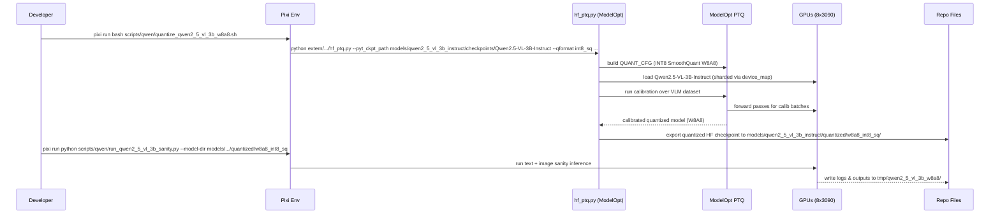

# Plan: Quantize Qwen2.5-VL-3B-Instruct to W8A8 with ModelOpt

## HEADER
- **Purpose**: Use NVIDIA ModelOpt’s LLM PTQ tooling to quantize the local Qwen2.5-VL-3B-Instruct checkpoint to a W8A8 (INT8 weights and activations) configuration, export a reusable checkpoint, and validate basic text and image+text behavior on our GPUs.
- **Status**: Canceled
- **Date**: 2025-12-05
- **Dependencies**:
  - `extern/TensorRT-Model-Optimizer/examples/llm_ptq/hf_ptq.py`
  - `extern/TensorRT-Model-Optimizer/examples/llm_ptq/vlm_utils.py`
  - `extern/TensorRT-Model-Optimizer/modelopt/torch/quantization/config.py`
  - `extern/TensorRT-Model-Optimizer/modelopt/torch/utils/vlm_dataset_utils.py`
  - `models/qwen2_5_vl_3b_instruct/` (local ModelScope snapshot + bootstrap)
  - `conf/model/qwen2_5_vl_3b_instruct/arch/qwen2_5_vl_3b_instruct.default.yaml`
  - `conf/model/qwen2_5_vl_3b_instruct/infer/qwen2_5_vl_3b_instruct.default.yaml`
  - `scripts/qwen/run_qwen2_5_vl_3b_sanity.py`
  - Qwen2.5-VL HF card: `https://huggingface.co/Qwen/Qwen2.5-VL-3B-Instruct`
- **Target**: Auto-quantize-model developers and AI assistants working on Qwen PTQ and deployment.

---

## 1. Purpose and Outcome

We want a repeatable workflow to quantize the local Qwen2.5-VL-3B-Instruct checkpoint to a W8A8 (INT8 weights + INT8 activations) configuration using NVIDIA ModelOpt, running on our multi-GPU 8× RTX 3090 host.

Success criteria:
- A working PTQ pipeline (script + config) that:
  - Loads the Qwen2.5-VL-3B-Instruct snapshot from `models/qwen2_5_vl_3b_instruct/checkpoints/Qwen2.5-VL-3B-Instruct`.
  - Runs ModelOpt’s HF PTQ flow with an INT8 config (e.g. `int8_sq` SmoothQuant) that effectively gives W8A8 for the language model.
  - Exports a quantized HF checkpoint to a stable repo path (e.g. `models/qwen2_5_vl_3b_instruct/quantized/w8a8_int8_sq/`).
- Basic sanity checks pass:
  - Text-only and image+text generation from the quantized checkpoint works and produces sensible outputs.
  - The quantized model fits and runs on the available GPUs (single or multiple) without OOM.
- The plan should keep the vision encoder behavior intact (we quantize at least the language model; quantizing the vision stack is optional/future work).

Open questions / unknowns to confirm during implementation:
- Whether `hf_ptq.py` + `get_language_model_from_vl` correctly detects and isolates the language model component for Qwen2.5-VL (it should, based on ModelOpt’s multimodal utilities).
- Which exact INT8 configuration best matches the user’s “W8A8” requirement:
  - `int8_sq` (SmoothQuant, W8A8) vs `int8` (if supported end-to-end for HF export) and how they perform on Qwen2.5-VL.
- Practical calibration dataset choice for VLM:
  - A local COCO 2017 image+caption subset vs a text-only dataset (e.g. `cnn_dailymail`) vs a smaller local, custom dataset if network access is constrained.
- How aggressive we can be with batch size and calibration sample count before hitting GPU memory limits on the 8×3090 machine.

---

## 2. Implementation Approach

### 2.0 Calibration dataset choice

We will use a local **COCO 2017 image+caption subset** as the primary calibration source, so that calibration batches always exercise both the vision and language pathways:

- **Vision-language calibration (primary)**:
  - Images from COCO 2017 (`train2017/`, `val2017/`) and their human-written captions from:
    - `annotations/captions_train2017.json`
    - `annotations/captions_val2017.json`
  - Expected root (via repo bootstrap): `datasets/coco2017/source-data`, which should mirror the standard COCO 2017 layout described in `datasets/coco2017/README.md`.
  - For PTQ, sample a few thousand `(image, caption)` pairs, preferring shorter single captions per image to keep sequence lengths reasonable.
- **Optional text-only calibration (secondary)**:
  - We can still layer in small amounts of text-only data if needed:
    - `cnn_dailymail` (HF dataset `abisee/cnn_dailymail`): generic news-style text.
    - `nvidia/Nemotron-Post-Training-Dataset-v2`: instruction-style text and code, as in ModelOpt examples.

Initial plan:
- Treat COCO 2017 (images + captions) as the primary calibration dataset, and only add text-only sources if we observe issues with long-form purely textual behavior.

### 2.1 High-level flow

1. **Verify environment and Qwen assets**
   - Ensure `nvidia-modelopt` and its HF extras are available via Pixi (already in `pyproject.toml`).
   - Confirm Qwen2.5-VL-3B-Instruct is bootstrapped and reachable at `models/qwen2_5_vl_3b_instruct/checkpoints/Qwen2.5-VL-3B-Instruct`.
   - Use the existing `scripts/qwen/run_qwen2_5_vl_3b_sanity.py` script to validate baseline FP16/BF16 behavior on GPUs.

2. **Study ModelOpt HF PTQ scripts for VLM support**
   - Review `extern/TensorRT-Model-Optimizer/examples/llm_ptq/hf_ptq.py` and `vlm_utils.py` to understand:
     - How multimodal models are detected (`is_multimodal_model`) and how language-model-only quantization is handled (`get_language_model_from_vl`).
     - How VL calibration datasets are wired via `get_vlm_dataset_dataloader` (currently `scienceqa`).
     - How `QUANT_CFG_CHOICES` maps `int8` and `int8_sq` to INT8 configurations and which are supported for HF export.

3. **Prototype manual PTQ run for Qwen2.5-VL-3B**
   - On a small calibration sample (e.g. 64–128 examples) and small batch size:
     - Run `hf_ptq.py` directly against the local snapshot:
       - `--pyt_ckpt_path models/qwen2_5_vl_3b_instruct/checkpoints/Qwen2.5-VL-3B-Instruct`
       - `--qformat int8_sq` (SmoothQuant W8A8 config)
       - `--kv_cache_qformat fp8` (or `none` initially, to simplify)
       - `--dataset scienceqa` (or another supported dataset if better suited)
       - `--calib_size 128` (or similar)
       - `--batch_size 0` to let ModelOpt auto-tune based on available memory
       - `--export_path tmp/qwen2_5_vl_3b_w8a8_proto`
       - `--trust_remote_code` as required by Qwen2.5-VL transformers integration.
     - Observe memory usage, calibration time, and any warnings or errors, especially around multimodal handling and device mapping.

4. **Design a stable W8A8 configuration for production runs**
   - Decide on:
     - Quantization format: treat `int8_sq` as the canonical W8A8 config for Qwen2.5-VL (weights and activations to INT8 with SmoothQuant).
     - KV cache quantization: start with `fp8` or `none` and only enable more aggressive formats if memory/throughput benefits are needed and accuracy loss is acceptable.
     - Calibration dataset and sizes:
       - Prefer a mixed or VLM-aware dataset (e.g. `scienceqa`) to exercise both text and vision embeddings for the language model.
       - Choose a `calib_size` in the 256–512 range and a batch size that fits comfortably on the available GPUs.
   - Validate from ModelOpt docs that this configuration is supported for HF export and downstream deployment (TRT-LLM / vLLM / SGLang).

5. **Create a repo-local quantization driver for Qwen2.5-VL-3B**
   - Add a thin wrapper script under `scripts/qwen/` (Python or bash) that:
     - Asserts the Qwen2.5-VL snapshot is present (or calls its bootstrap).
     - Constructs the `hf_ptq.py` command line with the agreed W8A8 settings:
       - Model path, `--qformat int8_sq`, dataset, calibration sizes, KV format, export path under `models/qwen2_5_vl_3b_instruct/quantized/w8a8_int8_sq/`.
     - Optionally passes `--use_seq_device_map` and `--gpu_max_mem_percentage` tuned for our 8×3090 setup.
     - Logs command-line and saves ModelOpt logs to `tmp/qwen2_5_vl_3b_w8a8/`.

6. **Export and register the quantized checkpoint**
   - After a successful PTQ run:
     - Store the exported HF checkpoint under `models/qwen2_5_vl_3b_instruct/quantized/w8a8_int8_sq/` (or similar).
     - Confirm the export contains updated config and quantization metadata as per ModelOpt HF export.
   - Add or update Hydra model config entries referencing the quantized checkpoint:
     - New `arch` variant: `conf/model/qwen2_5_vl_3b_instruct/arch/qwen2_5_vl_3b_instruct.w8a8_int8_sq.yaml` pointing to the quantized model path and dtype.
     - If needed, an `infer` overlay tuned for quantized behavior (e.g. max_new_tokens, temperature bounds).

7. **Sanity-check quantized model behavior**
   - Extend or parameterize `scripts/qwen/run_qwen2_5_vl_3b_sanity.py` to accept a `--model-dir` pointing to the quantized checkpoint and optionally a different `--device-map`.
   - Run:
     - Text-only sanity prompts and image+text prompts using the quantized checkpoint.
     - Save inputs/outputs and any observed differences vs FP16/BF16 baseline under `tmp/qwen2_5_vl_3b_w8a8/`.

8. **Optional: integrate with downstream deployment (TRT-LLM / vLLM / SGLang)**
   - If needed, use ModelOpt’s HF export APIs to produce a unified checkpoint suitable for:
     - TensorRT-LLM via `export_tensorrt_llm_checkpoint` or the unified HF export path.
     - vLLM/SGLang using `quantization="modelopt"` and the exported HF directory.
   - Capture one offline performance/latency measurement (on small test prompts) to verify that W8A8 quantization delivers expected speedups without unacceptable quality loss.

### 2.2 Sequence diagram (steady-state usage)

---

## 3. Files to Modify or Add

- **scripts/qwen/run_qwen2_5_vl_3b_sanity.py**
  - Allow selecting a model directory explicitly (already present) and add an option to label runs (baseline vs W8A8) in the output files.
- **scripts/qwen/quantize_qwen2_5_vl_3b_w8a8.sh** (new)
  - Convenience wrapper that:
    - Checks for the local ModelScope snapshot.
    - Invokes `hf_ptq.py` with the agreed INT8 SmoothQuant configuration, calibration dataset, and export path.
    - Writes logs under `tmp/qwen2_5_vl_3b_w8a8/`.
- **conf/model/qwen2_5_vl_3b_instruct/arch/qwen2_5_vl_3b_instruct.w8a8_int8_sq.yaml** (new)
  - Arch variant pointing at the quantized HF checkpoint directory and specifying dtype/int8 metadata as needed.
- **conf/model/qwen2_5_vl_3b_instruct/infer/qwen2_5_vl_3b_instruct.w8a8_int8_sq.yaml** (optional)
  - Inference preset tuned for the quantized model (e.g., max tokens, temperature bounds).
- **conf/config.yaml**
  - Optionally add a Hydra defaults variant (e.g., `model/qwen2_5_vl_3b_instruct/arch@model: qwen2_5_vl_3b_instruct.w8a8_int8_sq`) to select the quantized model via a simple override.
- **tmp/qwen2_5_vl_3b_w8a8/** (runtime-only, not committed)
  - Directory structure and filenames for PTQ logs, sanity-check inputs/outputs, and small metrics summaries.

---

## 4. TODOs (Implementation Steps)

- [ ] **Verify baseline Qwen2.5-VL-3B environment** Confirm the snapshot path, GPU availability, and run `run_qwen2_5_vl_3b_sanity.py` against the FP16/BF16 model as a baseline.
- [ ] **Confirm W8A8 config choice** From ModelOpt docs and `QUANT_CFG_CHOICES`, validate that `int8_sq` is an appropriate W8A8 (weights+activations INT8) config for Qwen2.5-VL and note any caveats.
- [ ] **Prototype hf_ptq run on small calib set** Manually run `hf_ptq.py` on Qwen2.5-VL-3B with `--qformat int8_sq` and small `calib_size` to confirm quantization works and to gauge memory usage and runtime.
- [ ] **Design stable calibration settings** Choose dataset(s), `calib_size`, and batch size that balance calibration coverage with throughput and memory limits on the 8×3090 setup.
- [ ] **Implement quantization driver script** Add `scripts/qwen/quantize_qwen2_5_vl_3b_w8a8.sh` (or a Python equivalent) that hides the full `hf_ptq.py` invocation behind a single Pixi command.
- [ ] **Export and register quantized checkpoint** Run the driver script end-to-end, verify the quantized HF checkpoint in `models/qwen2_5_vl_3b_instruct/quantized/w8a8_int8_sq/`, and add corresponding Hydra arch/infer variants.
- [ ] **Extend sanity-check script for quantized model** Update `run_qwen2_5_vl_3b_sanity.py` to easily switch between baseline and W8A8 models and to label outputs, then run both and store comparisons under `tmp/qwen2_5_vl_3b_w8a8/`.
- [ ] **(Optional) Integrate with deployment backends** If needed, export a unified HF checkpoint and validate W8A8 behavior with TensorRT-LLM / vLLM on one or two sample prompts.
