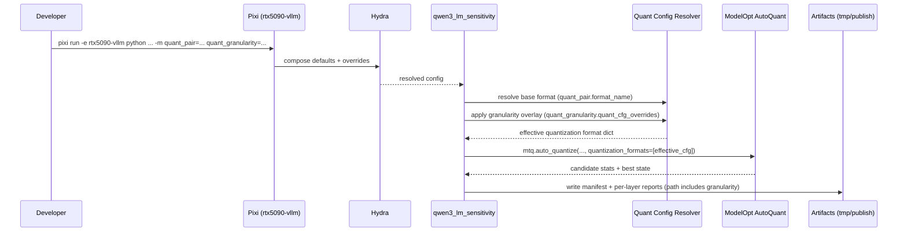

# Plan: Add Hydra quantization granularity control (ModelOpt AutoQuant)

## HEADER
- **Purpose**: Add Hydra-configurable quantization granularity controls (weights + activations) for ModelOpt-based Qwen3 runs, so we can grid-search combinations like (W dtype, A dtype, granularity) without creating bespoke configs for each setting.
- **Status**: Done
- **Date**: 2025-12-17
- **Dependencies**:
  - `context/design/qwen3-modelopt-production-options.md`
  - `context/design/qwen3-target-recipe.md`
  - `context/hints/about-modelopt-quantization-granularity.md`
  - `context/instructions/prep-rtx5090-vllm.md`
  - Hydra runner + config: `scripts/qwen/qwen3_lm_sensitivity.py`, `conf/preset/qwen3_lm_sensitivity.yaml`, `conf/quant_pair/*.yaml`
  - ModelOpt config bridge: `src/auto_quantize_model/modelopt_configs.py`, `src/auto_quantize_model/modelopt_autoquant.py`
  - Output naming: `src/auto_quantize_model/experiment_layout.py`
  - ModelOpt source reference: `extern/TensorRT-Model-Optimizer/modelopt/torch/quantization/config.py`
- **Target**: Quantization / inference engineers (and AI assistants) running ModelOpt sensitivity sweeps and maintaining reproducible Hydra experiments.

---

## 1. Purpose and Outcome

We want to control **quantization granularity** from Hydra so we can run combinatorics trials like:

- **Weights dtype**: `fp4` / `int4` / `fp8` / `int8` / `fp16`(none)
- **Activations dtype**: `fp8` / `int8` / `fp16`(none) (and potentially `int4`/`fp4` if ModelOpt supports it in our build)
- **Granularity**:
  - Weights: `per_out_channel` (axis=0), `per_in_channel` (axis=1; “per-column” for Linear), `per_group` (block/group quantization), `per_tensor`
  - Activations: `per_token_dynamic` (token strategy), `per_hidden_channel`, `per_group`, `per_tensor`

This is specifically required to match the llm-compressor target recipe for Qwen3-VL (“W=int4 per-channel, A=int8 per-token dynamic”) using ModelOpt knobs (`axis`, `block_sizes`, `type="dynamic"`), and to explore alternatives like per-column or group-wise weights.

Success criteria:
- A new Hydra configuration knob exists to specify granularity overrides for `*weight_quantizer` and `*input_quantizer` (and optionally `default`) in the resolved ModelOpt quantization config.
- `scripts/qwen/qwen3_lm_sensitivity.py` can run with:
  - No overrides (baseline behavior unchanged).
  - A “recipe-match” override (W per-channel, A per-token dynamic).
  - A sweep over multiple granularities via `-m` multirun without output collisions.
- Outputs (tmp and publish) are uniquely named by `(quant_pair, granularity, dataset.size)` and each run records the **effective quantization settings** (base format + overrides) in the manifest JSON for reproducibility.
- Validation can be done with repo-standard commands in the `rtx5090-vllm` Pixi env (`pixi run -e rtx5090-vllm ...`).

Non-goals (for this plan):
- Implement GPTQ itself (ModelOpt AutoQuant is not GPTQ).
- Add new quantization methods; this is a config + plumbing change.
- Guarantee all combinations work on all ModelOpt builds (we will validate and fail fast / skip unsupported combos).

---

## 2. Implementation Approach

### 2.1 High-level flow

1. Hydra composes a run config selecting:
   - Base quant format via `quant_pair.format_name` (as today).
   - Granularity overrides via a new `quant_granularity` config group.
2. Runner resolves the base ModelOpt quantization config dict using `resolve_quant_config(format_name)`.
3. Runner applies granularity overrides to the config dict (deep-copied) by mutating `cfg["quant_cfg"]["*weight_quantizer"]` and `cfg["quant_cfg"]["*input_quantizer"]`:
   - Enforce ModelOpt constraints: `axis` and `block_sizes` cannot coexist.
   - Normalize YAML/OmegaConf values into ModelOpt-friendly Python structures (e.g., integer axis keys in `block_sizes`).
4. Runner passes the overridden config dict into ModelOpt `mtq.auto_quantize(...)` as the single candidate format (or in a list, if we later add multi-candidate sweeps).
5. Runner writes artifacts to a directory that includes the granularity identifier to avoid collisions in multiruns.
6. Runner records the chosen base format name + overrides in the manifest JSON under a dedicated key (e.g., `manifest["quantization"]`).

### 2.2 Hydra config design (granularity as an overlay)

Add a new Hydra config group `conf/quant_granularity/` whose job is to describe an overlay to apply to a base ModelOpt quantization format.

Proposed schema (YAML):

```yaml
# conf/quant_granularity/<option>.yaml
name: w_channel_a_token

# Overlay applied to the resolved ModelOpt config dict.
quant_cfg_overrides:
  "*weight_quantizer":
    # Only include granularity-related knobs here.
    axis: 0          # per-output-channel for Linear weights (out, in)
    block_sizes: null
  "*input_quantizer":
    type: dynamic
    axis: null
    block_sizes:
      -1: null       # per-token dynamic pattern (ModelOpt converts this at runtime)
```

Notes:
- Keep `quant_cfg_overrides` narrowly scoped (granularity + dynamic/static) so base presets still control dtype-related fields like `num_bits` and FP8/FP4 formats.
- Use `null` in YAML for `None`.
- For group quantization, prefer explicit, common presets rather than relying on fragile CLI overrides of nested dict keys:
  - Example: `w_group128_a_token` sets `block_sizes: {-1: 128}` for weights and keeps activations as per-token dynamic.

Initial recommended options to include:
- `default` (no overrides; empty `quant_cfg_overrides: {}`).
- `recipe_match_channel_token` (W axis=0, A type=dynamic + `block_sizes: {-1: null}`).
- `w_per_out_channel` (W axis=0, A unchanged).
- `w_per_in_channel` (“per-column”; W axis=1, A unchanged).
- `w_group64`, `w_group128` (W block_sizes, A unchanged).
- `a_per_token_dynamic` (A type=dynamic + token block_sizes, W unchanged).
- `a_per_hidden_channel` (A axis=-1 or a named-safe axis depending on tensor layout, W unchanged).

### 2.3 Override application semantics (ModelOpt-safe normalization)

Implement a small, well-tested “overlay” function that:

- Deep-copies the resolved base config dict to avoid mutating global presets.
- Merges overrides into `cfg["quant_cfg"][pattern]` for the supported patterns:
  - Always apply to `*weight_quantizer` and `*input_quantizer` if present.
  - Optionally propagate `axis` to `quant_cfg["default"]` if that entry exists and is used by the selected preset (important for “all-layers” style configs).
- Enforces mutual exclusion:
  - If override specifies `axis`, remove any existing `block_sizes`.
  - If override specifies `block_sizes`, remove any existing `axis`.
- Normalizes `block_sizes` mapping keys:
  - Convert `"-1"`/`"-2"` string keys to integers `-1`/`-2` so ModelOpt sees axis indices.
  - Preserve special string keys like `"type"`, `"scale_bits"`, `"scale_block_sizes"`.
- Leaves everything else intact (algorithm choice, disable patterns, etc.).

### 2.4 Wiring into the Hydra runner and manifest

Plumbing changes:
- Add `quant_granularity` to `conf/preset/qwen3_lm_sensitivity.yaml` defaults so existing commands keep working (default granularity option).
- Update `scripts/qwen/qwen3_lm_sensitivity.py`:
  - Read `cfg.quant_granularity.quant_cfg_overrides`.
  - Build an “effective quantization format” dict: `base_format + overrides`.
  - Ensure scheme naming and output naming include the granularity identifier.
- Update manifest writing to include:
  - Base `format_name`
  - `quant_cfg_overrides` applied
  - (Optional) the final resolved `quant_cfg` for exact reproducibility (tradeoff: manifest size).

### 2.5 Output layout and grid-search ergonomics

To make Hydra multirun grid-search safe and easy:

- Update Hydra run dir templates in `conf/preset/qwen3_lm_sensitivity.yaml` to include `${quant_granularity.name}`.
- Extend publish output layout via `src/auto_quantize_model/experiment_layout.py`:
  - Either add a `granularity-<name>` directory layer, or add a `_g-<name>` suffix to the run dir name.
  - Keep existing `weight-<w>-act-<a>` grouping intact.

Provide example sweep commands (documented in `models/qwen3_vl_4b_instruct/layer-analysis/README.md`):

```bash
pixi run -e rtx5090-vllm python scripts/qwen/qwen3_lm_sensitivity.py -m \
  output_layout=publish \
  quant_pair=wint4_aint8,wfp4_afp8,wfp8_afp8 \
  quant_granularity=default,recipe_match_channel_token,w_group128 \
  dataset.size=small,medium
```

### 2.6 Sequence diagram (steady-state usage)



---

## 3. Files to Modify or Add

- **`conf/quant_granularity/default.yaml`** (new) No-op overlay for backward-compatible default behavior.
- **`conf/quant_granularity/*.yaml`** (new) A small set of named overlays (recipe match, per-channel, per-column, per-group sizes).
- **`conf/preset/qwen3_lm_sensitivity.yaml`** (update) Add `quant_granularity` to defaults; include it in `hydra.run.dir` and `hydra.sweep.subdir`.
- **`scripts/qwen/qwen3_lm_sensitivity.py`** (update) Read granularity config, build effective ModelOpt format dict, include granularity in scheme/output naming, and record overrides in manifest.
- **`src/auto_quantize_model/modelopt_autoquant.py`** (update) Allow resolving quantization formats with an optional overlay (or accept explicit dict configs in `quantization_formats` path).
- **`src/auto_quantize_model/modelopt_configs.py`** or **`src/auto_quantize_model/modelopt_quant_overrides.py`** (new) Implement and export the overlay/normalization helpers.
- **`src/auto_quantize_model/experiment_layout.py`** (update) Add granularity to publish output directory naming (new parameter with default behavior unchanged).
- **`models/qwen3_vl_4b_instruct/layer-analysis/README.md`** (update) Document the new granularity knob and provide example multirun sweeps.
- **`tests/unit/test_quant_granularity_overrides.py`** (new) Unit tests for overlay logic (no GPU required).

---

## 4. TODOs (Implementation Steps)

- [x] **Decide the granularity vocabulary** Define the canonical user-facing names (`per_column`, `per_channel`, `per_group128`, `per_token_dynamic`, etc.) and document their ModelOpt mapping (`axis`, `block_sizes`, `type`).
- [x] **Add Hydra config group** Create `conf/quant_granularity/` with `default` plus a minimal initial set of overlays, including a “recipe match” option based on `context/design/qwen3-modelopt-production-options.md`.
- [x] **Implement overlay + normalization helper** Add a small function that deep-copies a ModelOpt config dict and merges `quant_cfg_overrides` safely (axis/block_sizes exclusivity, `block_sizes` key normalization).
- [x] **Wire granularity into qwen3 runner** Update `scripts/qwen/qwen3_lm_sensitivity.py` to apply the overlay and ensure outputs/scheme names include granularity.
- [x] **Update output layout naming** Extend `src/auto_quantize_model/experiment_layout.py` (and any relevant Hydra templates) so published outputs are uniquely keyed by granularity.
- [x] **Record settings in manifest** Include base `format_name` + overlay (and optionally resolved `quant_cfg`) in `*_quant_manifest.json`.
- [x] **Add unit tests** Add `tests/unit/` coverage for: axis/block_sizes mutual exclusion, block_sizes key normalization, and deterministic naming from `(quant_pair, granularity)`.
- [x] **Smoke-test key combinations** In `rtx5090-vllm`, run one or two tiny calibration sweeps to confirm ModelOpt accepts the overridden configs and that outputs don’t collide.
- [x] **Document grid-search usage** Update `models/qwen3_vl_4b_instruct/layer-analysis/README.md` with example `-m` sweeps across `quant_pair` and `quant_granularity`.
