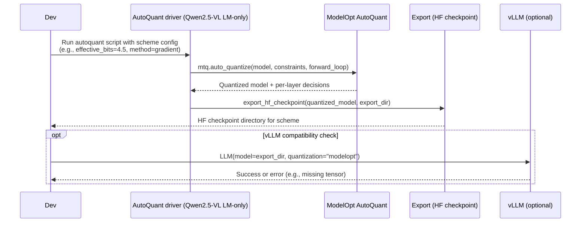

# Plan: ModelOpt AutoQuant FP8 schemes for Qwen2.5‑VL‑3B (LM-only)

## HEADER
- **Purpose**: Use ModelOpt’s sensitivity-based AutoQuant path to derive multiple FP8 mixed-precision schemes for the Qwen2.5‑VL‑3B language model, varying how many layers are quantized, while keeping the vision tower unquantized and vLLM compatibility in mind.
- **Status**: Draft
- **Date**: 2025-12-09
- **Dependencies**:
  - `extern/TensorRT-Model-Optimizer/examples/llm_ptq/hf_ptq.py`
  - `extern/TensorRT-Model-Optimizer/modelopt/torch/quantization/model_quant.py`
  - `extern/TensorRT-Model-Optimizer/modelopt/torch/quantization/utils.py`
  - `models/qwen2_5_vl_3b_instruct/quantized/fp8_fp8_coco2017` (baseline FP8 LM-only checkpoint)
  - `models/qwen2_5_vl_3b_instruct/reports/fp8-vlm-vs-textonly-vllm-compat.md`
  - `models/qwen2_5_vl_3b_instruct/reports/report-fp8-text-only.md`
- **Target**: Quantization / inference engineers (and AI assistants) experimenting with FP8 mixed-precision schemes for Qwen2.5‑VL under ModelOpt + vLLM.

---

## 1. Purpose and Outcome

We want to move beyond a single “all‑eligible FP8” config and:

- Explicitly use **ModelOpt AutoQuant** (sensitivity-based search) to derive **multiple mixed-precision FP8 schemes** for the Qwen2.5‑VL‑3B **language model only**.
- Control the **fraction of layers quantized** (e.g., “top‑K quantized blocks by sensitivity”, different effective bits budgets), while:
  - Keeping the **vision tower unquantized** (BF16/FP16), consistent with community practice.
  - Preserving or at least understanding **vLLM compatibility** (i.e., which schemes still load cleanly in vLLM).
- Capture the resulting schemes, configs, and artifacts in a reproducible way so future runs can reuse or refine them.

Success looks like:

- A family of named schemes (e.g., LM-only `fp8_autoquant_top10`, `fp8_autoquant_top20`, …, `fp8_autoquant_top100`, plus selected all-layers variants) with:
  - Corresponding exported HF checkpoints under `models/qwen2_5_vl_3b_instruct/quantized/`.
  - Documented per-layer quantization decisions, sensitivity rankings, and effective bits summaries.
- A reusable Python driver that:
  - Runs AutoQuant for Qwen2.5‑VL‑3B LM with different `--auto_quantize_bits` / scoring settings.
  - Outputs machine-readable quantization manifests (e.g., JSON) indicating which layers are FP8 vs BF16/FP16.
- Optional: a vLLM sanity script that attempts to load each scheme and records whether it is compatible, plus any error traces when it is not.

## 1.2 Research focus (not accuracy-driven)

This plan is **research-oriented** and prioritizes understanding the behavior of different quantization schemes and layer sensitivity algorithms over maximizing model accuracy:

- The primary goal is to **compare**:
  - Different quantization configs (e.g., all-layers FP8, ModelOpt defaults, custom patterns).
  - Different AutoQuant / sensitivity-analysis settings (effective bits budgets, scoring sample sizes, grouping rules).
- We explicitly **do not require** the resulting quantized models to achieve production-grade accuracy in this workflow:
  - It is acceptable—and expected—that some schemes degrade quality significantly.
  - Those “bad” schemes are still valuable as data points for understanding where and how quantization breaks.
- Evaluation emphasis:
  - Use **PyTorch inference** on shared calibration/eval sets to inspect:
    - Per-layer sensitivity trends.
    - Differences in logits / outputs across schemes.
    - How changes in config or algorithm affect which layers become “sensitive”.
  - vLLM loading and end-to-end accuracy remain important, but they are treated as **secondary checks** rather than the main optimization target here.

In short, this plan treats Qwen2.5‑VL‑3B as a **testbed** for quantization and sensitivity analysis, not as a deployment-focused benchmark; the design favors breadth of comparison and insight over squeezing out maximum accuracy from any single scheme.

## 1.1 Requirements

To keep this work reusable and extensible beyond the initial FP8 LM-only schemes, the tools and scripts we build must satisfy the following requirements:

- **Custom quantization configs**
  - The AutoQuant driver must support **custom ModelOpt quantization configs**, not just the built-in `FP8_DEFAULT_CFG` / `INT8_*` presets.
  - It should be possible to:
    - Run AutoQuant with an **all-layers FP8 config** (no `_default_disabled_quantizer_cfg` exclusions), for experimental “fully quantized” regimes.
    - Use the **default ModelOpt LLM configs** (`FP8_DEFAULT_CFG`, `INT4_AWQ_CFG`, hybrid formats, etc.) as a baseline.
    - Plug in additional, **user-defined configs** we find interesting later (e.g., MLP-only quantization, attention-only, custom KV schemes), without changing the core driver logic.
  - Scheme definitions (e.g., `AUTOQUANT_FP8_SCHEMES`) should be able to reference either built-in config symbols or local/custom config dicts.

- **Pure PyTorch inference / error probing**
  - All quantized models produced in this workflow must remain usable with **plain PyTorch inference** (no vLLM or TensorRT-LLM required) so we can:
    - Run **A/B comparisons** between different quantization configs (including all-layers vs ModelOpt-default vs custom) directly in PyTorch.
    - Inspect **numerical errors** introduced by quantization (e.g., comparing logits or downstream metrics) without relying on deployment runtimes.
  - The AutoQuant driver and any helpers should therefore:
    - Keep a straightforward path to run `model(**inputs)` on the quantized LM in PyTorch.
    - Allow swapping quantization configs and recomputing outputs on the same calibration / evaluation data, to study the impact of different schemes.
  - vLLM integration remains a separate concern (and is still a goal), but it is **not** a prerequisite for running quantized inference and error analysis in this Plan.

## 2. Implementation Approach

### 2.1 High-level flow

1. **Review and constrain AutoQuant behavior for Qwen2.5‑VL**  
   - Confirm how `hf_ptq.py` wires `mtq.auto_quantize` (`auto_quantize_bits`, `auto_quantize_method`, `num_score_steps`, etc.).  
   - Decide on a **language-model-only AutoQuant** usage: we still reuse the “extract language model, disable vision” pattern from the existing FP8 path.
2. **Design a set of AutoQuant scenarios**  
   - Choose one or more effective-bits targets and scoring budgets that will be used for **full-coverage sensitivity analysis runs** (LM-only and, optionally, all-layers).  
   - Define a family of derived schemes that slice these sensitivity baselines into “top‑X% of layers quantized” variants (e.g., LM-only `fp8_autoquant_top10`, `top20`, …, `top100`) by ranking layers by sensitivity and quantizing only the top fraction.
3. **Implement a Qwen2.5‑VL‑specific AutoQuant driver**  
   - New Python script under `scripts/qwen/` that:
     - Loads the LM-only Qwen2.5‑VL model.  
     - Builds a calibration forward loop (text-only, COCO captions) or uses `create_forward_loop`.  
     - Calls `mtq.auto_quantize` with configurable `effective_bits` / methods.  
     - Collects per-layer quantization decisions and writes them out as a manifest.
4. **Export multiple HF checkpoints using derived schemes**  
   - For each derived scheme (LM-only `fp8_autoquant_topXX` or an all-layers top‑X% variant):
     - Apply the scheme’s sliced quantization config (only the top‑X% most sensitive layers remain quantized; others are reverted to BF16/FP16).  
     - Export a unified HF checkpoint via `export_hf_checkpoint` under a distinct directory (e.g., `fp8_autoquant_top10_coco2017`, `fp8_autoquant_top50_coco2017`).
5. **Probe vLLM compatibility**  
   - For each exported scheme:
     - Attempt to load with `scripts/qwen/run_qwen2_5_vl_3b_vllm_fp8.py` (pointed at the new path).  
     - Record whether vLLM loads successfully or fails (and with what error), annotating which schemes are practically usable vs “ModelOpt-only”.
6. **Document schemes and results**  
   - Extend or add report(s) under `models/qwen2_5_vl_3b_instruct/reports/` summarizing:
     - AutoQuant settings used.  
     - Quantized vs non-quantized layer counts for each scheme.  
     - Any vLLM compatibility findings.

### 2.2 Sequence diagram (steady-state usage)



## 3. Files to Modify or Add

- **scripts/qwen/quantize_qwen2_5_vl_3b_fp8_coco2017.sh**
  - Optionally add a reference to the AutoQuant driver (as “advanced/sensitivity-based path”) in comments.
- **scripts/qwen/qwen2_5_vl_3b_autoquant_fp8_schemes.py** (new)
  - Main AutoQuant driver for Qwen2.5‑VL‑3B LM-only.
  - CLI flags for `--scheme-name`, `--auto-quantize-bits`, `--auto-quantize-method`, `--score-size`, etc.
  - Produces quantization manifests and exported checkpoints.
- **scripts/qwen/run_qwen2_5_vl_3b_vllm_fp8.py**
  - Optionally extend to accept a `--scheme-name` or explicit model dir for testing multiple schemes.
- **models/qwen2_5_vl_3b_instruct/reports/report-fp8-autoquant-schemes.md** (new)
  - Report summarizing AutoQuant settings, schemes, and vLLM compatibility.
- **context/summaries/modelopt-kb/howto-configure-pixi-vllm-for-modelopt-fp8.md**
  - Optional cross-link or short note about using AutoQuant-based schemes for advanced experiments.

## 4. TODOs (Implementation Steps)

- [ ] **Confirm AutoQuant hooks** Review `hf_ptq.py` and `model_quant.py` to understand how `mtq.auto_quantize` is used and how `auto_quantize_bits` interacts with `quant_cfg`.
- [ ] **Define scheme variants** Decide on 2–3 AutoQuant configurations (effective bits / methods / score sizes) that will produce clearly different mixed-precision schemes.
- [ ] **Implement AutoQuant driver** Add `scripts/qwen/qwen2_5_vl_3b_autoquant_fp8_schemes.py` to:
  - Load LM-only Qwen2.5‑VL‑3B.  
  - Build a calibration forward loop over COCO captions.  
  - Invoke `mtq.auto_quantize` with chosen settings.  
  - Save per-layer quantization decisions (e.g., JSON manifest).
 - [ ] **Export checkpoints per scheme** For each scheme, export a unified HF checkpoint under `models/qwen2_5_vl_3b_instruct/quantized/<scheme_name>` using `export_hf_checkpoint`.
 - [ ] **Check vLLM compatibility** Use `scripts/qwen/run_qwen2_5_vl_3b_vllm_fp8.py` (or a small helper) to try loading each scheme in the `rtx5090-vllm` env, capturing whether it succeeds or fails.
  - [ ] **Write autoquant report** Create `models/qwen2_5_vl_3b_instruct/reports/report-fp8-autoquant-schemes.md` summarizing schemes, layer counts (FP8 vs BF16/FP16), and vLLM compatibility.
  - [ ] **Optional doc cross-links** Update relevant context/KB docs to mention AutoQuant-based FP8 schemes as an advanced option and to point to the new report and driver script.

---

## 5. AutoQuant hooks and LM-only constraints (Subtask 4.1)

This section summarizes how ModelOpt AutoQuant is wired in the vendored examples, how per-layer decisions are represented, and how we will constrain AutoQuant to operate on the Qwen2.5‑VL‑3B language model only.

### 5.1 How `mtq.auto_quantize` is invoked in `hf_ptq.py`

- The primary entry point is `auto_quantize()` in `extern/TensorRT-Model-Optimizer/examples/llm_ptq/hf_ptq.py`. It wraps `modelopt.torch.quantization.model_quant.auto_quantize` (`mtq.auto_quantize`) and controls the sensitivity search.
- Key arguments:
  - `constraints={"effective_bits": auto_quantize_bits}`  
    - `auto_quantize_bits` is a floating-point “effective bits” budget (e.g., 4.5). The AutoQuant searcher converts this into a weight-size constraint via `estimate_quant_compression()` and `_get_constraints_for_search()` in `algorithms.py`.  
  - `quantization_formats=[QUANT_CFG_CHOICES[format] for format in qformat_list]`  
    - `qformat` is a comma-separated list of format names (`"fp8"`, `"int8_sq"`, `"nvfp4"`, etc.). `QUANT_CFG_CHOICES` maps these to full `QuantizeConfig` dictionaries (e.g., `mtq.FP8_DEFAULT_CFG`), which define per-quantizer attributes (`num_bits`, `axis`, etc.).  
    - AutoQuant internally also includes a “do not quantize” recipe so some layers may remain unquantized even if a format is available.
  - `data_loader=calib_dataloader` and `num_calib_steps=len(calib_dataloader)`  
    - AutoQuant first runs a calibration phase that is equivalent to `mtq.quantize(..., forward_loop=...)`, using all calibration batches unless overridden in later revisions.
  - `num_score_steps=min(len(calib_dataloader), max(auto_quantize_score_size // batch_size, 1))`  
    - Controls how many samples are used for the *sensitivity scoring* phase. This is usually smaller than `num_calib_steps` because scoring is the expensive step.  
    - `auto_quantize_score_size` is a global target sample budget; it is divided by `batch_size` and clipped to at least 1 step and at most the full calibrator length.
  - `method=auto_quantize_method`  
    - `"gradient"` (default): uses `AutoQuantizeGradientSearcher`.  
      - `forward_step(model, batch)` returns the full CausalLM output object; `loss_func(output, data)` returns `output.loss`; the searcher computes a gradient-based importance score per candidate quantization recipe using a Taylor expansion-style metric (`_get_auto_quantize_score`).  
    - `"kl_div"`: uses `AutoQuantizeKLDivSearcher`.  
      - `forward_step` returns logits only; loss is an internal KL divergence between a reference (unquantized) path and a quantized path.  
    - There is no separate `score_mode` parameter in the current code; the scoring behavior is fully determined by `method` and the searcher implementation. Any `score_func` passed in the config is ignored for `"gradient"`.
  - `disabled_layers=list(_default_disabled_quantizer_cfg.keys())`  
    - Provides a list of wildcard patterns (from `modelopt.torch.quantization.config._default_disabled_quantizer_cfg`) for layers that should not be quantized by AutoQuant (e.g., `lm_head`, certain routing/gating layers, etc.). AutoQuant uses these during the scoring/search process.
  - `checkpoint=auto_quantize_checkpoint`  
    - Optional path for saving/restoring the AutoQuant search state (`candidate_stats`, best recipes, etc.). When present, AutoQuant can skip the costly scoring phase and resume from previous runs.
- After `mtq.auto_quantize` returns `(model, state_dict)`, `hf_ptq.auto_quantize` optionally performs a *second* calibration pass for KV cache quantization:  
  - `enable_quant_kv_cache = args.kv_cache_qformat != "none"`.  
  - `kv_cache_quant_cfg = getattr(mtq, KV_QUANT_CFG_CHOICES[args.kv_cache_qformat])["quant_cfg"]`.  
  - It calls `mtq.set_quantizer_by_cfg` followed by a `mtq.calibrate` call inside a context that disables all non-KV quantizers, so the first AutoQuant pass handles weights/activations, and the second calibrates KV-only quantizers.

### 5.2 How per-layer decisions/configs are represented and can be exported

- In `model_quant.auto_quantize` (`extern/TensorRT-Model-Optimizer/modelopt/torch/quantization/model_quant.py`):
  - `quantization_formats` are normalized to `(QuantizeConfig, name)` pairs using `QuantRecipe.get_auto_name_for_config`.  
    - For built-in formats (`mtq.FP8_DEFAULT_CFG`, `mtq.NVFP4_AWQ_LITE_CFG`, etc.), the name is the symbolic format string (e.g., `"FP8_DEFAULT_CFG"`).  
    - For custom dict-based formats, `QuantRecipe` requires an explicit name and emits a warning that results may be suboptimal.
  - `auto_quantize` calls `apply_mode(model, mode="auto_quantize", registry=QuantizeModeRegistry)`, which wraps supported modules (e.g., linear layers) with quantization-aware modules and attaches hyperparameters (`QuantRecipeHparam`) that encode per-module quantization choices.
  - It then calls `set_quantizer_by_cfg(model, {"*": {"enable": False}})` to globally disable quantizers, letting the searcher selectively enable and configure quantizers per candidate recipe.
  - Finally it calls `searcher.search(model, constraints, config=search_config)`, and returns `(model, searcher.state_dict())`.
- In `algorithms.py`:
  - `QuantRecipe` wraps a `QuantizeConfig` plus metadata:
    - It enforces a consistent `QuantizeConfig` object and disables KV-cache output quantizers by default (`"*output_quantizer": QuantizerAttributeConfig(enable=False)`) to keep weight compression vs accuracy monotonic in the search.  
    - It computes an approximate *compression ratio* for each format via `estimate_quant_compression`, which is later used to translate the effective bits constraint into a weight-size constraint.
  - `QuantRecipeHparam` is the per-module hyperparameter object that:
    - Holds the candidate recipes for a set of quant modules.  
    - Manages the actual `TensorQuantizer` instances attached to each module for each candidate recipe.  
    - Accumulates per-recipe scores and costs over the AutoQuant scoring passes.
  - `_AutoQuantizeBaseSearcher` drives the search and maintains a `state_dict`:
    - `candidate_stats`: per-hparam statistics with lists of formats, scores, and costs.  
    - `best`: overall best recipe mapping, final effective bits, and score.  
    - `run_search` enforces that `constraints` contain a single `effective_bits` entry, converts it into an allowed weight-size range, and uses solver logic (or a threshold-based binary search for KL-div) to pick per-layer recipes.
    - After search, `QuantRecipe.fold_pqs_to_weights(model)` may fold pre-quant scales (`pre_quant_scale`) into weights for faster evaluation, but the quantizer modules and configuration remain inspectable.
  - For gradient-based search (`AutoQuantizeGradientSearcher`), the scoring rule is fixed (no pluggable `score_mode`):
    - It computes an importance score per candidate recipe using a second-order Taylor-style approximation based on gradients and output perturbations (`_get_auto_quantize_score` / `_add_auto_quantize_score`).
- Practical ways to derive LM-only mixed-precision schemes from AutoQuant:
  - Capture the `state_dict` returned by `mtq.auto_quantize` (especially `best["recipe"]` and `candidate_stats`) to a file (e.g., via `torch.save`) for offline analysis.
  - Post-process the quantized LM by walking `model.named_modules()` and:
    - Identifying quantized modules via `mtq.utils.is_quantized_linear` / `is_quantized`.  
    - Reading quantizer attributes (e.g., `num_bits`, `enable`, `axis`) via `weight_attr_names` / `quantizer_attr_names` and the associated `TensorQuantizer` instances.  
    - Emitting a manifest mapping module names (or logical block indices) to the chosen recipe name and key FP8 attributes.  
  - The exported HF checkpoint (`export_hf_checkpoint(full_model, export_dir=...)`) already writes a `hf_quant_config.json` that vLLM can consume. For our mixed schemes, we can additionally write a task-specific JSON manifest (e.g., `autoquant_manifest_<scheme>.json`) that directly captures LM-only per-layer decisions for analysis and reporting.

### 5.3 Restricting AutoQuant to Qwen2.5‑VL-3B LM-only

- `hf_ptq.py` already contains a pattern for quantizing only the language model component of a VLM:
  - After loading the full model as `full_model`, it computes `is_vlm = is_multimodal_model(full_model)`.  
  - For VLMs that are not handled by specialized branches, it uses `get_language_model_from_vl(full_model)` to get the “lineage” of modules toward the language model:
    - For Qwen2.5‑VL-style models, this returns `[vlm_model, vlm_model.language_model]` or `[vlm_model, vlm_model.model, vlm_model.model.language_model]`, depending on how the HF wrapper is structured.
  - It then:
    - Sets up a `disabled_quant_cfg`:
      ```python
      disabled_quant_cfg = {
          "quant_cfg": {"default": {"enable": False}},
          "algorithm": "max",
      }
      ```
    - Walks all children of the VLM ancestors that are *not* on the language model path and applies `mtq.quantize(module, disabled_quant_cfg, forward_loop=None)`. This effectively injects “do nothing” quantizer structures into non-LM modules so they can be excluded cleanly during export.  
    - Sets `model = language_model` and `model_type = get_model_type(model)` so that all subsequent quantization (including AutoQuant) operates on the LM module only.
- For Qwen2.5‑VL‑3B LM-only AutoQuant we will follow the same pattern:
  - Load the full Qwen2.5‑VL‑3B VLM in BF16/FP16.  
  - Use `get_language_model_from_vl(full_model)` to identify the LM component and its ancestors.  
  - Apply `disabled_quant_cfg` to all modules outside the LM lineage, as in `hf_ptq.py`, to ensure they remain effectively BF16/FP16 and to keep the export path consistent.  
  - Set `model = language_model` before invoking `mtq.auto_quantize`, so:
    - AutoQuant’s search space (quant modules, grouping rules) is limited to LM layers.  
    - `disabled_layers` can remain the default `_default_disabled_quantizer_cfg.keys()`; we do not need additional patterns for vision components because they are not part of `model` during AutoQuant.  
  - When exporting, we pass `full_model` (with its original vision tower and the quantized LM) to `export_hf_checkpoint`. This yields a VLM checkpoint where:
    - The vision tower is unquantized (BF16/FP16).  
    - The LM carries the per-layer FP8 decisions from AutoQuant.  
    - Non-LM modules that received `disabled_quant_cfg` appear as explicitly “unquantized” in the quant config, which is compatible with vLLM’s `exclude_modules` logic.

### 5.4 AutoQuant knobs relevant for vLLM compatibility

- Quantization formats:
  - vLLM’s `ModelOptFp8Config` (`extern/vllm/vllm/model_executor/layers/quantization/modelopt.py`) expects FP8-style formats when `quantization="modelopt"` is used.  
  - For this task we will restrict the AutoQuant `quantization_formats` to FP8-based configs (e.g. `mtq.FP8_DEFAULT_CFG`, and optionally other FP8 variants that vLLM supports) to avoid formats that are only supported in TensorRT-LLM but not in vLLM.
- KV-cache quantization:
  - AutoQuant disables KV-cache output quantizers in `QuantRecipe` by default; KV-cache quantization is added afterward via a separate `mtq.set_quantizer_by_cfg` + `mtq.calibrate` call.  
  - vLLM has a dedicated `ModelOptFp8KVCacheMethod`. We should keep KV quantization formats (`KV_QUANT_CFG_CHOICES`) within the subset vLLM supports (`KV_CACHE_QUANT_ALGOS = ["FP8"]`) and verify Qwen2.5‑VL loads with KV quant enabled/disabled.  
  - For early experiments, it is reasonable to treat KV-cache quantization as an independent toggle from the main AutoQuant scheme.
- Wrapper modules and naming:
  - AutoQuant uses grouping rules (`quant_grouping_rules` and `score_module_rules` in `algorithms.py`) to assign the same quant format to related modules (e.g., `q_proj/k_proj/v_proj`, MoE experts). These rules are designed to mirror TensorRT‑LLM’s fused kernels and should also align with how vLLM interprets the checkpoint.  
  - The search operates on quant modules inserted via ModelOpt’s conversion utilities. As long as we use `export_hf_checkpoint(full_model, export_dir=...)`, the resulting `hf_quant_config.json` and parameter names should match what vLLM’s ModelOpt loader expects.
- Effective bits and memory:
  - The `effective_bits` constraint directly trades off compression vs. accuracy. More aggressive (lower) effective bits will increase FP8 coverage and memory savings but may stress vLLM’s runtime (e.g., more FP8 GEMMs, tighter activation scaling ranges).  
  - Qwen2.5‑VL‑3B LM-only FP8 schemes should fit within RTX 5090 memory, but we should still be mindful of calibration batch sizes and `auto_quantize_score_size` to avoid OOMs during the search.

### 5.5 Agreed approach for later subtasks

- For the Qwen2.5‑VL‑3B AutoQuant driver:
  - Use the VLM-aware LM extraction pattern from `hf_ptq.py` (`get_language_model_from_vl`, `disabled_quant_cfg`) to ensure AutoQuant acts only on the language model.  
  - Invoke `mtq.auto_quantize` with:
    - `constraints={"effective_bits": <scheme-specific value>}`  
    - FP8-only `quantization_formats` drawn from ModelOpt FP8 configs compatible with vLLM.  
    - `method` in `{ "gradient", "kl_div" }` depending on whether we have labels in the calibration dataset.  
    - `num_score_steps` tuned via `auto_quantize_score_size` and `batch_size` to balance search quality vs. runtime on RTX 5090.
  - After AutoQuant, keep `state_dict` and post-process the quantized LM to produce a manifest of per-layer formats and quantizer attributes.
- For vLLM compatibility probing:
  - Rely on `export_hf_checkpoint(full_model, export_dir=...)` to generate ModelOpt-style FP8 checkpoints.  
  - Use vLLM’s `quantization="modelopt"` path to load the exported checkpoints and validate that:
    - The vision tower remains in BF16/FP16.  
    - LM layers are mapped to vLLM’s FP8 kernels.  
    - KV-cache options we choose (FP8 vs none) are supported.

These constraints and hooks will guide the design and implementation of the Qwen2.5‑VL‑3B AutoQuant driver and downstream subtasks in this task.

---

## 6. AutoQuant FP8 scheme variants (Subtask 4.2)

This section defines the initial catalog of FP8 AutoQuant schemes for Qwen2.5‑VL‑3B LM-only. The goal is to keep the set small but expressive, covering conservative vs aggressive options while remaining practical to sweep on a single RTX 5090.

### 6.1 Scheme catalog (names and intent)

We define a **family** of LM-only schemes that sweep the fraction of transformer blocks quantized to FP8 in 10% increments, plus an all-layers FP8 analysis variant:

- LM-only coverage grid:
  - Scheme names: `fp8_autoquant_top10`, `fp8_autoquant_top20`, `fp8_autoquant_top30`, …, `fp8_autoquant_top100`.
  - **Intent**: provide a smooth coverage axis where we can study how quality and memory change as more LM blocks are pushed into FP8, while keeping the vision tower in BF16/FP16.
  - **Coverage target** for `fp8_autoquant_topXX`:
    - Approx. **top XX%** of LM transformer blocks by sensitivity (measured at the block level via AutoQuant recipes).
    - Remaining blocks stay unquantized (BF16/FP16), except for any layers that AutoQuant’s default disabled list already excludes (e.g., `lm_head`).
  - **AutoQuant settings (starting point)**:
    - `auto_quantize_bits ≈ 11.0` for all `fp8_autoquant_topXX` schemes in the first round of experiments, using FP8-only formats; this gives a moderate compression target above the FP8 floor (8 bits).
    - `auto_quantize_method = "gradient"` (uses loss-based gradients; COCO captions with labels from causal LM loss).
    - `auto_quantize_score_size = 128` (or tuned modestly up/down depending on observed runtime vs quality).

- All-layers FP8 analysis scheme:
  - Scheme name: `fp8_autoquant_all_layers_fp8`.
  - **Intent**: aggressive analysis setting that enables FP8 quantization for all eligible layers using a custom config (`FP8_ALL_LAYERS_CFG`), including non-LM components, to study sensitivity across the full VLM.
  - **Coverage target**:
    - **All eligible** transformer blocks across the model (subject to AutoQuant’s internal disabled-layers list and any model-specific constraints), with no explicit top-K pruning; the effective-bits constraint itself forces some layers to remain higher precision / unquantized.
  - **AutoQuant settings (starting point)**:
    - `auto_quantize_bits ≈ 11.0` in the initial implementation, as a balanced setting that drives many layers toward FP8 while respecting the FP8-only constraint.
    - `auto_quantize_method = "gradient"`.
    - `auto_quantize_score_size = 128` (using multimodal calibration data as described in §5 and Subtask 4.3).

All schemes:

- Use **LM-only AutoQuant** as defined in §5 for the `fp8_autoquant_topXX` family (vision tower BF16/FP16, LM extracted via `get_language_model_from_vl`), and the VLM-aware calibration path plus `FP8_ALL_LAYERS_CFG` for `fp8_autoquant_all_layers_fp8`.
- Restrict `quantization_formats` to FP8-based configs compatible with vLLM (initially `mtq.FP8_DEFAULT_CFG` and the custom `FP8_ALL_LAYERS_CFG`; NVFP4 or hybrid formats can be added later in a separate experiment, or via custom configs per §1.1).
- Rely on ModelOpt’s internal grouping rules to keep Q/K/V and MoE experts consistent within each transformer block.

### 6.2 Two-stage sensitivity + “top-K” scheme mapping

AutoQuant itself optimizes per-layer quantization recipes under an **effective bits** constraint; it does not directly operate in terms of “top 10% / 20% / … / 100% of layers”. For both LM-only and all-layers analysis, we therefore split the workflow into two stages:

1. **Stage A – Full sensitivity analysis (all eligible layers):**
   - Run AutoQuant once per configuration family, with all candidate layers enabled:
     - LM-only family: run a single LM-only AutoQuant search (e.g., using the `fp8_autoquant_top100` / full-coverage settings) so that **all LM transformer blocks** participate in the search under the chosen `auto_quantize_bits`, formats, and calibration data.
     - All-layers analysis: run AutoQuant with the `FP8_ALL_LAYERS_CFG` config on the full Qwen2.5‑VL model (including non-LM components) so that **all eligible layers** receive candidate recipes and sensitivity scores.
   - From the resulting AutoQuant `state_dict` and quantized model, extract per-block recipes and statistics:
     - Collapse per-module recipes at the transformer block (or logical layer) level (e.g., group all quantized linear/attention modules under a block index `block_i`).
     - For each block, compute a *block importance / sensitivity score* (e.g., the sum of AutoQuant scores over all recipes/modules in that block).
     - Optionally compute a **FP8 coverage indicator** per block (e.g., whether the block’s main GEMM paths are in FP8 in the full-coverage run).
   - Store these full-coverage manifests as the canonical **sensitivity baselines** for later slicing.

2. **Stage B – Derive “top-X% quantized” schemes from sensitivity rankings:**
   - For LM-only coverage schemes `fp8_autoquant_topXX`, where `XX ∈ {10, 20, 30, …, 100}`:
     - Let `coverage_fraction = XX / 100.0`.
     - Rank LM transformer blocks by their sensitivity score from Stage A (highest sensitivity first).
     - Mark the top `coverage_fraction` of LM blocks as **quantized** (keep their FP8 recipes from the full-coverage run) and revert all remaining LM blocks to BF16/FP16 by disabling quantizers or selecting the “no quantization” recipe.
   - For all-layers analysis, optionally define analogous “top-X% of all layers quantized” schemes:
     - Rank all eligible layers (LM + vision + other modules) by sensitivity.
     - Select the top-X% of layers and keep their FP8 recipes; revert the rest to BF16/FP16.
   - For each derived scheme, emit a manifest capturing:
     - For each block (LM-only or all-layers): whether it is FP8-quantized in the scheme, and which recipe name is used.
     - Scheme-level effective bits and approximate FP8 coverage fraction.

This two-stage mapping ensures that schemes are defined in terms of a **single full-coverage sensitivity analysis** per configuration family, plus an explicit proportion of layers (top-X% by sensitivity) that are actually quantized in each derived scheme. The initial implementation focuses on running the full sensitivity pass and recording per-layer statistics; the scheme slicing step (Stage B) can then be applied flexibly without re-running AutoQuant for every coverage point.

### 6.3 Machine-readable scheme config

We will maintain a small machine-readable config that the driver script can consume. The initial version can be a Python dict co-located with the driver, and later optionally mirrored as JSON/YAML if needed.

**Proposed location**

- `scripts/qwen/qwen2_5_vl_3b_autoquant_fp8_schemes.py` (AutoQuant driver) defines a module-level constant, for example:
  - `AUTOQUANT_FP8_SCHEMES` – a dict keyed by scheme name.

**Example structure (conceptual)**

```python
AUTOQUANT_FP8_SCHEMES: dict[str, dict[str, object]] = {
    "fp8_autoquant_top10": {
        "auto_quantize_bits": 11.0,
        "auto_quantize_method": "gradient",
        "auto_quantize_score_size": 128,
        "coverage_mode": "top_k_blocks",
        "coverage_fraction": 0.10,
        "quant_formats": ["FP8_DEFAULT_CFG"],
    },
    "fp8_autoquant_top20": {
        "auto_quantize_bits": 11.0,
        "auto_quantize_method": "gradient",
        "auto_quantize_score_size": 128,
        "coverage_mode": "top_k_blocks",
        "coverage_fraction": 0.20,
        "quant_formats": ["FP8_DEFAULT_CFG"],
    },
    # ...
    "fp8_autoquant_top100": {
        "auto_quantize_bits": 11.0,
        "auto_quantize_method": "gradient",
        "auto_quantize_score_size": 128,
        "coverage_mode": "top_k_blocks",
        "coverage_fraction": 1.0,
        "quant_formats": ["FP8_DEFAULT_CFG"],
    },
    "fp8_autoquant_all_layers_fp8": {
        "auto_quantize_bits": 11.0,
        "auto_quantize_method": "gradient",
        "auto_quantize_score_size": 128,
        "coverage_mode": "full",
        "coverage_fraction": 1.0,
        "quant_formats": ["FP8_ALL_LAYERS_CFG"],
    },
}
```

The driver will:

- Look up scheme settings by name.
- Run LM-only AutoQuant with the given `auto_quantize_bits`, method, formats, and score size for the `fp8_autoquant_topXX` family (and the VLM-aware path for `fp8_autoquant_all_layers_fp8`).
- Apply the scheme’s `coverage_mode` / `coverage_fraction` rule to the ranked blocks to produce the final manifest and checkpoint.

### 6.4 Rationale and expected usage

- **Why a 10%-step coverage grid?**
  - The `fp8_autoquant_top10` … `fp8_autoquant_top100` family gives a simple, monotonic coverage axis where we can correlate “fraction of LM blocks in FP8” with quality, memory, and vLLM behavior.
  - The same AutoQuant settings (method, formats, score size) can be reused across the grid, with `effective_bits` and coverage fraction treated as separate knobs.
  - `fp8_autoquant_top100` serves as the “full LM coverage” anchor, while lower-percentage schemes approximate more conservative mixed-precision settings.
- **Reuse for larger Qwen2.5-VL variants**
  - The scheme definitions are expressed as fractions of LM blocks and effective bits, rather than absolute layer indices, so they should generalize to larger variants (e.g., 7B, 14B) with minimal adjustment.
- **vLLM implications**
  - By restricting to FP8-only formats and keeping vision BF16/FP16, these schemes align with vLLM’s `ModelOptFp8Config` expectations.  
  - KV-cache quantization remains an orthogonal knob; the same scheme catalog can be evaluated with KV FP8 on/off without changing layer coverage.

These scheme variants and mapping rules are the reference for implementing the AutoQuant driver and for interpreting results in later subtasks.
