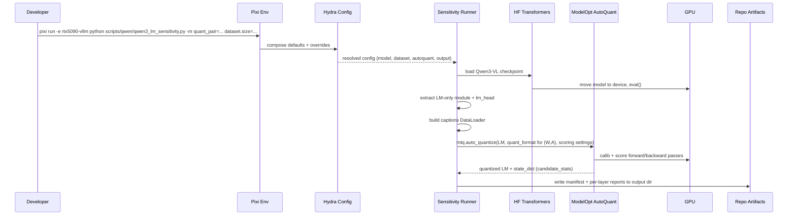

# Plan: Qwen3-VL LM-only per-layer sensitivity (FP4/FP8/INT8 weights, FP8/FP16 activations) with Hydra

## HEADER
- **Purpose**: Add a Hydra-configurable workflow to run Qwen3‑VL LM‑only per-layer sensitivity analysis across weight/activation precision pairs (W∈{FP4, FP8, INT8} × A∈{FP8, FP16}), reusing/refactoring existing ModelOpt AutoQuant tooling so experiments are easy to sweep and reproduce.
- **Status**: Draft
- **Date**: 2025-12-16
- **Dependencies**:
  - `models/qwen3_vl_4b_instruct/helpers/qwen3_vl_4b_autoquant_int8_lm/run_qwen3_vl_4b_autoquant_int8_lm.py`
  - `models/qwen3_vl_4b_instruct/helpers/qwen3_vl_4b_autoquant_all_layers/run_qwen3_vl_4b_autoquant_all_layers.py`
  - `scripts/qwen/run_qwen3_vl_4b_int8_sensitivity_3phase.sh`
  - `models/qwen3_vl_4b_instruct/layer-analysis/README.md`
  - `src/auto_quantize_model/modelopt_configs.py`
  - `extern/TensorRT-Model-Optimizer/modelopt/torch/quantization/config.py`
  - `context/plans/done/plan-modelopt-autoquant-fp8-qwen2_5-vl-mixed-schemes.md`
  - Hydra config tree: `conf/config.yaml`, `conf/model/qwen2_5_vl_3b_instruct/arch/qwen2_5_vl_3b_instruct.default.yaml`
- **Target**: Quantization / inference engineers (and AI assistants) running Qwen3‑VL sensitivity sweeps with ModelOpt and maintaining reproducible experiment configs.

---

## 1. Purpose and Outcome

We want a single, Hydra-configurable entry point to run **LM-only** per-layer sensitivity analysis for Qwen3‑VL (language model component only; vision tower kept higher precision) while sweeping:

- **Weight precision**: FP4, FP8, INT8
- **Activation precision**: FP8, FP16

Success looks like:

- A Hydra-driven runner that can reproduce the existing INT8 LM-only sensitivity run and extend it to the new (W,A) pairs via simple overrides or Hydra multirun.
- For each (W,A) pair and calibration subset size (small/medium/large), the runner writes a consistent set of artifacts:
  - `*_quant_manifest.json` (AutoQuant candidate stats + summary)
  - `layer-sensitivity-report.md` (human-readable)
  - `layer-sensitivity-report.json` (machine-readable)
  - `*_autoquant_state.pt` (ignored where appropriate)
- Outputs are organized in a predictable, publishable layout under `models/qwen3_vl_4b_instruct/layer-analysis/weight-<w>-act-<a>/...` (mirroring the existing `weight-int8-act-int8/` convention), with an option to write to `tmp/` during iteration.
- Existing ad-hoc scripts are refactored into reusable library functions and thin wrappers so configuration and experiment tracking lives in Hydra, not argparse/bash glue.

Assumptions / open questions to resolve early:

- “FP4” refers to **MXFP4** by default (ModelOpt exposes `W4A8_MXFP4_FP8_CFG` in the TRT-LLM-aligned build); NVFP4 variants are treated as optional/advanced.
- ModelOpt support for **INT8 weights + FP8 activations** (mixed integer/FP8 quantizers) must be validated; if unsupported, we will either (a) drop that pair or (b) treat “activation FP8” for INT8 as “W8A8 INT8” only when explicitly requested.
- Sensitivity scoring method is `gradient` by default (matching existing tooling), but should be configurable.

---

## 2. Implementation Approach

### 2.1 High-level flow

1. **Hydra compose config** selecting:
   - Qwen3‑VL checkpoint path and dtype
   - Text calibration source (COCO captions subset) and sampling size
   - AutoQuant scoring settings (method, score size, calib steps)
   - Quantization pair (weight format + activation format)
   - Output layout (tmp vs published `models/.../layer-analysis/`)
2. **Load Qwen3‑VL model** via Transformers, move to device, set eval mode.
3. **Extract language model module** from the VLM (`get_language_model_from_vl`) and obtain `lm_head` for LM loss computation.
4. **Build text-only calibration DataLoader** from captions.
5. **Build ModelOpt quantization format config** for the requested (W,A) pair:
   - Prefer ModelOpt built-in configs when they match the pair.
   - Use small, explicit custom configs only when needed (e.g., “MXFP4 weight-only”, “INT8 weight-only”, “INT8 weight + FP8 act”).
6. **Run `mtq.auto_quantize`** on the LM module with the configured scoring method and steps.
7. **Write artifacts** (manifest + reports) to the configured output dir.
8. **(Optional) Sweep runs** via Hydra multirun across pairs and dataset sizes, producing a grid of comparable outputs.

### 2.2 Hydra configuration design

Add a small Hydra config “task” dedicated to sensitivity analysis, reusing the existing `conf/` grouped tree patterns:

- **Model group**:
  - `conf/model/qwen3_vl_4b_instruct/arch/qwen3_vl_4b_instruct.default.yaml`
- **Dataset group** (text captions calibration):
  - `conf/dataset/vlm_coco2017_captions.yaml` with a `size: {small,medium,large}` field and an interpolated `captions_path`.
- **Quantization pair group** (primary UX knob):
  - `conf/quant_pair/wfp4_afp16.yaml`
  - `conf/quant_pair/wfp4_afp8.yaml`
  - `conf/quant_pair/wfp8_afp16.yaml`
  - `conf/quant_pair/wfp8_afp8.yaml`
  - `conf/quant_pair/wint8_afp16.yaml`
  - `conf/quant_pair/wint8_afp8.yaml` (guarded by an early runtime capability check)
- **AutoQuant settings**:
  - `conf/autoquant/gradient_default.yaml` (method, score size, effective bits, etc.)
- **Task config**:
  - `conf/preset/qwen3_lm_sensitivity.yaml` (defaults wiring + output conventions)

This design supports both:

- Single run: `python ... scripts/qwen/qwen3_lm_sensitivity.py quant_pair=wfp4_afp16 dataset.size=large`
- Sweep: `python ... -m quant_pair=wfp4_afp16,wfp4_afp8,wfp8_afp16,wfp8_afp8,wint8_afp16,wint8_afp8 dataset.size=small,medium,large`

### 2.3 Refactor strategy (reuse existing features)

Refactor the existing Qwen3 drivers into shared, testable helpers so the Hydra runner is thin:

- Move “core mechanics” into `src/auto_quantize_model/`:
  - Loading/extracting LM from VLM
  - Calibration dataset building
  - AutoQuant invocation wrapper (incl. forward_step + loss)
  - Manifest + report writing
- Keep the existing scripts under `models/qwen3_vl_4b_instruct/helpers/...` as:
  - Thin wrappers calling the shared library, or
  - Deprecated in favor of the Hydra runner (with README pointers and parity checks).

Key detail: update reporting so it remains readable when we add more than one candidate format in the future (even if the first implementation runs one (W,A) pair per run).

### 2.4 Sequence diagram (steady-state usage)

---

## 3. Files to Modify or Add

- **`conf/model/qwen3_vl_4b_instruct/arch/qwen3_vl_4b_instruct.default.yaml`** (new) Hydra model definition for the local Qwen3‑VL checkpoint.
- **`conf/dataset/vlm_coco2017_captions.yaml`** (new) Dataset config pointing at `datasets/vlm-quantize-calib/coco2017_captions_${size}.txt`.
- **`conf/quant_pair/*.yaml`** (new) One file per (W,A) pair (six total).
- **`conf/autoquant/gradient_default.yaml`** (new) Default AutoQuant scoring config for sensitivity runs.
- **`conf/preset/qwen3_lm_sensitivity.yaml`** (new) Top-level task config wiring defaults and output layout.
- **`scripts/qwen/qwen3_lm_sensitivity.py`** (new) Hydra entry-point script for LM-only sensitivity runs and sweeps.
- **`src/auto_quantize_model/qwen/autoquant_sensitivity.py`** (new) Shared implementation: model loading/extraction, dataloaders, AutoQuant wrapper, artifact writing.
- **`src/auto_quantize_model/modelopt_configs.py`** (update) Add/registry custom configs needed for missing (W,A) pairs (e.g., MXFP4 weight-only; INT8 weight-only; INT8 weight + FP8 act).
- **`models/qwen3_vl_4b_instruct/helpers/...`** (update) Refactor existing argparse drivers to call shared helpers or point users to the Hydra runner.
- **`scripts/qwen/run_qwen3_vl_4b_int8_sensitivity_3phase.sh`** (update, optional) Replace with Hydra multirun or keep as a thin wrapper around the new runner.
- **`models/qwen3_vl_4b_instruct/layer-analysis/README.md`** (update) Document new analysis folders and the Hydra regeneration command(s).

---

## 4. TODOs (Implementation Steps)

- [ ] **Confirm format mapping** Decide the canonical mapping for “FP4/FP8/INT8 weights” and “FP8/FP16 activations” to ModelOpt format configs; validate `wint8_afp8` feasibility with a tiny smoke run.
- [ ] **Add Hydra model config for Qwen3‑VL** Create `conf/model/qwen3_vl_4b_instruct/arch/...` mirroring the existing Qwen2.5 pattern.
- [ ] **Add Hydra dataset config for captions subsets** Implement `conf/dataset/vlm_coco2017_captions.yaml` and verify `size=small|medium|large` resolves to the correct file paths.
- [ ] **Define quant_pair config group** Add `conf/quant_pair/*.yaml` and document intended semantics (one run == one (W,A) pair).
- [ ] **Implement shared LM-only AutoQuant sensitivity module** Create `src/auto_quantize_model/qwen/autoquant_sensitivity.py` with type-hinted helpers for: loading/extracting LM, building DataLoader, running AutoQuant, writing artifacts.
- [ ] **Implement Hydra runner script** Add `scripts/qwen/qwen3_lm_sensitivity.py` using `@hydra.main(...)`, calling the shared module, and supporting `report_only` regeneration.
- [ ] **Refactor existing Qwen3 scripts to reuse helpers** Keep parity with current outputs (manifest keys, report filenames) and avoid duplicating loader/loss code.
- [ ] **Update/report output conventions** Ensure outputs land under a predictable directory structure (`models/.../layer-analysis/weight-<w>-act-<a>/...`), with an option to use `tmp/` during iteration.
- [ ] **Add lightweight unit tests** Cover pure functions (quant cfg builder, path/layout builder, report serializer) under `tests/unit/` without requiring GPUs.
- [ ] **Document usage** Update `models/qwen3_vl_4b_instruct/layer-analysis/README.md` with Hydra run and sweep examples that regenerate the committed artifacts.
