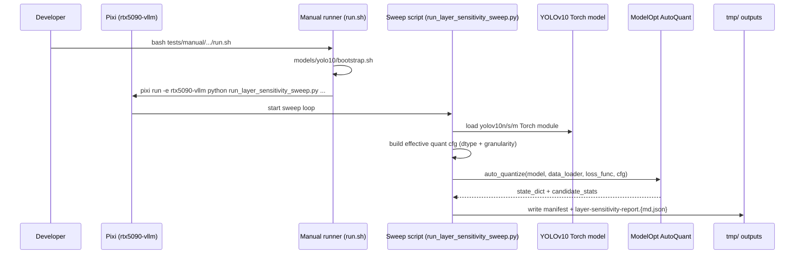

# Plan: YOLOv10 layer sensitivity sweep (ModelOpt AutoQuant)

## HEADER
- **Purpose**: Add a repeatable, manual-test workflow to run NVIDIA ModelOpt AutoQuant **per-layer sensitivity** analyses for YOLOv10 (`yolov10n/s/m`) across a grid of `(weight dtype, activation dtype, granularity)` using a medium-size COCO calibration subset.
- **Status**: Done
- **Date**: 2025-12-18
- **Dependencies**:
  - `context/instructions/prep-rtx5090-vllm.md`
  - `models/yolo10/bootstrap.sh`
  - `models/yolo10/checkpoints/` (expects `yolov10n.pt`, `yolov10s.pt`, `yolov10m.pt`)
  - `datasets/quantize-calib/quant100.txt` (used as the medium calibration list) and `datasets/coco2017/source-data/`
  - `src/auto_quantize_model/modelopt_autoquant.py` (manifest/report writers)
  - `src/auto_quantize_model/modelopt_configs.py` (format resolution; FP8/INT8/NVFP4/MXFP4/INT4 presets)
  - `src/auto_quantize_model/modelopt_quant_overrides.py` (granularity overlay helper)
  - Reference manual test pattern: `tests/manual/fp8fp8_yolo11n_granularity_sweep/`
- **Target**: Quantization engineers and AI assistants running reproducible YOLOv10 AutoQuant sensitivity sweeps.

---

## 1. Purpose and Outcome

We want a one-command, repeatable sweep that produces per-layer sensitivity artifacts for:

- **Models**: `yolov10n`, `yolov10s`, `yolov10m`
- **Weight dtype**: `int4`, `int8`, `fp4`, `fp8`
- **Activation dtype**: `int4`, `int8`, `fp4`, `fp8`
- **Granularity**: `per_channel`, `per_layer`

Success looks like:

- A manual-test entrypoint under `tests/manual/` that runs the full grid (or a filtered subset) using the `rtx5090-vllm` Pixi env.
- Each run produces:
  - `*_quant_manifest.json` (includes model id, dataset params, base format, overrides, and a small effective-config summary)
  - `layer-sensitivity-report.md` and `layer-sensitivity-report.json`
  - `composed-config.yaml` (run configuration snapshot)
  - `*_autoquant_state.pt` (ignored by Git in `tmp/`)
- Outputs and logs are written under `tmp/<subdir>/<timestamp>/...` with collision-free, human-browsable paths.
- The runner can **skip/mark unsupported combinations** (e.g., if ModelOpt can’t run `A=int4` on this model/build) without killing the entire sweep.

Note: ModelOpt preset support differs by build; the implementation should probe capabilities and fail fast per-run with clear logging rather than assuming every cross-product is valid.

### Implementation entrypoint

- Manual runner: `tests/manual/yolo10_layer_sensitivity_sweep/run.sh`
- Sweep driver: `tests/manual/yolo10_layer_sensitivity_sweep/scripts/run_layer_sensitivity_sweep.py`

---

## 2. Implementation Approach

### 2.1 High-level flow

1. Ensure YOLOv10 assets exist (`models/yolo10/bootstrap.sh`).
2. Build a **medium calibration batch list** from `datasets/quantize-calib/quant100.txt` (default: all 100 images) using YOLO-style letterbox preprocessing to `NCHW float32` in `[0,1]`.
3. For each `(model, weight_dtype, act_dtype, granularity)` combination:
   1. Load the YOLOv10 Torch module (`ultralytics.YOLOv10(...).model`) with the `torch.load(weights_only=False)` workaround.
   2. Construct a ModelOpt quantization config dict:
      - Start from a base preset chosen for the dtype pair (see 2.3).
      - Apply granularity overrides (see 2.2).
      - Optionally apply enable/disable toggles when presets default to `enable: False` for activations (e.g., INT4 weight-only presets).
   3. Run `modelopt.torch.quantization.auto_quantize` with:
      - `constraints={"effective_bits": <target>}`
      - `quantization_formats=[effective_cfg]` (single candidate; sensitivity comes from per-layer NONE vs quantized recipe selection)
      - `forward_step(model, batch)` that calls `model(batch["images"])`
      - A simple, stable loss (e.g., MSE over tensor leaves of the model output) to enable gradient-based scoring.
   4. Write artifacts to `tmp/<subdir>/<timestamp>/outputs/<model>/<w>-<a>/<granularity>/...` and logs to a parallel `logs/` tree.
4. Provide a small summarizer utility that prints top-k sensitive layers per run to a CSV/JSON index under the run root.

### 2.2 Granularity semantics (per-channel vs per-layer)

Define granularity in a way that is consistent for conv nets and implementable via ModelOpt knobs:

- **Weights**
  - `per_channel`: set `*weight_quantizer.axis = 0` (per-output-channel for Conv/Linear weights)
  - `per_layer`: set `*weight_quantizer.axis = null` (per-tensor / per-layer)
- **Activations** (YOLO uses `NCHW`)
  - `per_channel`: set `*input_quantizer.axis = 1`
  - `per_layer`: set `*input_quantizer.axis = null`

Implementation notes:

- For presets that use `block_sizes` (notably FP4/NVFP4/MXFP4 and INT4 blockwise presets), ModelOpt may require blockwise quantization for correctness/performance. Because ModelOpt disallows `axis` and `block_sizes` simultaneously, the runner should:
  - Attempt the requested granularity and catch failures.
  - Record “unsupported granularity for this dtype preset” and skip, rather than forcing an invalid config.

### 2.3 Quantization-format construction (dtype pair → base preset)

Implement a small mapping layer that chooses a base preset and then patches `num_bits`/enable fields where needed.

Candidate strategy:

- **`int8/int8`**: start from `INT8_DEFAULT_CFG`
- **`fp8/fp8`**: start from `FP8_DEFAULT_CFG`
- **`fp4/fp4`**: start from `NVFP4_DEFAULT_CFG` (or `MXFP4_DEFAULT_CFG` behind a flag)
- **`int4/*` and `*/int4`**:
  - Start from `INT4_BLOCKWISE_WEIGHT_ONLY_CFG` (or `INT4_AWQ_CFG` behind a flag) and explicitly enable/configure `*input_quantizer` for activation dtype where possible.
  - If activation `int4` is not supported by ModelOpt for this model/build, skip and log.

Key design choice: keep this mapping in one function so we can later swap in better presets like `W4A8_*` configs if they match a requested dtype pair.

### 2.4 Sequence diagram (steady-state usage)

---

## 3. Files to Modify or Add

- **`tests/manual/yolo10_layer_sensitivity_sweep/README.md`** add usage docs, expected outputs, and example filtered sweeps.
- **`tests/manual/yolo10_layer_sensitivity_sweep/run.sh`** entrypoint that creates `tmp/<subdir>/<timestamp>` and runs the sweep via `pixi run -e rtx5090-vllm`.
- **`tests/manual/yolo10_layer_sensitivity_sweep/scripts/run_layer_sensitivity_sweep.py`** main sweep driver (model loading, config generation, AutoQuant invocation, artifact writing, skip/continue behavior).
- **`src/auto_quantize_model/modelopt_quant_overrides.py`** (optional) extend supported override keys or add helpers to apply overrides to both `*..._quantizer` and `default` patterns when needed for vision nets.
- **`src/auto_quantize_model/modelopt_autoquant.py`** (optional) add a “quantized conv” detector for nicer manifests; sensitivity ranking itself already works via `candidate_stats`.

---

## 4. TODOs (Implementation Steps)

- [x] **Define supported matrix** Decide how to map `int4/int8/fp4/fp8` dtype names to ModelOpt presets and/or patched configs; document expected unsupported combos.
- [x] **Create manual test directory** Add `tests/manual/yolo10_layer_sensitivity_sweep/` with `README.md`, `run.sh`, and `scripts/run_layer_sensitivity_sweep.py`.
- [x] **Implement YOLOv10 loader** Load `ultralytics.YOLOv10(...).model` using local `models/yolo10/src` and `torch.load(weights_only=False)` patch.
- [x] **Implement calibration loader** Read first `N` images from `datasets/quantize-calib/quant100.txt` (default `N=100` as “medium”), letterbox to `imgsz`, produce `List[{"images": Tensor}]`.
- [x] **Implement output-aware loss** Make a stable `loss_func` that can handle YOLOv10 output dicts by reducing over all tensor leaves (MSE).
- [x] **Implement config builder** Build base config from preset and patch weight/input quantizers for requested dtype pair; record the effective config summary in manifest/logs.
- [x] **Implement granularity overlays** Apply `per_channel` vs `per_layer` via `apply_quant_cfg_overrides`; skip combinations that require `block_sizes` but request `axis`-based granularity.
- [x] **Implement sweep loop** Iterate models × dtype pairs × granularities; support filter flags and `--max-runs` for quick iteration; always “continue on failure” and write a failures index.
- [x] **Write artifacts** For each run, write `*_quant_manifest.json`, `layer-sensitivity-report.md/json`, `composed-config.yaml`, and `*_autoquant_state.pt` under `tmp/<subdir>/<timestamp>/...`.
- [x] **Smoke test** Run a small subset of the full grid (e.g., `yolov10n`, `fp8/fp8`, both granularities) and confirm artifacts are produced and no collisions occur.
- [x] **Document sweep examples** In the manual README, include full-grid and filtered examples, expected runtime scale, and how to resume/re-run safely.
