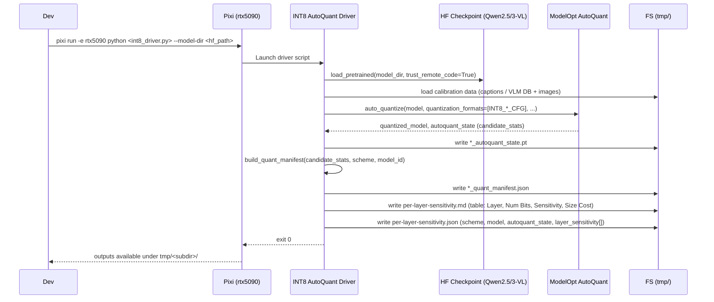

# Plan: INT8 Per-Layer Sensitivity for Qwen2.5-VL and Qwen3-VL

## HEADER
- **Purpose**: Design and implement INT8 (W8A8) ModelOpt configs and drivers to run per-layer sensitivity analysis for Qwen2.5-VL-3B and Qwen3-VL-4B, both for full VLM (vision + text towers) and LM-only text towers.
- **Status**: Draft
- **Date**: 2025-12-11
- **Dependencies**:
  - `src/auto_quantize_model/modelopt_configs.py`
  - `models/qwen2_5_vl_3b_instruct/helpers/qwen2_5_vl_3b_autoquant_fp8_schemes.py`
  - `models/qwen2_5_vl_3b_instruct/helpers/qwen2_5_vl_3b_autoquant_fp8_all_layers_per_scheme.py`
  - `models/qwen3_vl_4b_instruct/helpers/qwen3_vl_4b_autoquant_all_layers/run_qwen3_vl_4b_autoquant_all_layers.py`
  - `context/summaries/modelopt-kb/howto-modelopt-all-layer-sensitivity-analysis.md`
  - `context/instructions/prep-rtx5090.md`
- **Target**: Quantization / VLM developers and AI assistants

---

## 1. Purpose and Outcome

The goal of this plan is to extend the existing FP8 per-layer sensitivity tooling to support INT8 (W8A8) configurations for both Qwen2.5-VL-3B and Qwen3-VL-4B.

Success criteria:
- A reusable ModelOpt INT8 config for:
  - **LM-only** flows that respect ModelOpt’s default name/pattern filtering (text tower only, vision in higher precision).
  - **All-layers VLM** flows that attempt to quantize both vision and text towers (subject to ModelOpt constraints).
- For each model (Qwen2.5-VL and Qwen3-VL), the ability to run:
  - INT8 LM-only AutoQuant per-layer sensitivity.
  - INT8 all-layers VLM AutoQuant per-layer sensitivity.
- Each run produces paired outputs:
  - `per-layer-sensitivity.md` — human-readable table with columns `Layer`, `Num Bits`, `Sensitivity`, `Size Cost`.
  - `per-layer-sensitivity.json` — structured summary with keys `scheme`, `model`, `autoquant_state`, and `layer_sensitivity` (array of `{layer, num_bits, sensitivity, size_cost}`).

This gives a parallel set of INT8 sensitivity artifacts to compare against existing FP8 runs, enabling both scheme design and cross-precision analysis.

## 2. Implementation Approach

### 2.1 High-level flow

1. **Design ModelOpt INT8 configs**:
   - Derive an `INT8_DEFAULT_LM_CFG` based on ModelOpt’s built-in INT8 config for LLMs, preserving name-pattern filters and default enablement.
   - Derive an `INT8_ALL_LAYERS_CFG` that mirrors `FP8_ALL_LAYERS_CFG` but uses INT8 quantizers and enables all quantizable layers (VLM vision + text.
2. **Expose configs via `CUSTOM_QUANT_CONFIGS`**:
   - Register new INT8 configs with stable names (e.g., `INT8_LM_DEFAULT_CFG`, `INT8_ALL_LAYERS_CFG`) under `CUSTOM_QUANT_CONFIGS` in `modelopt_configs.py`.
3. **Extend Qwen2.5-VL LM-only AutoQuant driver**:
   - Add new schemes in `AUTOQUANT_FP8_SCHEMES`-like registry for INT8 (e.g., `int8_autoquant_top25`, `int8_autoquant_full`) pointing at `INT8_LM_DEFAULT_CFG`.
   - Allow choosing between FP8 and INT8 via `--scheme-name` and/or a new `--quant-format` flag.
4. **Add Qwen2.5-VL all-layers INT8 driver**:
   - Clone the existing `qwen2_5_vl_3b_autoquant_fp8_all_layers_per_scheme` flow to an INT8 variant that uses `INT8_ALL_LAYERS_CFG`.
   - Ensure it writes per-scheme `per-layer-sensitivity.{md,json}` with consistent shape.
5. **Extend Qwen3-VL all-layers helper for INT8**:
   - Add an optional `--quant-format` or `--scheme-type` flag to `run_qwen3_vl_4b_autoquant_all_layers.py` (or a new sibling script) to switch between `FP8_ALL_LAYERS_CFG` and `INT8_ALL_LAYERS_CFG`.
   - Maintain identical JSON/Markdown output shape for FP8 and INT8 runs, only changing scheme metadata.
6. **Add LM-only INT8 helper for Qwen3-VL**:
   - Implement a Qwen3-VL LM-only AutoQuant driver (similar to Qwen2.5’s LM-only script) using `INT8_LM_DEFAULT_CFG` and text-only COCO captions.
   - Emit `per-layer-sensitivity.{md,json}` under `tmp/qwen3_vl_4b_autoquant_int8_lm/`.
7. **Wire environment + calibration data**:
   - Use the `rtx5090` Pixi env (Transformers ≥ 4.57, ModelOpt installed).
   - Reuse the existing calibration sources:
     - Text-only: `datasets/vlm-quantize-calib/coco2017_captions.txt`.
     - VLM: `datasets/vlm-quantize-calib/coco2017_vlm_calib.db` + `datasets/coco2017/source-data`.
8. **Validate numerically on small budgets**:
   - Run each INT8 driver with reduced `--max-calib-samples` and `--auto-quantize-score-size` for quick sanity checks.
   - Confirm that:
     - AutoQuant converges with a reasonable `effective_bits`.
     - `per-layer-sensitivity.{md,json}` are produced and parsed correctly.
9. **Document usage**:
   - Update relevant READMEs (Qwen2.5-VL helpers, Qwen3-VL helpers, plus a short note in `models/README.md`) to show example Pixi commands for the INT8 per-layer analysis.

### 2.2 Sequence diagram (steady-state usage)

## 3. Files to Modify or Add

- **src/auto_quantize_model/modelopt_configs.py**
  - Add INT8 ModelOpt configs (`INT8_LM_DEFAULT_CFG`, `INT8_ALL_LAYERS_CFG`) and register them in `CUSTOM_QUANT_CONFIGS`.
- **models/qwen2_5_vl_3b_instruct/helpers/qwen2_5_vl_3b_autoquant_fp8_schemes.py**
  - Extend scheme registry for INT8 LM-only schemes; factor out common AutoQuant wiring so FP8/INT8 share code.
  - Add `write_layer_sensitivity_json` helper (already present) to handle INT8 as well.
- **models/qwen2_5_vl_3b_instruct/helpers/qwen2_5_vl_3b_autoquant_fp8_all_layers_per_scheme.py**
  - Allow selecting INT8 all-layers config and generate `per-layer-sensitivity.{md,json}` per scheme.
- **models/qwen3_vl_4b_instruct/helpers/qwen3_vl_4b_autoquant_all_layers/run_qwen3_vl_4b_autoquant_all_layers.py**
  - Generalize to support an INT8 all-layers scheme (via flag or new entry point) and ensure both FP8 and INT8 write `per-layer-sensitivity.{md,json}`.
- **models/qwen3_vl_4b_instruct/helpers/qwen3_vl_4b_autoquant_int8_lm/run_qwen3_vl_4b_autoquant_int8_lm.py** (new)
  - New LM-only INT8 AutoQuant driver for Qwen3-VL-4B, mirroring the Qwen2.5 LM-only flow.
- **context/instructions/prep-rtx5090.md**
  - Optionally add a short note that INT8 per-layer analysis uses `rtx5090` with ModelOpt and where outputs are written.
- **models/qwen2_5_vl_3b_instruct/README.md** and **models/qwen3_vl_4b_instruct/README.md**
  - Brief usage examples for running INT8 per-layer sensitivity.

## 4. TODOs (Implementation Steps)

### 4.1 Shared / Core work

- [x] **Add INT8 configs in ModelOpt wrapper** Implemented `INT8_LM_DEFAULT_CFG` and `INT8_ALL_LAYERS_CFG` in `src/auto_quantize_model/modelopt_configs.py` and exposed them via `CUSTOM_QUANT_CONFIGS` for reuse across Qwen2.5-VL and Qwen3-VL.
- [ ] **Prepare shared calibration subsets** Create or document small, medium, and large calibration subsets for both text-only and VLM flows (e.g., ~10 / 100 / 512 samples from `datasets/vlm-quantize-calib/coco2017_captions.txt` and `coco2017_vlm_calib.db`) so Qwen2.5-VL and Qwen3-VL INT8 drivers can reuse the same calibration sizes.
- [ ] **Wire calibration defaults and CLI flags** Ensure all drivers (Qwen2.5-VL and Qwen3-VL, LM-only and all-layers) share sensible defaults for `--max-calib-samples`, `--auto-quantize-score-size`, model paths, and an option to pick FP8 vs INT8 schemes via CLI.
- [ ] **Update docs and context** Refresh relevant READMEs and (optionally) context docs to point to the new INT8 per-layer analysis commands and explain how INT8 and FP8 runs can be compared.

### 4.2 Qwen3-VL tasks

- [x] **Generalize Qwen3-VL all-layers helper for INT8** Updated `models/qwen3_vl_4b_instruct/helpers/qwen3_vl_4b_autoquant_all_layers/run_qwen3_vl_4b_autoquant_all_layers.py` to accept a `--quant-format {fp8,int8}` flag, select between `FP8_ALL_LAYERS_CFG` and `INT8_ALL_LAYERS_CFG`, and emit `per-layer-sensitivity.{md,json}` with a shared manifest structure.
- [x] **Implement Qwen3-VL LM-only INT8 driver** Added `models/qwen3_vl_4b_instruct/helpers/qwen3_vl_4b_autoquant_int8_lm/run_qwen3_vl_4b_autoquant_int8_lm.py` that mirrors the Qwen2.5 LM-only AutoQuant flow but uses `INT8_LM_DEFAULT_CFG`, text-only COCO captions, and writes into `tmp/qwen3_vl_4b_autoquant_int8_lm/`.
- [ ] **Run Qwen3-VL INT8 sanity tests (3-phase)** In the `rtx5090` env, run both LM-only and all-layers INT8 drivers for Qwen3-VL with:
  - A tiny calibration set (≈10 samples) to validate basic wiring and output files.
  - A medium calibration set (≈100 samples) to check stability of scores and runtime.
  - A large calibration set (≈512 samples) to generate final, high-resolution per-layer sensitivity artifacts.

### 4.3 Qwen2.5-VL tasks

- [x] **Extend Qwen2.5-VL LM-only AutoQuant for INT8** Updated `models/qwen2_5_vl_3b_instruct/helpers/qwen2_5_vl_3b_autoquant_fp8_schemes.py` to add `int8_autoquant_*` LM-only schemes backed by `INT8_LM_DEFAULT_CFG`, sharing the existing AutoQuant wiring and emitting `per-layer-sensitivity.{md,json}`.
- [x] **Add Qwen2.5-VL all-layers INT8 variant** Extended `models/qwen2_5_vl_3b_instruct/helpers/qwen2_5_vl_3b_autoquant_fp8_all_layers_per_scheme.py` with a `--quant-format {fp8,int8}` flag so it can reuse FP8 coverage manifests while driving INT8 all-layers schemes via `INT8_ALL_LAYERS_CFG`, writing per-scheme Markdown + JSON in a `layer-sensitivity/` subdir.
- [ ] **Run Qwen2.5-VL INT8 sanity tests (3-phase)** In the `rtx5090` env, run both LM-only and all-layers INT8 drivers with:
  - A tiny calibration set (≈10–16 samples) to validate basic wiring and output files. (LM and all-layers top-10 INT8 sanity runs completed.)
  - A medium calibration set (≈100 samples) to check stability of scores and runtime.
  - A large calibration set (≈512 samples) to generate final, high-resolution per-layer sensitivity artifacts.
