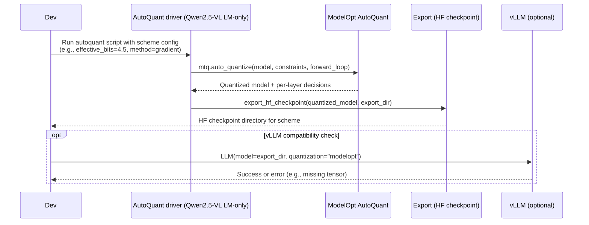

# Plan: ModelOpt AutoQuant FP8 schemes for Qwen2.5‑VL‑3B (LM-only)

## HEADER
- **Purpose**: Use ModelOpt’s sensitivity-based AutoQuant path to derive multiple FP8 mixed-precision schemes for the Qwen2.5‑VL‑3B language model, varying how many layers are quantized, while keeping the vision tower unquantized and vLLM compatibility in mind.
- **Status**: Draft
- **Date**: 2025-12-09
- **Dependencies**:
  - `extern/TensorRT-Model-Optimizer/examples/llm_ptq/hf_ptq.py`
  - `extern/TensorRT-Model-Optimizer/modelopt/torch/quantization/model_quant.py`
  - `extern/TensorRT-Model-Optimizer/modelopt/torch/quantization/utils.py`
  - `models/qwen2_5_vl_3b_instruct/quantized/fp8_fp8_coco2017` (baseline FP8 LM-only checkpoint)
  - `models/qwen2_5_vl_3b_instruct/reports/fp8-vlm-vs-textonly-vllm-compat.md`
  - `models/qwen2_5_vl_3b_instruct/reports/report-fp8-text-only.md`
- **Target**: Quantization / inference engineers (and AI assistants) experimenting with FP8 mixed-precision schemes for Qwen2.5‑VL under ModelOpt + vLLM.

---

## 1. Purpose and Outcome

We want to move beyond a single “all‑eligible FP8” config and:

- Explicitly use **ModelOpt AutoQuant** (sensitivity-based search) to derive **multiple mixed-precision FP8 schemes** for the Qwen2.5‑VL‑3B **language model only**.
- Control the **fraction of layers quantized** (e.g., “top‑K quantized blocks by sensitivity”, different effective bits budgets), while:
  - Keeping the **vision tower unquantized** (BF16/FP16), consistent with community practice.
  - Preserving or at least understanding **vLLM compatibility** (i.e., which schemes still load cleanly in vLLM).
- Capture the resulting schemes, configs, and artifacts in a reproducible way so future runs can reuse or refine them.

Success looks like:

- A small set of named schemes (e.g., `fp8_autoquant_top25`, `fp8_autoquant_top50`, `fp8_autoquant_full`) with:
  - Corresponding exported HF checkpoints under `models/qwen2_5_vl_3b_instruct/quantized/`.
  - Documented per-layer quantization decisions and effective bits summaries.
- A reusable Python driver that:
  - Runs AutoQuant for Qwen2.5‑VL‑3B LM with different `--auto_quantize_bits` / scoring settings.
  - Outputs machine-readable quantization manifests (e.g., JSON) indicating which layers are FP8 vs BF16/FP16.
- Optional: a vLLM sanity script that attempts to load each scheme and records whether it is compatible, plus any error traces when it is not.

## 2. Implementation Approach

### 2.1 High-level flow

1. **Review and constrain AutoQuant behavior for Qwen2.5‑VL**  
   - Confirm how `hf_ptq.py` wires `mtq.auto_quantize` (`auto_quantize_bits`, `auto_quantize_method`, `num_score_steps`, etc.).  
   - Decide on a **language-model-only AutoQuant** usage: we still reuse the “extract language model, disable vision” pattern from the existing FP8 path.
2. **Design a set of AutoQuant scenarios**  
   - Pick 2–3 effective bits targets or other knobs to produce different FP8 coverage levels (e.g., more aggressive vs conservative).  
   - Decide how to map AutoQuant’s outputs into “top‑K layers quantized” schemes if needed (e.g., by sensitivity ranking).
3. **Implement a Qwen2.5‑VL‑specific AutoQuant driver**  
   - New Python script under `scripts/qwen/` that:
     - Loads the LM-only Qwen2.5‑VL model.  
     - Builds a calibration forward loop (text-only, COCO captions) or uses `create_forward_loop`.  
     - Calls `mtq.auto_quantize` with configurable `effective_bits` / methods.  
     - Collects per-layer quantization decisions and writes them out as a manifest.
4. **Export multiple HF checkpoints using derived schemes**  
   - For each scheme:
     - Apply the chosen AutoQuant config (or filtered quantization config) to the LM.  
     - Export a unified HF checkpoint via `export_hf_checkpoint` under a distinct directory (e.g., `fp8_autoquant_top25_coco2017`, `fp8_autoquant_top50_coco2017`).
5. **Probe vLLM compatibility**  
   - For each exported scheme:
     - Attempt to load with `scripts/qwen/run_qwen2_5_vl_3b_vllm_fp8.py` (pointed at the new path).  
     - Record whether vLLM loads successfully or fails (and with what error), annotating which schemes are practically usable vs “ModelOpt-only”.
6. **Document schemes and results**  
   - Extend or add report(s) under `models/qwen2_5_vl_3b_instruct/reports/` summarizing:
     - AutoQuant settings used.  
     - Quantized vs non-quantized layer counts for each scheme.  
     - Any vLLM compatibility findings.

### 2.2 Sequence diagram (steady-state usage)

## 3. Files to Modify or Add

- **scripts/qwen/quantize_qwen2_5_vl_3b_fp8_coco2017.sh**
  - Optionally add a reference to the AutoQuant driver (as “advanced/sensitivity-based path”) in comments.
- **scripts/qwen/qwen2_5_vl_3b_autoquant_fp8_schemes.py** (new)
  - Main AutoQuant driver for Qwen2.5‑VL‑3B LM-only.
  - CLI flags for `--scheme-name`, `--auto-quantize-bits`, `--auto-quantize-method`, `--score-size`, etc.
  - Produces quantization manifests and exported checkpoints.
- **scripts/qwen/run_qwen2_5_vl_3b_vllm_fp8.py**
  - Optionally extend to accept a `--scheme-name` or explicit model dir for testing multiple schemes.
- **models/qwen2_5_vl_3b_instruct/reports/report-fp8-autoquant-schemes.md** (new)
  - Report summarizing AutoQuant settings, schemes, and vLLM compatibility.
- **context/summaries/modelopt-kb/howto-configure-pixi-vllm-for-modelopt-fp8.md**
  - Optional cross-link or short note about using AutoQuant-based schemes for advanced experiments.

## 4. TODOs (Implementation Steps)

- [ ] **Confirm AutoQuant hooks** Review `hf_ptq.py` and `model_quant.py` to understand how `mtq.auto_quantize` is used and how `auto_quantize_bits` interacts with `quant_cfg`.
- [ ] **Define scheme variants** Decide on 2–3 AutoQuant configurations (effective bits / methods / score sizes) that will produce clearly different mixed-precision schemes.
- [ ] **Implement AutoQuant driver** Add `scripts/qwen/qwen2_5_vl_3b_autoquant_fp8_schemes.py` to:
  - Load LM-only Qwen2.5‑VL‑3B.  
  - Build a calibration forward loop over COCO captions.  
  - Invoke `mtq.auto_quantize` with chosen settings.  
  - Save per-layer quantization decisions (e.g., JSON manifest).
- [ ] **Export checkpoints per scheme** For each scheme, export a unified HF checkpoint under `models/qwen2_5_vl_3b_instruct/quantized/<scheme_name>` using `export_hf_checkpoint`.
- [ ] **Check vLLM compatibility** Use `scripts/qwen/run_qwen2_5_vl_3b_vllm_fp8.py` (or a small helper) to try loading each scheme in the `rtx5090-vllm` env, capturing whether it succeeds or fails.
- [ ] **Write autoquant report** Create `models/qwen2_5_vl_3b_instruct/reports/report-fp8-autoquant-schemes.md` summarizing schemes, layer counts (FP8 vs BF16/FP16), and vLLM compatibility.
- [ ] **Optional doc cross-links** Update relevant context/KB docs to mention AutoQuant-based FP8 schemes as an advanced option and to point to the new report and driver script.

