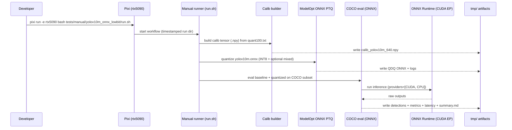

# Plan: Quantize CV YOLOv10m (ONNX) with low-bit schemes from layer sensitivity

## HEADER
- **Purpose**: Produce reproducible INT8 and (if supported) INT4/mixed-precision quantized variants of `models/cv-models/yolov10m/checkpoints/yolov10m.onnx` guided by per-layer sensitivity, then compare accuracy (COCO mAP) and performance (ORT/TensorRT) against the baseline in the RTX 5090 Pixi environment.
- **Status**: Draft
- **Date**: 2025-12-22
- **Dependencies**:
  - `context/tasks/task-anything.md`
  - `context/instructions/prep-rtx5090.md`
  - `models/cv-models/yolov10m/README.md`
  - `models/cv-models/helpers/run_random_onnx_inference.py`
  - `datasets/coco2017/bootstrap.sh`, `datasets/quantize-calib/quant100.txt`
  - Calibration builder pattern: `scripts/yolo11/make_yolo11_calib_npy.py`
  - ModelOpt ONNX PTQ pattern: `scripts/yolo11/quantize_yolo11n_int8_onnx.sh`
  - ONNX COCO eval pattern: `scripts/yolo11/eval_yolo11_onnx_coco.py`
  - Sensitivity sweep driver: `tests/manual/yolo10_layer_sensitivity_sweep/scripts/run_layer_sensitivity_sweep.py`
  - ModelOpt format presets: `src/auto_quantize_model/modelopt_configs.py`, `src/auto_quantize_model/modelopt_quant_overrides.py`
  - ModelOpt KB: `context/summaries/modelopt-kb/howto-modelopt-onnx-ptq-for-yolo11.md`, `context/summaries/modelopt-kb/howto-qdq-onnx-to-mixed-precision-tensorrt.md`
- **Target**: Quantization engineers and AI assistants running YOLOv10m PTQ + mixed-precision experiments on RTX 5090.

---

## 1. Purpose and Outcome

We want to quantize `models/cv-models/yolov10m/checkpoints/yolov10m.onnx` using low-bit schemes informed by per-layer sensitivity analysis, and measure the accuracy/performance tradeoffs.

Success looks like:

- A repeatable, one-command manual workflow (via `pixi run -e rtx5090 ...`) that:
  - Builds a calibration tensor from `datasets/quantize-calib/quant100.txt`.
  - Produces an **INT8 Q/DQ ONNX** artifact as a deployable baseline.
  - Produces one or more **candidate “mixed” schemes** (e.g., keep top‑K sensitive layers in FP16/INT8, quantize the rest more aggressively), subject to tool support for INT4 and/or mixed precision in the chosen ONNX/TensorRT path.
  - Evaluates baseline + candidates on a fixed COCO2017 val subset (mAP bbox) and benchmarks latency/throughput.
- Artifacts are written under a timestamped `tmp/yolov10m_lowbit/<run-id>/...` directory and include:
  - Quantization settings snapshots (CLI args / YAML / manifest JSON).
  - Quantized ONNX outputs (and optional TensorRT engines) plus build logs.
  - COCO evaluation outputs (detections + metrics JSON) and a concise results summary Markdown.

Non-goals:
- Training/fine-tuning, architectural changes, or claiming 1:1 transferability of Ultralytics (Torch) sensitivity rankings to the independently managed `models/cv-models` ONNX artifact.

## 2. Implementation Approach

### 2.1 High-level flow

1. **Bootstrap and baseline**
   1. Verify the ONNX checkpoint exists: `models/cv-models/yolov10m/checkpoints/yolov10m.onnx` (symlink target reachable).
   2. Bootstrap COCO2017 + calibration list:
      - `bash datasets/coco2017/bootstrap.sh`
      - Confirm `datasets/quantize-calib/quant100.txt` points at real images.
   3. Baseline smoke checks:
      - ORT sanity: run `models/cv-models/helpers/run_random_onnx_inference.py` on the model.
      - COCO baseline: run a new `eval_yolov10m_onnx_coco.py` (Section 3) on the **medium** subset (100 COCO val images) and save metrics JSON.

2. **Calibration tensor**
   1. Generate an `[N, 3, 640, 640]` float32 calibration tensor under `tmp/` using YOLO-style preprocessing (letterbox + RGB + `[0,1]` scaling).
   2. Prefer a shared/scripted builder so the exact preprocessing is reproducible and reused by both quantization and evaluation.

3. **Deployable INT8 ONNX PTQ baseline (ModelOpt)**
   1. Add a wrapper script (mirroring `scripts/yolo11/quantize_yolo11n_int8_onnx.sh`) to run `python -m modelopt.onnx.quantization` for `yolov10m.onnx`.
   2. Start with `--quantize_mode=int8` and `--calibration_method=max` and run calibration on GPU: `--calibration_eps "cuda:0 cpu"`.
   3. Validate:
      - ORT inference runs end-to-end (CUDA EP preferred).
      - Numeric sanity via a simple baseline vs QDQ comparison (reuse `scripts/yolo11/compare_quantize_precision.py` patterns if helpful).
      - COCO mAP + latency comparisons vs baseline.

4. **Sensitivity-guided mixed schemes (decision point: ONNX-native vs Torch-exported)**

   Important: `models/cv-models/yolov10m` (ONNX) and `models/yolo10` (Ultralytics Torch) are independent artifacts. Mixed-precision “layer keep” policies only make sense if we can reliably target corresponding layers/nodes.

   1. Run a YOLOv10m Torch sensitivity sweep (methodology/proxy) using the existing manual tooling:
      - `pixi run -e rtx5090 python tests/manual/yolo10_layer_sensitivity_sweep/scripts/run_layer_sensitivity_sweep.py ... --models yolov10m --weight-dtypes int4 int8 --act-dtypes fp8 --granularities per_layer`
   2. Propose candidate policies from `layer-sensitivity-report.{md,json}`:
      - Keep top‑K most sensitive layers at FP16 (or INT8), quantize the remainder to INT4 (or INT8) as appropriate.
      - Keep the candidate set small (e.g., K ∈ {0, 5, 10, 20}) to make evaluation tractable.
   3. Choose one of these implementation paths (based on tool support and layer-name alignment):
      - **Path A (ONNX-native, preferred if supported)**: Implement mixed precision by **excluding node/layer sets from quantization** in the ModelOpt ONNX PTQ workflow (e.g., keep excluded nodes in FP16). This requires verifying ModelOpt ONNX PTQ supports node/op exclusion or per-node overrides for this model.
      - **Path B (Torch → quantize → export)**: Quantize the Ultralytics YOLOv10m Torch checkpoint with ModelOpt mixed precision / per-layer overrides, then export a new ONNX artifact and evaluate that ONNX. Treat this as a research/development artifact unless it is confirmed deployable and matches the target `models/cv-models` ONNX behavior closely enough.

5. **Performance measurement (ORT + optional TensorRT)**
   1. ORT CUDA EP latency: measure warmup + steady-state iterations with fixed input shape `1x3x640x640`, recording mean/p50/p95.
   2. Optional TensorRT:
      - Build FP16 baseline and QDQ-driven INT8/mixed engines with `trtexec`, using `--precisionConstraints=obey` for QDQ models.
      - Record engine build logs and per-layer precision summaries if available (for mixed precision verification).

6. **Results summary and iteration**
   1. Write a compact results table (baseline vs each candidate) including:
      - COCO mAP (AP@[.5:.95]) on the chosen subset
      - Latency (ms) / throughput (img/s) for ORT (and TRT if used)
      - Notes on scheme settings (K, dtypes, exclusions, calibration method)
   2. Iterate K / scheme definitions until the best latency ↔ accuracy tradeoff is identified.

### 2.2 Sequence diagram (steady-state usage)

---

## 3. Files to Modify or Add

- **`tests/manual/yolov10m_onnx_lowbit/README.md`** Document end-to-end workflow, expected artifacts, and example commands in the `rtx5090` Pixi env.
- **`tests/manual/yolov10m_onnx_lowbit/run.sh`** Orchestrate: bootstrap checks → calibration tensor → quantize → eval/bench; write everything under `tmp/yolov10m_lowbit/<run-id>/`.
- **`scripts/cv-models/quantize_yolov10m_int8_onnx.sh`** ModelOpt ONNX PTQ wrapper (INT8 baseline), mirroring `scripts/yolo11/quantize_yolo11n_int8_onnx.sh`.
- **`scripts/cv-models/eval_yolov10m_onnx_coco.py`** COCO2017 val evaluator for YOLOv10m ONNX (preprocess → ORT → decode → NMS → COCOeval + latency stats).
- **`scripts/cv-models/bench_onnxruntime.py`** (optional) A small, model-agnostic ORT benchmarking helper reused by eval scripts.
- **`models/cv-models/yolov10m/README.md`** Add “Quantization + evaluation quickstart” section with stable paths and recommended commands.
- **`context/tasks/task-anything.md`** (optional) Link to the plan file and point at the new manual runner as the canonical “how to run”.

## 4. TODOs (Implementation Steps)

- [ ] **Confirm prerequisites** Verify `yolov10m.onnx` symlink, COCO dataset bootstrap, and baseline ORT inference in `pixi run -e rtx5090`.
- [ ] **Baseline COCO eval** Implement `scripts/cv-models/eval_yolov10m_onnx_coco.py` and capture baseline metrics + latency on a fixed subset.
- [ ] **Calibration tensor builder** Reuse or refactor a YOLO-style calibration tensor builder and standardize output location under `tmp/yolov10m_lowbit/<run-id>/`.
- [ ] **INT8 ONNX PTQ wrapper** Add `scripts/cv-models/quantize_yolov10m_int8_onnx.sh` and validate ORT + COCO eval on the quantized QDQ output.
- [ ] **Sensitivity sweep runbook** Add a short, reproducible command template for `tests/manual/yolo10_layer_sensitivity_sweep/...` (yolov10m, int4/int8 weights, fp8 activations) and store outputs under `tmp/`.
- [ ] **Candidate mixed schemes** Define K-based mixed-precision policies from the sensitivity report(s) and choose the implementable path (ONNX-native exclusions vs Torch→export).
- [ ] **Materialize mixed/low-bit artifacts** Implement the selected approach to generate candidate INT4/INT8/mixed artifacts, recording exact settings (and skip unsupported combos cleanly).
- [ ] **Benchmark ORT (+ optional TRT)** Measure latency/throughput for baseline and all candidates; optionally build TRT engines with `--precisionConstraints=obey` and record per-layer precision summaries.
- [ ] **Summarize results** Write `tmp/yolov10m_lowbit/<run-id>/summary.md` with a comparison table and a short recommendation of the best scheme.
- [ ] **(Optional) INC cross-check** Run an INC PTQ/tuning flow for INT8 and compare accuracy/latency and (if available) sensitivity ranking against ModelOpt.
