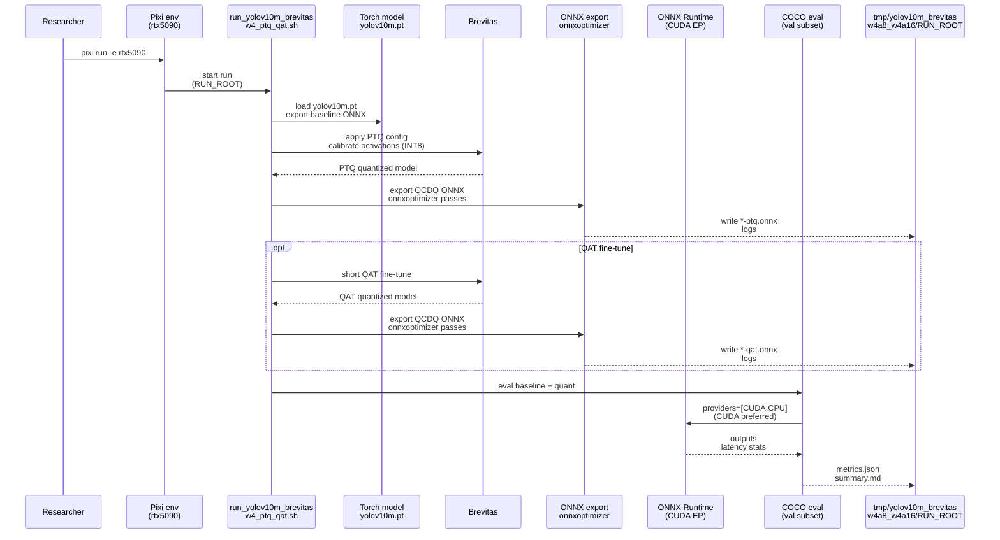

# Plan: Quantize Ultralytics YOLOv10m (`yolov10m.pt`) to W4/W8 variants ONNX (Brevitas PTQ + optional QAT, QCDQ, RTX 5090)

## HEADER
- **Purpose**: Produce reproducible YOLOv10m ONNX artifacts for research that express **4-bit and 8-bit weights** with either **floating activations/compute (A16-like)** or **INT8 fake-quant activations (A8)**, using **PTQ first** and **optional QAT**, and validate they run on **ONNX Runtime CUDA EP** in the `rtx5090` Pixi environment.
- **Status**: In progress (W8 PTQ sanity checks pass; Ultralytics-trainer QAT logging added; W4 accuracy still low)
- **Date**: 2025-12-23
- **Dependencies**:
  - `context/instructions/prep-rtx5090.md`
  - `context/hints/about-brevitas-yolo-w4a8-w4a16-onnx-nvidia-gpu.md`
  - `models/yolo10/README.md`
  - `models/yolo10/checkpoints/yolov10m.pt`
  - `models/yolo10/helpers/convert_to_onnx.py`
  - `datasets/quantize-calib/quant100.txt`
  - `models/cv-models/yolov10m/README.md` (ONNX output contract reference)
  - `scripts/cv-models/make_yolov10m_calib_npy.py`
  - `scripts/cv-models/eval_yolov10m_onnx_coco.py`
- **Target**: Quantization engineers and AI assistants running low-bit YOLO experiments on RTX 5090.

---

## 0. Current Status

- Baseline + PTQ exports (W8A16, W8A8, W4A16(-like), W4A8) and ORT CUDA EP evaluation are implemented and reproducible.
- W8 PTQ sanity checks show only modest accuracy drop vs baseline (pipeline correctness likely OK):
  - baseline `mAP_50_95=0.6022`
  - PTQ W8A16 `mAP_50_95=0.5983`
  - PTQ W8A8 `mAP_50_95=0.5932`
- W4 remains the main issue:
  - PTQ W4A16 `mAP_50_95=0.1277`
  - PTQ W4A8 `mAP_50_95=0.1150`
  - QAT W4A8 partial recovery: `mAP_50_95=0.2912`
- Reference run root and dataset-aware report: `tmp/yolov10m_brevitas_w4a8_w4a16/2025-12-23_16-12-40/summary.md`

## 1. Purpose and Outcome

We want an **inspectable ONNX graph** for YOLOv10m that expresses “W4A16” and “W4A8” in a way that is **runnable on NVIDIA GPU** (ORT CUDA EP), even if it does not provide “true INT4 Conv kernels”.

Terminology note: In this plan, **W4A8 means INT8 activations** represented with ONNX Q/DQ (`QuantizeLinear` / `DequantizeLinear`) and floating-point compute after dequantization; it does **not** mean FP8.

Success looks like:

- A reproducible, scriptable workflow (Pixi `rtx5090`) starting from the **public Ultralytics checkpoint** `models/yolo10/checkpoints/yolov10m.pt`, producing artifacts under `tmp/yolov10m_brevitas_w4a8_w4a16/<run-id>/`:
  - Baseline export: `onnx/yolov10m-baseline-fp16.onnx` (or FP32 if FP16 export is unavailable).
  - PTQ exports:
    - `onnx/yolov10m-w8a16-qcdq-ptq.onnx` (sanity check: weight-only INT8)
    - `onnx/yolov10m-w8a8-qcdq-ptq.onnx` (sanity check: INT8 weights + INT8 activations)
    - `onnx/yolov10m-w4a16-qcdq-ptq.onnx`
    - `onnx/yolov10m-w4a8-qcdq-ptq.onnx`
  - QAT exports (optional, if PTQ accuracy loss is too large):
    - `onnx/yolov10m-w4a16-qcdq-qat.onnx`
    - `onnx/yolov10m-w4a8-qcdq-qat.onnx`
- All produced ONNX artifacts pass:
  - **Random-tensor smoke** inference on **CUDAExecutionProvider** (CPU is last resort).
  - A small **COCO val subset** run via `scripts/cv-models/eval_yolov10m_onnx_coco.py` with providers ordered `CUDAExecutionProvider CPUExecutionProvider` and optional `--disable-cpu-fallback` for “GPU-only” enforcement.
- Each run captures a minimal “repro bundle” under `tmp/.../<run-id>/`:
  - Export/quant config snapshot (JSON/YAML), environment snapshot (package versions), and build logs.
  - A short `summary.md` comparing baseline vs W8A16/W8A8 vs W4A16(-like)/W4A8 (accuracy/latency for the chosen subset).

Correctness sanity check:

- If we are using the quantization framework and evaluation tooling correctly, **W8A16 and W8A8 PTQ should not collapse** in accuracy vs baseline on the fixed 100-image COCO subset (expect only a modest drop). If W8 PTQ also shows a large drop, treat it as evidence that the quantization insertion/export/eval path is wrong (e.g., quantizing the wrong tensors, miscalibration, or I/O contract mismatch).

Non-goals:

- Claiming performance gains or true INT4 Conv execution; QCDQ is expected to dequantize to FP16/FP32 for Conv-heavy detectors.
- Matching any third-party / non-public ONNX checkpoint byte-for-byte; the baseline is the **official Ultralytics** `yolov10m.pt` plus our export settings.
- FP8 workflows (float8 activations/compute); this plan’s “A8” is **INT8**, not FP8.

## 2. Implementation Approach

### 2.1 High-level flow

This plan intentionally starts from the **public** Ultralytics YOLOv10m Torch checkpoint (`yolov10m.pt`) because Brevitas quantization is **PyTorch-first**. We do **PTQ first** (no training), and only run **QAT** if accuracy loss is unacceptable.

1. **Establish baseline (Torch → ONNX)**
   1. Export baseline ONNX from `models/yolo10/checkpoints/yolov10m.pt` (use `models/yolo10/helpers/convert_to_onnx.py` as the default exporter).
   2. Run random-tensor smoke + a 100-image COCO slice on that exported ONNX with CUDA EP preferred.
   3. Confirm the ONNX I/O contract matches the expected YOLOv10m output format (`models/cv-models/yolov10m/README.md`) so that downstream evaluation tooling is valid.

2. **Implement PTQ first (no training)**
   - **PTQ-W8A16 sanity**: quantize weights to INT8, leave activations floating, export QCDQ ONNX, and verify accuracy is close to baseline.
   - **PTQ-W8A8 sanity**: quantize weights to INT8 and add INT8 activation quantizers with calibration; export QCDQ ONNX, and verify accuracy is close to baseline.
   - **PTQ-W4A16-like**: quantize weights to 4-bit, leave activations floating (run model in FP16 where feasible), and export QCDQ ONNX.
   - **PTQ-W4A8 (INT8 activations)**: quantize weights to 4-bit and add activation quantizers (INT8). Run a calibration pass using images from `datasets/quantize-calib/quant100.txt` to set activation quantization parameters, then export QCDQ ONNX.

3. **Optional: QAT fine-tune (training)**
   - If PTQ accuracy loss is too large, run a short QAT fine-tune starting from the PTQ-initialized quantized model:
     - Keep it intentionally small and reproducible (e.g., a few thousand steps or 1–3 epochs), and record hyperparameters + seed.
     - Prefer a COCO 2017 train subset if available; fall back to a smaller labeled subset if not.
   - Export QCDQ ONNX from the QAT checkpoint using the same export path and evaluate.

4. **ONNX export + cleanup (common path)**
   - Export using Brevitas `export_onnx_qcdq(..., dynamo=False)` to keep the “standard ops” QCDQ style.
   - Apply the Torch 2.9 compatibility patch described in `context/hints/about-brevitas-yolo-w4a8-w4a16-onnx-nvidia-gpu.md` as a reusable helper (avoid ad-hoc monkeypatching in notebooks).
   - Run `onnxoptimizer` passes to reduce obvious noise (identity/cast chains, redundant transposes) while keeping Q/DQ nodes intact.

5. **Validation loop**
   - Run `scripts/cv-models/eval_yolov10m_onnx_coco.py` on baseline + W8A16/W8A8 + W4A16(-like)/W4A8 outputs, capture metrics/latency, and summarize in `tmp/.../summary.md`.

### 2.2 Sequence diagram (steady-state usage)

## 3. Files to Modify or Add

- **`scripts/cv-models/run_yolov10m_brevitas_w4_ptq_qat.sh`** Orchestrate baseline export → PTQ calibration/export → optional QAT fine-tune/export → eval; write all artifacts under `tmp/yolov10m_brevitas_w4a8_w4a16/<run-id>/`.
- **`scripts/cv-models/quantize_yolov10m_brevitas_w4.py`** Main implementation: load `models/yolo10/checkpoints/yolov10m.pt`, apply PTQ/QAT quant configs, export QCDQ ONNX (with Torch 2.9 compat helper), run onnxoptimizer, and print a short report.
- **`src/auto_quantize_model/brevitas_onnx_export_compat.py`** Provide a small, documented helper to make Brevitas ONNX export work with Torch 2.9 (patch opset getter) without ad-hoc monkeypatching.
- **`models/yolo10/README.md`** Add a short “Brevitas PTQ/QAT W4A8/W4A16(-like)” runbook section with commands and caveats.

## 4. TODOs (Implementation Steps)

- [x] **Baseline GPU readiness** Confirm `onnxruntime.get_available_providers()` includes `CUDAExecutionProvider` and run baseline YOLOv10m ONNX smoke + COCO slice with CUDA preferred (baseline exported from `yolov10m.pt`).
- [x] **Brevitas export compatibility helper** Add `src/auto_quantize_model/brevitas_onnx_export_compat.py` and a tiny smoke script that verifies Brevitas QCDQ export works in `pixi -e rtx5090` without manual monkeypatching.
- [x] **Implement PTQ W8A16 sanity** Quantize weights to 8-bit with Brevitas; export `yolov10m-w8a16-qcdq-ptq.onnx`; validate ORT CUDA inference and check accuracy is close to baseline.
- [x] **Implement PTQ W8A8 sanity** Quantize weights+activations to 8-bit with Brevitas; calibrate activations using `datasets/quantize-calib/quant100.txt`; export `yolov10m-w8a8-qcdq-ptq.onnx`; validate ORT CUDA inference and check accuracy is close to baseline.
- [x] **Implement PTQ W4A16-like** Quantize weights to 4-bit with Brevitas; run model in FP16 where feasible; export `yolov10m-w4a16-qcdq-ptq.onnx`; validate ORT CUDA inference.
- [x] **Implement PTQ W4A8** Add activation quantizers (INT8) and a calibration pass using `datasets/quantize-calib/quant100.txt`; export `yolov10m-w4a8-qcdq-ptq.onnx`; validate ORT CUDA inference.
- [x] **Optional QAT** Run a short Ultralytics-trainer QAT fine-tune (with TensorBoard + loss curve) and export `*-qat.onnx`; validate ORT CUDA inference and compare vs PTQ.
- [x] **Optimize exported graphs** Apply `onnxoptimizer` to all exports, ensuring Q/DQ nodes remain (no accidental dequant folding that erases “inspectability”).
- [x] **End-to-end eval + summary** Run COCO slice evaluation for baseline/PTQ/QAT variants and write a dataset-aware `tmp/.../summary.md`.
- [ ] **Quality gates** If code is added/changed: run `pixi run -e rtx5090 ruff check .` and `pixi run -e rtx5090 mypy .` and fix only issues introduced by this work.
