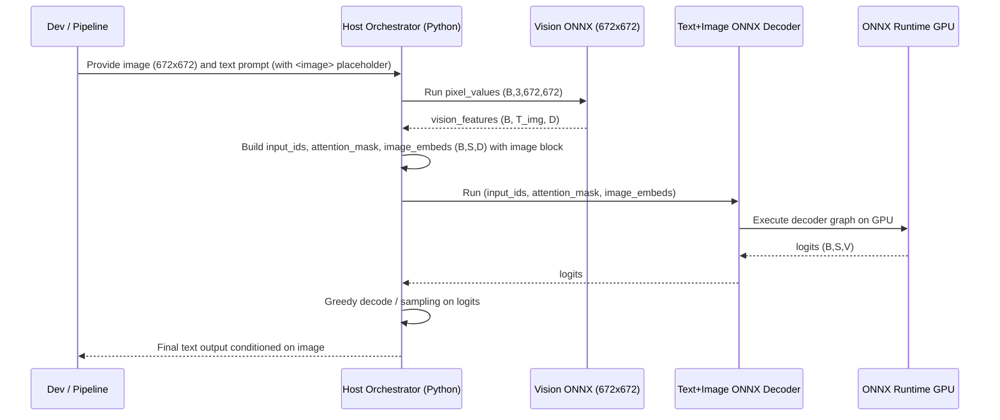

# Plan: Qwen2.5-VL ONNX text+preembedded-image decoder

## HEADER
- **Purpose**: Implement an ONNX-friendly Qwen2.5‑VL decoder that consumes token IDs plus pre-aligned image embeddings (from a fixed 672×672 vision ONNX) so we can approximate full VLM inference on GPU via ONNX Runtime.
- **Status**: In Progress
- **Date**: 2025-12-10
- **Dependencies**:
  - `models/qwen2_5_vl_3b_instruct/helpers/convert_to_onnx_text_fp16.py`
  - `models/qwen2_5_vl_3b_instruct/helpers/convert_to_onnx_vision_672_fp32.py`
  - `models/qwen2_5_vl_3b_instruct/checkpoints/Qwen2.5-VL-3B-Instruct/`
  - `transformers.models.qwen2_5_vl.modeling_qwen2_5_vl` (HF library)
  - `context/issues/bugfix-pytorch-onnx-export-qwen2_5_vl-text-lm.md`
  - `context/hints/howto-export-qwen2_5_vl-to-onnx-for-layer-sensitivity.md`
- **Target**: Quantization / deployment engineers and AI assistants working on Qwen2.5‑VL ONNX and INC integration.

---

## 1. Purpose and Outcome

We want to run Qwen2.5‑VL‑3B inference on GPU using ONNX Runtime by composing:
- A **vision ONNX** that maps fixed 672×672 RGB images to vision features.
- A **decoder ONNX** that accepts:
  - `input_ids` and `attention_mask` for text tokens.
  - **Pre-embedded image features** aligned to placeholder positions in the sequence.

Success criteria:
- A new ONNX export script produces a **text+preembedded-image decoder ONNX** (e.g. `qwen2_5_vl_3b_text_with_image_fp16.onnx`).
- The exported graph:
  - Uses a fixed sequence length and image-feature block consistent with the 672×672 vision ONNX.
  - Runs on ONNX Runtime GPU with inputs `(input_ids, attention_mask, image_embeds)` and outputs `logits`.
- A small Python orchestrator demonstrates end-to-end multimodal inference:
  - CPU/ONNXRuntime: image → vision ONNX → `image_embeds`.
  - ONNXRuntime GPU: text+image ONNX → `logits` / generated tokens.

## 2. Implementation Approach

Current status:

- The fusion wrapper and export script are implemented:
  - `Qwen25VLTextWithImageWrapper` merges `image_embeds` at positions where `input_ids == image_token_id`.
  - `models/qwen2_5_vl_3b_instruct/helpers/convert_to_onnx_text_with_image_fp16.py` successfully exports:
    - `onnx/qwen2_5_vl_3b_text_with_image_fp16.onnx`
    - `onnx/qwen2_5_vl_3b_text_with_image_fp16.onnx_data`
- Vision ONNX at 672×672 is exported via:
  - `models/qwen2_5_vl_3b_instruct/helpers/convert_to_onnx_vision_672_fp32.py`
  - `onnx/qwen2_5_vl_3b_vision_672_fp32.onnx` (+ `_data`), with vision features of shape `[576, 2048]` for a single 672×672 image.
- Remaining work is to standardize the sequence layout contract and build the ORT-based multimodal orchestrator + docs.

### 2.1 High-level flow

1. **Define sequence/layout contract**
   - Fix a sequence length `S` for multimodal prompts (e.g. an upper bound such as 256 or 512 tokens).
   - Decide where in the sequence the image tokens will live (e.g. a contiguous window of length `T_img`).
   - Ensure `T_img` matches the output length of the vision ONNX at 672×672 (e.g. 576 tokens).
   - Document this layout as the canonical ONNX multimodal contract.

2. **Implement a PyTorch fusion wrapper for export**
   - Create a new helper module that:
     - Loads `Qwen2_5_VLForConditionalGeneration`.
     - Extracts `core_model.model.language_model`, `embed_tokens`, and `lm_head`.
     - Implements `forward(input_ids, attention_mask, image_embeds)`:
       - Embed tokens via `embed_tokens(input_ids)`.
       - Compute `image_mask` from positions equal to `config.image_token_id`.
       - Merge: `fused_embeds = where(image_mask, image_embeds, token_embeds)`.
       - Call `language_model(..., inputs_embeds=fused_embeds, use_cache=False, return_dict=True)`.
       - Apply `lm_head` and return `logits`.
   - Keep the wrapper strictly tensor-based and avoid any Python-side dynamic control flow beyond fixed-shape operations.

3. **Export the fusion wrapper to ONNX (decoder with image_embeds input)**
   - Use the same ONNX export tooling that now works for text-only Qwen2.5‑VL:
     - Run in `rtx5090-vllm` Pixi env.
     - Wrap `torch.onnx.export` in `torch._dynamo.config.patch(fake_tensor_cache_enabled=False)`.
     - Pass `dynamo=False` to force the legacy TorchScript exporter and avoid `torch.export` issues.
   - Configure ONNX inputs and dynamic axes:
     - Inputs:
       - `input_ids: (batch, seq)` — might be static `seq=S` or dynamic batch with fixed seq.
       - `attention_mask: (batch, seq)`.
       - `image_embeds: (batch, seq, hidden_size)` — fixed seq, hidden size matches model.
     - Outputs:
       - `logits: (batch, seq, vocab)`.
   - Save to `models/qwen2_5_vl_3b_instruct/onnx/qwen2_5_vl_3b_text_with_image_fp16.onnx` plus `_data`.

4. **Implement host-side embedding layout for vision features**
   - Determine `T_img` from the vision ONNX output (e.g. 576 tokens).
   - In a small orchestrator helper:
     - Run the vision ONNX with `pixel_values: (B, 3, 672, 672)` and get `vision_features: (B, T_img, D)`.
     - Allocate `image_embeds: zeros(B, S, D)`.
     - Choose a contiguous window `[P, P+T_img)` in the sequence, and set:
       - `image_embeds[:, P:P+T_img, :] = vision_features`.
     - Ensure `input_ids` at `[P:P+T_img)` are set to `image_token_id` so the fusion wrapper will overwrite those positions.
   - This logic lives **outside** ONNX in a Python orchestrator, keeping the ONNX graphs simple.

5. **Test end-to-end multimodal inference**
   - Build a small script in `models/qwen2_5_vl_3b_instruct/helpers/` that:
     - Loads vision ONNX and decoder-with-image ONNX via ONNX Runtime.
     - Prepares one or two fixed prompts with a single image and a short text question.
     - Runs:
       - Vision ONNX → `vision_features`.
       - Host embedding layout → `image_embeds`.
       - Decoder ONNX → `logits` → greedy decode (on host).
     - Compares results qualitatively with the original PyTorch VLM pipeline on the same prompt.
   - Document known limitations:
     - Fixed image resolution and token layout.
     - No full generation loop inside ONNX (host handles autoregressive steps).

### 2.2 Sequence diagram (steady-state usage)

## 3. Files to Modify or Add

- **models/qwen2_5_vl_3b_instruct/helpers/convert_to_onnx_text_with_image_fp16.py**
  - Implemented: fusion wrapper definition and ONNX export for decoder with `image_embeds` input.
- **models/qwen2_5_vl_3b_instruct/helpers/convert_to_onnx_text_fp16.py**
  - Optionally factor out shared export helpers (Dynamo workaround, ONNX external data aggregation).
- **models/qwen2_5_vl_3b_instruct/helpers/convert_to_onnx_vision_672_fp32.py**
  - Confirm and document the exact `T_img` length and hidden size `D` used by the decoder.
- **models/qwen2_5_vl_3b_instruct/helpers/run_qwen2_5_vl_onnx_multimodal_demo.py**
  - New demo/orchestrator that runs:
    - Vision ONNX → `vision_features`.
    - Host embedding layout → `image_embeds`.
    - Text+image ONNX decoder → logits and decoded text.
- **context/issues/bugfix-pytorch-onnx-export-qwen2_5_vl-text-lm.md**
  - Update with notes that the fusion-wrapper export uses the same Dynamo workaround and legacy exporter path and currently succeeds.
- **context/hints/howto-export-qwen2_5_vl-to-onnx-for-layer-sensitivity.md**
  - Add a short subsection describing the text+preembedded-image pattern as an alternative ONNX multimodal contract.

## 4. TODOs (Implementation Steps)

- [ ] **Confirm sequence and image block layout** Decide on fixed `S`, `T_img`, and the index range `[P,P+T_img)` for image tokens; validate `T_img` against vision ONNX output at 672×672.
- [x] **Implement fusion wrapper module** Add a small `Qwen25VLTextWithImageWrapper` class that merges `image_embeds` into token embeddings and calls the Qwen2.5‑VL text model with `inputs_embeds`.
- [x] **Add text+image ONNX export script** Create `convert_to_onnx_text_with_image_fp16.py` using the Dynamo fake-tensor-cache workaround to export the wrapper.
- [x] **Generate decoder-with-image ONNX** Run the new export script in `rtx5090-vllm` and verify it produces `qwen2_5_vl_3b_text_with_image_fp16.onnx` and `_data`.
- [ ] **Implement vision+decoder orchestrator** Add `run_qwen2_5_vl_onnx_multimodal_demo.py` that composes the vision and decoder ONNX models using ONNX Runtime GPU and host-side layout logic.
- [ ] **Smoke-test multimodal inference** Compare demo outputs to the original PyTorch VLM on a small set of prompts/images and document any systematic differences.
- [ ] **Update context docs and bug report** Refresh `context/hints/` and the ONNX bugfix issue with the new pattern, noting which exports work under which envs and exporter configurations.
