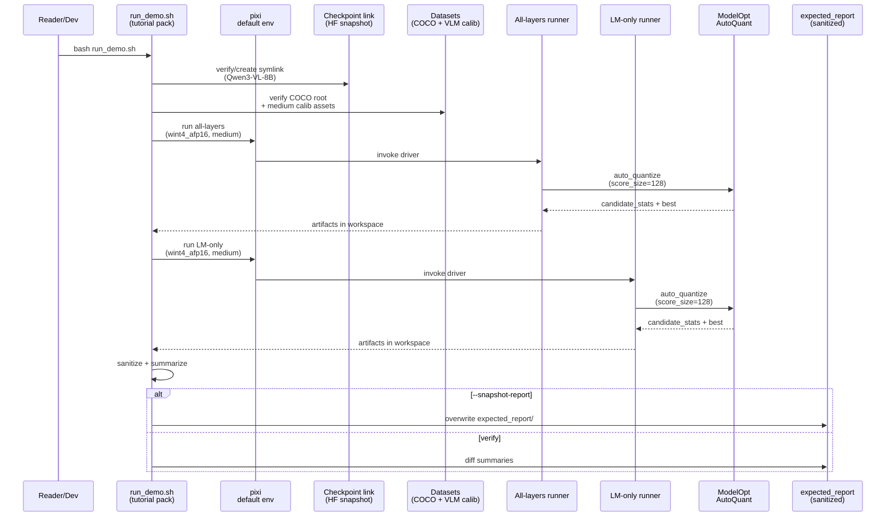

# Plan: Revise Qwen3-VL-8B Tutorial Pack (Introduce + Layer Sensitivity)

## HEADER

- **Purpose**: Update the Qwen3-VL-8B tutorial pack to meet `context/tasks/req-revise-qwen3-8b-tutorial.md`, including medium-dataset defaults, INT4 example quant pairs, and non-zero sensitivity outputs for both all-layers and LM-only runs.
- **Status**: Draft
- **Date**: 2026-01-21
- **Dependencies**:
  - `context/tasks/req-revise-qwen3-8b-tutorial.md`
  - `context/issues/known/issue-qwen3-vl-lm-only-tutorial-zero-sensitivity.md`
  - `docs/tutorial/howto/tut-qwen3-vl-8b-introduce-model-layer-sensitivity/README.md`
  - `docs/tutorial/howto/tut-qwen3-vl-8b-introduce-model-layer-sensitivity/run_demo.sh`
  - `datasets/vlm-quantize-calib/README.md`
  - `datasets/coco2017/README.md`
  - `conf/preset/qwen3_lm_sensitivity.yaml`
  - `conf/quant_pair/wint4_afp16.yaml`
  - `conf/quant_pair/wint4_aint8.yaml`
  - `scripts/qwen/qwen3_lm_sensitivity.py`
  - `models/qwen3_vl_4b_instruct/helpers/qwen3_vl_4b_autoquant_all_layers/run_qwen3_vl_4b_autoquant_all_layers.py`
  - `src/auto_quantize_model/modelopt_configs.py`
  - `src/auto_quantize_model/modelopt_autoquant.py`
  - `src/auto_quantize_model/qwen/autoquant_sensitivity.py`
- **Target**: AI assistants and developers running Qwen3-VL sensitivity analysis in the default Pixi env.

---

## 1. Purpose and Outcome

Success means:

- The tutorial pack runs end-to-end in the **default Pixi environment** and produces **non-zero** per-layer sensitivities for:
  - **all-layers** sensitivity, and
  - **LM-only** sensitivity.
- The tutorial uses **medium** dataset settings by default:
  - `dataset.calib_seq_len=512`, `dataset.batch_size=8`, `dataset.num_calib_batches=16`,
  - `scheme.auto_quantize_score_size=128`,
  - `dataset.num_calib_samples=128`, `dataset.max_calib_samples=128` (full subset).
- The tutorial’s worked examples use `wint4_afp16` and `wint4_aint8`.
- The README explains:
  - how the checkpoint link is created,
  - what `run_demo.sh` does step-by-step,
  - why “4B helper” scripts are used for 8B (parameterized `--model-dir`),
  - why the older LM-only artifacts differ, and how to get meaningful results.
- `expected_report/` contains **sanitized but real** run artifacts (and verification diffs pass).

Key outputs:

- Updated `docs/tutorial/howto/tut-qwen3-vl-8b-introduce-model-layer-sensitivity/README.md`
- Updated `docs/tutorial/howto/tut-qwen3-vl-8b-introduce-model-layer-sensitivity/run_demo.sh`
- New/updated `expected_report/` snapshots for the chosen quant pairs and modes.

## 2. Implementation Approach

### 2.1 High-level flow

1. Switch the tutorial pack to use the repo’s existing COCO/VLM calibration assets:
   - COCO root via `datasets/coco2017/source-data` (bootstrap-created symlink).
   - VLM calib DB via `datasets/vlm-quantize-calib/coco2017_vlm_calib_medium.db`.
   - Captions via `datasets/vlm-quantize-calib/coco2017_captions_medium.txt`.
2. Update the tutorial runner to run 4 scenarios (same dataset settings, different mode/quant-pair):
   - all-layers + `wint4_afp16`
   - all-layers + `wint4_aint8`
   - LM-only + `wint4_afp16`
   - LM-only + `wint4_aint8`
3. Ensure both the all-layers and LM-only runners:
   - use `auto_quantize_score_size=128`,
   - use full medium subset (128 samples),
   - record dataset metadata correctly in the manifest (`num_calib_samples`, `max_calib_samples`, `batch_size`, `num_calib_batches`),
   - and yield **non-zero** sensitivity values.
4. Update documentation to explicitly teach dataset sizing:
   - default: medium,
   - small: quick smoke tests,
   - large: real application runs.
5. Re-run and snapshot `expected_report/` with sanitized artifacts, and keep verification stable by diffing summary files.

### 2.2 Sequence diagram (steady-state usage)

## 3. Files to Modify or Add

- **docs/tutorial/howto/tut-qwen3-vl-8b-introduce-model-layer-sensitivity/README.md**: update narrative, under-the-hood explanation, dataset sizing guidance, and quant-pair examples.
- **docs/tutorial/howto/tut-qwen3-vl-8b-introduce-model-layer-sensitivity/run_demo.sh**: switch defaults to medium assets; add flags for `--dataset-size {small,medium,large}`; run both quant pairs; enforce score_size=128; snapshot/verify logic per pack conventions.
- **docs/tutorial/howto/tut-qwen3-vl-8b-introduce-model-layer-sensitivity/expected_report/**: regenerate with real outputs for the 4 documented scenarios (sanitized).
- **docs/tutorial/howto/tut-qwen3-vl-8b-introduce-model-layer-sensitivity/scripts/summarize_manifest.py**: include `quant_pair`, dataset size, score_size, and a non-zero check in the stable summary (so verification fails loudly if results regress to zeros).
- **docs/tutorial/howto/tut-qwen3-vl-8b-introduce-model-layer-sensitivity/scripts/sanitize_artifacts.py**: extend if new artifacts are produced (e.g., Hydra `composed-config.yaml`).
- **conf/model/qwen3_vl_8b_instruct/arch/qwen3_vl_8b_instruct.default.yaml**: add an 8B model config group for Hydra-based runners (if the tutorial uses Hydra for LM-only and/or all-layers).
- **conf/model/qwen3_vl_8b_instruct/infer/qwen3_vl_8b_instruct.default.yaml**: add infer config if needed for consistency with other model groups.
- **(Optional) scripts/qwen/qwen3_vlm_sensitivity.py** and **conf/preset/qwen3_vlm_sensitivity.yaml**: if we decide to migrate all-layers to a Hydra runner (for consistent quant_pair usage and dataset metadata).
- **context/tasks/req-revise-qwen3-8b-tutorial.md**: commit the requirements doc once stabilized.

## 4. TODOs (Implementation Steps)

- [ ] **Audit current pack vs requirements** list concrete gaps vs `context/tasks/req-revise-qwen3-8b-tutorial.md` and confirm scope (all-layers + LM-only, 2 quant pairs, medium defaults).
- [ ] **Decide runner strategy for all-layers** either extend existing all-layers CLI driver to accept arbitrary `format_name`/quant-pair, or implement a Hydra all-layers runner; document the choice.
- [ ] **Add Hydra model config for 8B** create `conf/model/qwen3_vl_8b_instruct/...` so Hydra runners can target 8B without long CLI overrides.
- [ ] **Update run_demo.sh defaults and flags** set dataset.size=medium by default; add `--dataset-size` to switch to small/large; ensure it uses full subset (128) and `score_size=128`.
- [ ] **Wire dataset assets into runs** use `datasets/vlm-quantize-calib/coco2017_{captions,vlm_calib}_medium.*` and `datasets/coco2017/source-data` (bootstrap requirement + clear error messages).
- [ ] **Run all-layers scenarios** run with `wint4_afp16` and `wint4_aint8`, saving outputs to workspace subdirs; ensure manifest has correct dataset metadata and non-zero sensitivities.
- [ ] **Run LM-only scenarios** run with `wint4_afp16` and `wint4_aint8` (likely via Hydra `scripts/qwen/qwen3_lm_sensitivity.py`); ensure manifest has correct dataset metadata and non-zero sensitivities.
- [ ] **Update README under-the-hood sections** explain `run_demo.sh` step-by-step, the invoked runners, artifacts, dataset sizing, and “4B helper script” naming.
- [ ] **Refresh expected_report snapshots** run `--snapshot-report` and ensure artifacts are sanitized; keep the repo size reasonable (store only what’s needed + stable summaries).
- [ ] **Strengthen verification summaries** update summarizer to assert non-zero sensitivities and stable key metadata (dataset size, score_size, quant_pair).
- [ ] **Validate end-to-end** run `run_demo.sh` (no snapshot) and confirm it diffs cleanly against `expected_report/`.
- [ ] **Commit + push** commit requirements doc + tutorial updates + refreshed expected reports to the main branch.
