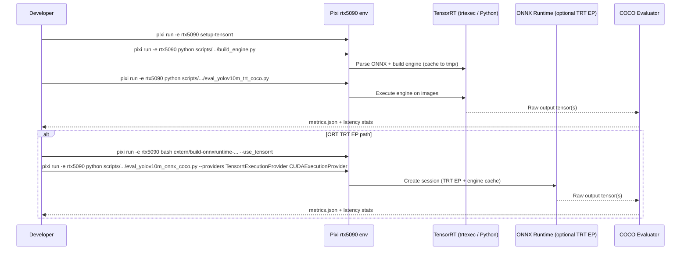

# Plan: Enable TensorRT inference in the `rtx5090` Pixi environment

## HEADER

- **Purpose**: Make TensorRT available for inference workflows in the Pixi `rtx5090` environment, with a clear path to run YOLOv10m (and other ONNX models) using TensorRT either directly or via ONNX Runtime TensorRT EP.
- **Status**: Draft
- **Date**: 2025-12-23
- **Dependencies**:
  - `pyproject.toml` (Pixi env activation + tasks)
  - `scripts/cv-models/eval_yolov10m_onnx_coco.py` (current ORT-based evaluator)
  - `models/cv-models/yolov10m/README.md` (repro commands)
  - `extern/onnxruntime/` (ORT source)
  - `extern/build-onnxruntime-cuda-12_8.sh` (current CUDA EP build script)
  - `extern/howto-build-onnxruntime-with-pixi-cuda-12_8.md` (current build doc)
- **Target**: Developers and AI assistants working on GPU/TRT deployment and quantization benchmarking.

---

## 1. Purpose and Outcome

Success means:

- `pixi run -e rtx5090 python -c "import tensorrt as trt"` works (TensorRT Python bindings available in the env).
- `trtexec` is discoverable under `pixi run -e rtx5090` (or we have a stable absolute path and documented usage).
- We can run YOLOv10m inference on RTX 5090 using TensorRT, and record latency/throughput under `tmp/…`.
- We have a validated integration path:
  - **Direct TensorRT** (engine build + Python runner), and/or
  - **ONNX Runtime TensorRT EP** (ORT session providers include `TensorrtExecutionProvider`).

Non-goals (for the initial iteration):

- Perfect parity across every TRT precision mode. We will opportunistically support FP16/INT8/FP8 first; NVFP4 is attempted only if TRT tooling in this container supports it for the target model.

## 2. Implementation Approach

### 2.1 High-level flow

1. Confirm what TensorRT is already present in the NGC TRT-LLM container (libs, `trtexec`, Python bindings).
2. Make Pixi `rtx5090` inherit the required runtime environment variables (PATH + library search paths).
3. Install TensorRT Python bindings into the `rtx5090` Pixi env (prefer reproducible `pixi run setup-tensorrt` / pinned versions).
4. Add a **direct TensorRT inference runner** for ONNX models (engine caching under `tmp/`).
5. (Optional but preferred for reuse) Build and install **ONNX Runtime with TensorRT EP** from `extern/onnxruntime` and validate `TensorrtExecutionProvider`.
6. Integrate TensorRT options into our benchmarking workflow (same COCO slice, same pre/postproc), and write results to `tmp/…`.

### 2.2 Choosing “direct TRT” vs “ORT TRT EP”

**Path A — Direct TensorRT (fastest to unblock)**

- Build engines with `trtexec` (or TensorRT Python builder).
- Run inference via TensorRT Python API (so we can reuse our existing Python post-processing and COCO evaluation).
- Pros: avoids rebuilding ORT, strongest control over TRT flags, easiest to add NVFP4 experiments if supported by TRT tooling.
- Cons: requires writing/maintaining a small TensorRT runner (bindings, memory management, stream sync).

**Path B — ONNX Runtime TensorRT EP (best integration with existing evaluator)**

- Build ORT from source with `--use_tensorrt` so `ort.get_available_providers()` includes `TensorrtExecutionProvider`.
- Use existing evaluator by switching `--providers TensorrtExecutionProvider CUDAExecutionProvider ...` and enabling TRT engine caching provider options.
- Pros: minimal code changes in evaluation pipeline; ORT handles execution and fallback logic.
- Cons: build complexity; ORT TRT EP behavior depends on TRT/ORT versions; NVFP4 support may still be limited by EP.

Recommendation: implement Path A first (guarantees “TRT inference works”), then add Path B to reuse the ORT evaluation scripts and provider priority semantics.

### 2.3 Sequence diagram (steady-state usage)

## 3. Files to Modify or Add

- **`pyproject.toml`** Add/adjust `rtx5090` activation env vars so `trtexec` and TRT libs are visible under `pixi run -e rtx5090`; decide whether to pin `tensorrt` as a dependency or keep it as an explicit task (`setup-tensorrt`).
- **`extern/build-onnxruntime-cuda-12_8.sh`** Extend to optionally build with TRT EP (or add a new `extern/build-onnxruntime-tensorrt-cuda-12_8.sh` wrapper).
- **`extern/howto-build-onnxruntime-with-pixi-cuda-12_8.md`** Add a TRT EP section, or create **`extern/howto-build-onnxruntime-with-pixi-tensorrt.md`**.
- **`scripts/cv-models/`** Add TensorRT helpers:
  - `build_trt_engine.py` (ONNX → TRT engine, supports FP16/INT8/FP8, engine + timing cache under `tmp/`)
  - `infer_trt_engine.py` (run engine on NCHW tensors, returns output arrays)
  - `eval_yolov10m_trt_coco.py` (reuse preprocessing + decode + COCOeval, but inference via TRT engine)
- **`scripts/cv-models/eval_yolov10m_onnx_coco.py`** (Optional) Add CLI flags for ORT TRT EP provider options (engine cache path, timing cache, precision toggles) once ORT TRT EP is available.
- **`models/cv-models/yolov10m/README.md`** Document the TRT inference commands and when to use direct TRT vs ORT TRT EP.

## 4. TODOs (Implementation Steps)

- [ ] **Inventory TRT in container** Confirm TensorRT version, `trtexec` location, lib paths, and whether Python `tensorrt` is already present outside Pixi.
- [ ] **Make TRT visible under Pixi** Update `pyproject.toml` activation env vars so `pixi run -e rtx5090 trtexec --version` works (or document a stable absolute path).
- [ ] **Install TRT Python bindings in `rtx5090`** Use `pixi run -e rtx5090 setup-tensorrt` (and/or pin `tensorrt==…` in the rtx5090 feature) so `import tensorrt` works reproducibly.
- [ ] **Add direct TRT engine build script** Implement `scripts/cv-models/build_trt_engine.py` with engine caching under `tmp/<task>/trt/…` and flags for FP16/INT8/FP8 (and “try NVFP4 if supported”).
- [ ] **Add direct TRT inference runner** Implement `scripts/cv-models/infer_trt_engine.py` (minimal I/O: `.engine` + `.npy` input → `.npy` output) to support debugging and perf microbenchmarks.
- [ ] **Add TRT-backed YOLOv10m evaluator** Implement `scripts/cv-models/eval_yolov10m_trt_coco.py` that reuses existing preprocessing/postprocessing and writes `metrics.json` + latency stats under `tmp/…`.
- [ ] **Build ORT with TensorRT EP (optional but preferred)** Extend `extern/build-onnxruntime-cuda-12_8.sh` (or add a new script) to pass `--use_tensorrt`, wire `TENSORRT_HOME` discovery, then install the wheel into the `rtx5090` env.
- [ ] **Wire ORT TRT EP options (optional)** Extend `scripts/cv-models/eval_yolov10m_onnx_coco.py` to accept TRT EP provider options (engine cache enable/path, timing cache).
- [ ] **Validate end-to-end** For YOLOv10m baseline + one QDQ candidate, run:
  - ORT CUDA (baseline reference)
  - Direct TRT (engine)
  - ORT TRT EP (if built)
  Save results under a single `tmp/<task>/…` run root.
- [ ] **Document and codify** Update `models/cv-models/yolov10m/README.md` with the canonical TRT commands and add a short troubleshooting section (missing `libnvinfer.so`, plugin paths, engine cache).
