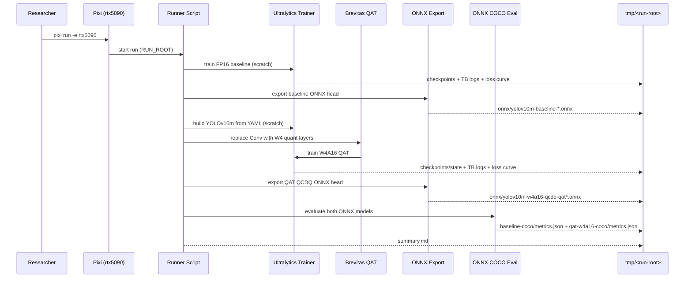

# Plan: Train YOLOv10m from scratch (COCO2017) with Brevitas W4A16 QAT vs FP16 baseline

## HEADER
- **Purpose**: Train Ultralytics YOLOv10m from random init on COCO2017 using (1) an FP16/AMP baseline and (2) a Brevitas W4A16 QAT model (weight-only int4 fake-quant), following the training-recipe conventions used in `extern/quantized-yolov5`, then compare accuracy and export/evaluate both in a common ONNX-based pipeline.
- **Status**: Draft
- **Date**: 2025-12-23
- **Dependencies**:
  - `context/instructions/prep-rtx5090.md`
  - `magic-context/general/python-coding-guide.md`
  - `extern/quantized-yolov5/train.py` (reference training loop + “from scratch” conventions)
  - `extern/quantized-yolov5/data/hyps/hyp.scratch.yaml` (reference COCO scratch hyperparameters)
  - `extern/quantized-yolov5/models/quant_common.py` (reference Brevitas quantizer patterns)
  - `models/yolo10/src/ultralytics/cfg/models/v10/yolov10m.yaml`
  - `datasets/coco2017/source-data/` (train2017/ val2017/ annotations/)
  - `src/auto_quantize_model/cv_models/yolov10_brevitas.py` (Brevitas wrappers + ONNX export helpers)
  - `src/auto_quantize_model/cv_models/yolov10_ultralytics_qat.py` (Ultralytics-trainer wrapper + TB/loss curve patterns)
  - `scripts/cv-models/eval_yolov10m_onnx_coco.py`
  - `models/cv-models/yolov10m/README.md` (ONNX output contract reference)
- **Target**: Quantization engineers and AI assistants running training + QAT experiments on RTX 5090.

---

## 1. Purpose and Outcome

Success looks like:

- A reproducible training + evaluation workflow (Pixi `rtx5090`) that:
  - trains a **baseline FP16** YOLOv10m model from scratch on COCO2017,
  - trains a **Brevitas W4A16 QAT** YOLOv10m model from scratch on COCO2017,
  - uses a “full run” schedule (COCO2017 train2017 + val2017, ~300 epochs, SGD-style recipe), aligned with the conventions in `extern/quantized-yolov5`,
  - exports both to ONNX (baseline raw head output; QAT as Brevitas QCDQ),
  - evaluates both with the same `scripts/cv-models/eval_yolov10m_onnx_coco.py` contract,
  - writes a dataset-aware report under a single run root.
- The run root contains sufficient artifacts to reproduce/inspect:
  - training args snapshots (Ultralytics `args.yaml` + our JSON metadata),
  - TensorBoard event logs for both trainings,
  - loss curves (CSV + PNG) for both trainings,
  - final Torch checkpoints (baseline `.pt`, QAT quantized `.pt` if feasible),
  - ONNX exports and COCO eval metrics JSON,
  - `summary.md` comparing baseline vs QAT.

Scope assumptions (explicit):

- “From scratch” means model weights are randomly initialized from `models/yolo10/src/ultralytics/cfg/models/v10/yolov10m.yaml` (no `yolov10m.pt` pretraining).
- “W4A16 QAT” means **weight-only int4 fake-quant** (activations remain floating; no activation calibration), with an optional “first/last layer higher precision” variant (common in low-bit training and present in `extern/quantized-yolov5` configs).

## 2. Implementation Approach

### 2.1 High-level flow

1. **Standardize dataset configuration**
   1. Create a run-local dataset YAML pointing to `datasets/coco2017/source-data/` to avoid relying on Ultralytics defaults.
   2. Record dataset provenance (paths + counts) in a JSON metadata file under the run root.

2. **Define the “scratch recipe” (aligned with `extern/quantized-yolov5`)**
   1. Default to 300 epochs on COCO2017 at `imgsz=640`.
   2. Use explicit (non-auto) optimizer settings and hyperparameters comparable to `extern/quantized-yolov5/data/hyps/hyp.scratch.yaml`:
      - `optimizer=SGD`, `lr0=0.01`, `lrf=0.1`, `momentum=0.937`, `weight_decay=5e-4`
      - `warmup_epochs=3.0`, `warmup_momentum=0.8`, `warmup_bias_lr=0.1`
      - augment knobs (`hsv_*`, `translate`, `scale`, `fliplr`, `mosaic`, etc) mapped onto Ultralytics trainer args.
   3. Ensure determinism settings are recorded (seed, deterministic flag, dataloader workers).

3. **Train baseline FP16 from scratch**
   1. Use Ultralytics `DetectionTrainer` with model cfg `.../yolov10m.yaml`, `pretrained=False`, AMP enabled, and the defined “scratch recipe” hyperparameters.
   2. Fix YOLOv10 validation compatibility by adapting dict predictions:
      - during validation/NMS, map `preds={"one2many": (y,x), "one2one": (y,x)}` to the tensor `preds["one2one"][0]` (or `preds["one2many"][0]`) before NMS.
   3. Add TensorBoard logging + a loss-curve artifact (CSV + PNG).
   4. Save `best`/`last` checkpoints like standard Ultralytics training.
   5. Export baseline ONNX head model (FP16 weights if exporter supports it, else FP32).

4. **Train Brevitas W4A16 QAT from scratch**
   1. Create a custom trainer (or wrapper) that:
      - builds the YOLOv10m model from YAML (random init),
      - replaces Conv layers with Brevitas quant layers (`QuantConv2d`) configured for **W4 weight quant** and no activation quant,
      - optionally keeps first/last layers at higher precision (e.g., W8 or FP) to match the practice in `extern/quantized-yolov5` “in/out bit width” configs,
      - trains using Ultralytics’ standard training loop (loss, augmentations, schedulers).
   2. Add TensorBoard logging + a loss-curve artifact (CSV + PNG).
   3. Reuse the same dict-prediction adapter so in-trainer validation works and checkpoints are comparable to the FP16 baseline.
   4. Save `best`/`last` checkpoints like standard training; if full-object serialization fails, save `{state_dict, ema_state_dict, args.yaml, quant_config.json}` as the canonical checkpoint.
   5. Export Brevitas QCDQ ONNX head model.

5. **Evaluate (common evaluator)**
   1. Run `scripts/cv-models/eval_yolov10m_onnx_coco.py` on both ONNX exports with providers `CUDAExecutionProvider CPUExecutionProvider`.
   2. Use full COCO2017 val2017 for the final comparison (no `--max-images` cap), and optionally a smaller capped eval for iteration.
   3. Write `baseline-coco/metrics.json` and `qat-w4a16-coco/metrics.json` under the run root.

6. **Report**
   1. Generate `summary.md` with:
      - train dataset info (COCO2017 train split path + counts),
      - evaluation dataset info (COCO2017 val split path + counts),
      - training hyperparameters (epochs, batch, imgsz, lr schedule, seed),
      - pointers to TensorBoard log dirs and loss curve PNGs,
      - COCO mAP comparison and latency stats.

### 2.2 Sequence diagram (steady-state usage)

## 3. Files to Modify or Add

- **`scripts/cv-models/train_yolov10m_scratch_fp16_vs_w4a16_qat_brevitas.py`** New main entrypoint (subcommands `fp16` and `qat-w4a16`) that trains, logs TB/loss curves, and exports ONNX.
- **`scripts/cv-models/run_yolov10m_scratch_fp16_vs_w4a16_qat.sh`** End-to-end runner that sets a run root, captures logs, runs training, exports, eval, and summary.
- **`conf/cv-models/yolov10m/hyp.scratch.yaml`** New “scratch recipe” config (ported/mapped from `extern/quantized-yolov5/data/hyps/hyp.scratch.yaml`) to keep training hyperparameters explicit and reproducible.
- **`src/auto_quantize_model/cv_models/yolov10_brevitas.py`** Extend/adjust quantization insertion for “training from scratch” (e.g., expose a QAT-friendly config helper distinct from PTQ-only usage).
- **`src/auto_quantize_model/cv_models/yolov10_v10detect_val_adapter.py`** New helper to adapt YOLOv10 dict predictions into tensors suitable for standard NMS/validator paths.
- **`src/auto_quantize_model/cv_models/yolov10_ultralytics_qat.py`** Reuse patterns for TB logging and loss curve emission; optionally generalize into a shared “Ultralytics TB logger” helper used by both baseline and QAT.
- **`scripts/cv-models/write_yolov10m_scratch_train_summary.py`** New summary writer specialized for “training from scratch” runs (train dataset + eval dataset + training artifacts + ONNX eval metrics).
- **`context/tasks/working/...`** Add a new task folder (or extend an existing training task) with subtasks and post-run summaries.
- **`context/plans/plan-train-yolov10m-from-scratch-w4a16-qat-brevitas.md`** This plan (kept updated as implementation progresses).

## 4. TODOs (Implementation Steps)

- [ ] **Define run-root contract** Decide `tmp/` layout (e.g., `tmp/yolov10m_scratch_w4a16_qat_vs_fp16/<run-id>/`) and required artifacts (TB dirs, loss curves, checkpoints, ONNX, metrics, summary).
- [ ] **Add dataset YAML writer** Implement a helper that writes a run-local COCO2017 YAML pointing to `datasets/coco2017/source-data` and records counts/provenance.
- [ ] **Port scratch hyperparameters** Add `conf/cv-models/yolov10m/hyp.scratch.yaml` by mapping `extern/quantized-yolov5/data/hyps/hyp.scratch.yaml` into Ultralytics trainer args (document any keys that don’t map 1:1).
- [ ] **Implement YOLOv10 dict-val adapter** Make validation/NMS handle `v10Detect` dict outputs (e.g., use `preds['one2one'][0]`), so in-trainer validation and “best.pt” selection work.
- [ ] **Implement FP16 scratch training** Add `fp16` training subcommand using Ultralytics `DetectionTrainer` with `pretrained=False`, AMP enabled, the scratch hyperparameters, and working in-trainer validation; emit TB logs + loss curve.
- [ ] **Implement W4A16 QAT model builder** Implement “build from YAML → apply Brevitas W4 weight quantization” for YOLOv10m (Conv2d → `QuantConv2d`, activations unquantized).
- [ ] **Add quant scheme variants** Support (a) strict W4 for all Conv weights and (b) mixed-precision first/last layers (inspired by `extern/quantized-yolov5` bit-width patterns); record the scheme in artifacts and filenames.
- [ ] **Integrate W4A16 model into Ultralytics training** Add a custom trainer override (e.g., override `setup_model()` or inject `trainer.model`) so quantization happens before optimizer creation.
- [ ] **Persist checkpoints safely** Ensure checkpoints are usable for final export and analysis (prefer full `.pt` like standard Ultralytics; fallback to `state_dict` + EMA `state_dict` + configs if serialization fails).
- [ ] **Export ONNX artifacts** Export baseline head ONNX and QAT QCDQ ONNX (consistent I/O contract for the evaluator); optionally run `optimize_onnx_keep_qdq` on QAT export.
- [ ] **Run ONNX COCO evaluation** Evaluate baseline and QAT ONNX with `scripts/cv-models/eval_yolov10m_onnx_coco.py` (full val2017 for the final run; smaller subset for iteration) and write metrics JSON.
- [ ] **Write final report** Implement `summary.md` generator including training dataset/eval dataset provenance and pointers to TB + loss curves.
- [ ] **Dry-run on small subset** Validate the full pipeline on a small COCO subset (e.g., 1000 train images, 200 val images, 1 epoch) before attempting full COCO2017 training.
- [ ] **Full COCO2017 training runs** Run baseline FP16 and W4A16 QAT full training (or an agreed schedule), copy results to `models/yolo10/reports/<run-id>/`, and document outcomes.
