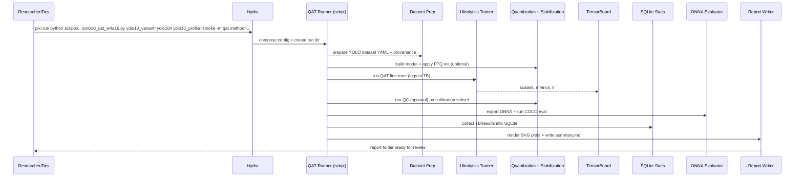

# Plan: Stable YOLOv10 (n→s→m) W4A16 QAT with EMA + QC (sweepable research methods)

## HEADER
- **Purpose**: Implement a reproducible, research-backed W4A16 (weight-only int4) QAT pipeline for Ultralytics YOLOv10 that avoids the “early peak then collapse” instability by incorporating WACV’24 EMA + post-hoc Quantization Correction (QC), plus optional ICML’22 oscillation dampening/freezing and BN handling, while supporting Hydra-driven method/hyperparameter sweeps and a fast validation ladder: **yolo10n → yolo10s → yolo10m**.
- **Status**: Draft
- **Date**: 2025-12-25
- **Dependencies**:
  - `models/yolo10/reports/2025-12-25-qat-w4a16/about-qat-yolo-training-instability.md` (problem statement + curated references)
  - `tmp/papers/qat-yolo-oscillations/gupta2024_oscillations_quantized_yolo_wacv.pdf` (WACV 2024 EMA + QC)
  - `tmp/papers/qat-yolo-oscillations/gupta2024_oscillations_quantized_yolo_wacv.txt` (paper text for copyable equations)
  - `tmp/papers/qat-yolo-oscillations/nagel22_overcoming_oscillations_qat.pdf` (ICML 2022 oscillation dampening/freezing)
  - `tmp/papers/qat-yolo-oscillations/nagel22_overcoming_oscillations_qat.txt` (paper text for copyable equations)
  - `models/yolo10/src/ultralytics/` (YOLOv10 trainer + validator)
  - `models/yolo10/checkpoints/yolov10n.pt` (pretrained starting point for fast validation)
  - `models/yolo10/checkpoints/yolov10s.pt` (next-step scale-up)
  - `models/yolo10/checkpoints/yolov10m.pt` (final target)
  - `models/yolo10/src/ultralytics/cfg/models/v10/yolov10n.yaml`
  - `models/yolo10/src/ultralytics/cfg/models/v10/yolov10s.yaml`
  - `models/yolo10/src/ultralytics/cfg/models/v10/yolov10m.yaml`
  - `src/auto_quantize_model/cv_models/yolov10_coco_dataset.py` (COCO→YOLO dataset prep helper)
  - `scripts/cv-models/train_yolov10m_scratch_fp16_vs_w4a16_qat_brevitas.py` (existing YOLOv10 QAT/validator adapter patterns to refactor/extend)
  - `scripts/cv-models/collect_training_stats_sqlite.py` and `scripts/cv-models/plot_training_stats_from_sqlite.py` (TB→SQLite→figures)
  - NVIDIA ModelOpt (in Pixi env) for optional PTQ initialization (to be validated)
- **Target**: Quantization engineers and AI assistants running YOLOv10n/s/m QAT experiments and comparing stabilization methods.

---

## 1. Purpose and Outcome

Success looks like:

- A stable and reproducible **YOLOv10 W4A16 QAT** workflow that:
  - is model-variant agnostic (works for **yolo10n**, **yolo10s**, **yolo10m**),
  - uses a fast validation ladder (prove the method on **yolo10n**, then scale to **yolo10s**, then finalize on **yolo10m**),
  - starts from a **pretrained** checkpoint (rather than scratch) by default,
  - supports **multiple stabilization methods** (baseline QAT, EMA, EMA+QC, + optional dampening/freezing/BN re-estimation),
  - exports and evaluates models consistently (Ultralytics validator during training + ONNX eval pipeline after training),
  - emits artifacts sufficient for review: configs, TB logs, SQLite stats DB, SVG plots, checkpoints, ONNX exports, COCO metrics, and `summary.md`.
- A Hydra-based configuration surface (under `conf/`) that makes it easy to run controlled sweeps over:
  - model variant (yolo10n / yolo10s / yolo10m),
  - QAT method (EMA/QC/dampening/freezing),
  - optimizer/LR schedule,
  - quantization granularity (per-tensor vs per-channel weights),
  - starting point (pretrained, optional PTQ-initialized),
  - BN strategy (freeze vs re-estimate).

Scope assumptions:

- “W4A16” means **weight-only** int4 fake-quant during training, with activations left in FP16/FP32 (no activation quantization).
- This plan prioritizes **stability + repeatability** over absolute peak accuracy initially; once stable, we expand sweeps for accuracy/perf tradeoffs.

## 2. Implementation Approach

### 2.1 High-level flow

0. **Validate quickly by scaling model size (n→s→m)**
   - Goal: de-risk research-method implementation (EMA/QC/BN handling) cheaply before committing to expensive YOLOv10m runs.
   - Stage gates:
     - **yolo10n**: smoke test + short-run stability on a subset (minutes to hours).
     - **yolo10s**: confirm stability persists at higher capacity (hours).
     - **yolo10m**: full target run(s) once the method is stable and reproducible (long).
   - Operationally, this means the runner and configs must be **parameterized by model variant** (cfg path + pretrained checkpoint), not hard-coded to YOLOv10m.

1. **Prepare a run-local YOLO dataset view for COCO**
   - Use `src/auto_quantize_model/cv_models/yolov10_coco_dataset.py` to create a run-local YOLO dataset YAML + train/val lists (full COCO or configured subset).
   - Record dataset provenance (counts, split, file lists) in run metadata.
   - For fast iteration, support a **subset mode** (e.g., cap to N train/val images or use a deterministic filelist) so that yolo10n smoke tests are practical.
   - Subset mode should be deterministic and reviewable:
     - Write explicit `train.txt` / `val.txt` lists under the run directory (or a dataset cache dir), and point the dataset YAML at those lists.
     - Selection strategy: `first_n_sorted` (default for reproducibility) or `random_seeded` (for representativeness), configured via Hydra.
     - Record the exact lists and selection parameters in run metadata so the experiment can be reconstructed.

### 2.1.1 Suggested `yolo10_profile` presets (to accelerate the n→s→m ladder)

These are “engineering defaults” to validate the research method quickly; they are not intended to be the final accuracy recipe.

- `smoke` (debug correctness fast):
  - train cap: 2k images, val cap: 200 images
  - epochs: 3–5
  - evaluation: every epoch
  - goal: confirm the pipeline runs end-to-end (QAT + EMA + QC + export + plots), and that metrics are non-degenerate
- `short` (check stability trends):
  - train cap: 20k images, val cap: 2k images
  - epochs: 20–30
  - evaluation: every epoch
  - goal: detect the “early peak then collapse” failure mode and compare baseline vs EMA vs EMA+QC
- `full` (final comparisons):
  - train cap: full COCO train2017 (~118k images), val cap: full val2017 (5k images)
  - epochs: 100+ (or align with the repo’s scratch recipe once stable)
  - evaluation: every epoch or every N epochs (trade-off runtime)
  - goal: produce report-quality results for yolo10m and produce ONNX-eval comparisons

2. **Build the QAT model (W4A16 weight-only) from a pretrained checkpoint**
   - Load a variant-specific pretrained checkpoint (configurable): `models/yolo10/checkpoints/yolov10{n,s,m}.pt`.
   - Load the matching Ultralytics model cfg (configurable): `models/yolo10/src/ultralytics/cfg/models/v10/yolov10{n,s,m}.yaml`.
   - Apply weight quantization insertion.
   - Keep first/last layers optionally higher precision (W8 or FP) as a sweepable knob, because ultra-low-bit endpoints are frequently fragile.

3. **(Optional) PTQ initialization before QAT**
   - Provide a configurable PTQ initialization step to set quantizer scale(s) before QAT.
   - Prefer NVIDIA ModelOpt if it supports the desired weight-only int4 scheme; otherwise fall back to “MSE/range” init (Brevitas or custom).

4. **QAT fine-tuning (main stage)**
   - Run Ultralytics training with conservative QAT hyperparameters (lower LR, no AMP, longer warmup), logging to TensorBoard.
   - Apply stabilization hooks depending on method variant:
     - **EMA** on weights (and quantization parameters if learnable).
     - (Optional) **Oscillation dampening** regularizer (ICML’22).
     - (Optional) **Iterative weight freezing** (ICML’22).
     - BN strategy: freeze BN or allow BN to run, plus optional post-QAT BN re-estimation.

5. **Post-hoc QC correction (WACV’24)**
   - Starting from the (EMA) QAT checkpoint, freeze the base model and learn per-layer correction parameters for 1 epoch on a calibration subset.
   - Keep BN statistics fixed during QC to avoid “moving target” dynamics.

6. **Export + evaluation + report**
   - Export ONNX (baseline + quantized variants), run COCO evaluation in a consistent ONNX runtime pipeline, and write/refresh:
     - `training-stats.db` + SVGs for TB-equivalent plots,
     - `summary.md` comparing methods and calling out stability issues.

### 2.2 Maths and methodology (core concepts to document in-code and in the report)

This section is intentionally math-heavy so future reviewers can audit the logic and confirm fidelity to the research methods.

#### 2.2.1 Weight-only fake quantization (W4A16)

We maintain a latent floating-point weight tensor \(W\) but use a quantized (fake-quant) tensor \(W_q\) in the forward pass.

For uniform symmetric per-tensor quantization with bit-width \(b=4\):

- integer range: \(q_{\min}=-2^{b-1}=-8\), \(q_{\max}=2^{b-1}-1=7\)
- scale (step size): \(s>0\)

Forward fake-quant:

```
W_int = clamp(round(W / s), q_min, q_max)
W_q   = s * W_int
```

During QAT, gradients are typically passed through the rounding step using the **Straight-Through Estimator (STE)**:

```
d/dx round(x)  ≈  1
```

This approximation is a major driver of the oscillation phenomenon at low bit-width.

#### 2.2.2 Why oscillations happen (STE + thresholds)

At low bit-width, the quantization grid is coarse. If many latent weights lie near decision thresholds between two integer grid points, SGD-like updates can repeatedly push weights across the threshold. Under STE, crossing the threshold is not “felt” correctly by the gradient, so weights can **toggle** between two adjacent bins rather than converge.

For YOLO-family detectors, this can be amplified by:

- sensitivity of localization losses and NMS to small shifts,
- coupling of Conv/BN statistics,
- learnable quantization scale factors (if used), which can themselves oscillate (WACV’24).

#### 2.2.3 EMA for QAT smoothing (WACV’24)

WACV’24 proposes using an exponential moving average (EMA) of the QAT latent parameters to reduce the side-effects of oscillations.

Their update equations (paper Eq. 6–8) are:

```
W_ema(t) = α * W_ema(t-1) + (1-α) * W(t)
sW_ema(t) = α * sW_ema(t-1) + (1-α) * sW(t)
sa_ema(t) = α * sa_ema(t-1) + (1-α) * sa(t)
```

For **W4A16 weight-only**, we keep the same structure but typically only need \(W\) and (optionally) \(s_W\). We will:

- maintain an EMA shadow model,
- evaluate/export using the EMA weights (and EMA quantization parameters if learnable),
- optionally ramp \(α\) from 0 → \(α_{\text{target}}\) early in training (the paper mentions using \(α=0\) at the start to allow larger updates).

Practical guidance from the paper:

- \(α=0.9999\) (effective window \(\approx 1/(1-α) \approx 10{,}000\) updates),
- Adam, lr \(1e^{-4}\), QAT for ~100 epochs for their W3/W4 experiments (note: they quantize activations too; we adapt conservatively).

#### 2.2.4 Post-hoc Quantization Correction (QC) (WACV’24)

WACV’24 adds a lightweight post-hoc correction stage that trains only correction parameters to compensate for errors induced by oscillations.

They define (paper Eq. 9–11) per-layer affine correction on pre-activations:

```
ĥ_l = γ_l ⊙ h_l + β_l
h_l = W_q,l * a_{l-1} + b_l
a_l = φ(BN(ĥ_l))
```

Where:

- \(γ_l\) and \(β_l\) are per-channel (dimension = number of output channels) correction parameters,
- BN statistics are kept fixed during QC.

Optimization objective (paper Eq. 11):

```
argmin_{γ,β}  L(W_q, γ, β; D_c)
```

Key implementation observation (important for export):

- If BN is in eval mode (fixed stats), QC parameters can be **folded** into BN affine parameters for inference/export:
  - BN is an affine transform \(BN(x)=a x + b\) under fixed stats.
  - \(BN(γx+β)=aγx + (aβ+b)\), so QC can be absorbed without adding runtime ops.

For W4A16 YOLOv10n/s/m, QC will be implemented as:

- attach QC parameters to selected Conv→BN blocks (sweepable scope: “all conv blocks” vs “only backbone” vs “exclude heads”),
- freeze all existing weights/quantizers,
- train for 1 epoch on a calibration subset \(D_c\) (configurable; can reuse `datasets/quantize-calib/quant100.txt` or a larger subset),
- output a corrected checkpoint and ONNX export.

#### 2.2.5 Oscillation dampening and iterative freezing (ICML’22, optional but valuable baselines)

ICML’22 proposes:

1) **Oscillation dampening**: encourage latent weights to move toward bin centers (away from thresholds).

Their dampening loss (paper Eq. 5–6) is:

```
L_dampen = || W_bin_center − clip(W, s*n, s*p) ||^2
L_total = L_task + λ * L_dampen
```

Implementation detail:

- \(W_{\text{bin center}}\) is treated as a target and gradients do not flow through it (detach).
- Use an annealing schedule for \(λ\) (cosine ramp) to avoid hindering early optimization.

2) **Iterative freezing**: track oscillation frequency per-weight in integer domain and freeze weights exceeding a threshold.

From their reference implementation (cloned for study into `tmp/oss/oscillations-qat/`), the tracked signal is essentially:

- compute integer-domain changes \(\Delta w_{\text{int}}(t)\),
- mark oscillation when the sign of \(\Delta w_{\text{int}}\) flips,
- maintain EMA of oscillation indicators and freeze weights when EMA exceeds \(f_{\text{th}}\).

Even though this is optional for the first stable W4A16 pipeline, we want it implemented because:

- it is a strong research-backed baseline,
- it provides additional debugging metrics (“how many weights are oscillating?”),
- it can complement EMA/QC for YOLO detectors.

#### 2.2.6 BatchNorm strategy (BN freeze vs BN re-estimation)

Both papers connect oscillations to BN statistic corruption. We will treat BN as an explicit experimental factor:

- **BN freeze during QAT**: set BN layers to eval mode (fixed running stats) to reduce drift; optionally keep BN affine parameters trainable.
- **BN re-estimation after QAT**: run a forward-only pass in train mode with momentum=1 to refresh running stats (ICML’22).

For QC:

- BN stats must be fixed (per WACV’24), otherwise QC learns against a moving target.

### 2.3 Sequence diagram (steady-state usage)



### 2.4 Sweep design (Hydra-first, reproducible comparisons)

We will implement a config surface designed for multirun sweeps without code changes:

- `yolo10_variant`: `yolo10n | yolo10s | yolo10m` (controls cfg + pretrained checkpoint)
- `yolo10_profile`: `smoke | short | full` (preset bundles for dataset size + epoch budget so we can iterate on yolo10n quickly)
- `qat.method`: `baseline | ema | ema_qc | ema_dampen | ema_freeze | ema_qc_dampen | ...`
- `qat.starting_point`: `pretrained | pretrained_ptq_init`
- `qat.quant.granularity`: `per_tensor | per_out_channel`
- `qat.bn.strategy`: `train_bn | freeze_bn | post_bn_reestimate`
- `training.optimizer`: `sgd | adamw | adam` (WACV’24 uses Adam @ 1e-4; Ultralytics defaults to SGD)
- `training.lr0`, `training.warmup`, `training.weight_decay`, `training.epochs`, `training.batch`, `training.imgsz`
- `calibration`: dataset choice and size for PTQ/QC (e.g., `quant100`, `quant1000`, or a fixed COCO shard)

Each run writes:

- the fully composed Hydra config,
- a machine-readable run manifest (paths to best/last, ONNX exports, metrics JSONs),
- TB logs and SQLite stats DB.

### 2.5 Validation: what “stable” means

We define stability with concrete criteria:

- **No catastrophic collapse**: validation mAP does not drop to near-zero after an early peak for a sustained segment of training.
- **EMA benefit visible**: EMA-evaluated validation is equal or better than raw weights in late training.
- **QC benefit measurable**: EMA+QC improves over EMA alone on the same checkpoint (at least on a fixed eval subset).

## 3. Files to Modify or Add

- **`conf/preset/yolo10_qat_w4a16.yaml`** New Hydra preset for YOLOv10 QAT runs (dataset/hardware/output layout + defaults) that can select yolo10n/s/m.
- **`conf/yolo10_variant/yolo10n.yaml`** Variant selector that composes yolo10n model defaults (cfg + pretrained checkpoint).
- **`conf/yolo10_variant/yolo10s.yaml`** Variant selector that composes yolo10s model defaults.
- **`conf/yolo10_variant/yolo10m.yaml`** Variant selector that composes yolo10m model defaults.
- **`conf/yolo10_profile/smoke.yaml`** Fast profile (small subset + few epochs) for method debugging on yolo10n.
- **`conf/yolo10_profile/short.yaml`** Medium profile (larger subset + moderate epochs) for stability confirmation.
- **`conf/yolo10_profile/full.yaml`** Full profile (full COCO training budget) for the final yolo10m runs.
- **`conf/model/yolo10n/arch/yolo10n.default.yaml`** New model config entry describing yolo10n pretrained checkpoint + Ultralytics cfg path.
- **`conf/model/yolo10s/arch/yolo10s.default.yaml`** New model config entry describing yolo10s pretrained checkpoint + Ultralytics cfg path.
- **`conf/model/yolo10m/arch/yolo10m.default.yaml`** New model config entry describing yolo10m pretrained checkpoint + Ultralytics cfg path.
- **`conf/cv-models/yolo10/qat_w4a16.yaml`** QAT-specific training defaults shared across variants (optimizer, LR, BN strategy, EMA/QC defaults).
- **`conf/cv-models/yolo10/qat_method/*.yaml`** Method configs (baseline, ema, ema_qc, dampen, freeze, combinations).
- **`scripts/cv-models/yolo10_qat_w4a16.py`** New Hydra runner that orchestrates dataset prep, QAT, QC, export, eval, and report for yolo10n/s/m.
- **`src/auto_quantize_model/cv_models/yolov10_qat_stabilization.py`** Shared implementation for EMA + QC + optional dampening/freezing + BN re-estimation hooks.
- **`src/auto_quantize_model/cv_models/yolov10_brevitas.py`** Extend/refactor quant insertion to support (a) pretrained fine-tune QAT and (b) exposing quantizer params for EMA/logging.
- **`scripts/cv-models/yolo10_qat_qc.py`** (Optional) Separate entrypoint to run QC on an existing QAT checkpoint (useful for batch post-processing across variants).
- **`scripts/cv-models/write_yolo10_qat_report.py`** (Optional) Report writer that standardizes copying artifacts into `models/yolo10/reports/<date>-<experiment>/`.

## 4. TODOs (Implementation Steps)

- [ ] **Write the Hydra preset** Add `conf/preset/yolo10_qat_w4a16.yaml` with a stable run/sweep directory layout and explicit defaults.
- [ ] **Add variant selectors** Add `conf/yolo10_variant/{yolo10n,yolo10s,yolo10m}.yaml` to make variant switching/sweeping easy.
- [ ] **Add run profiles** Add `conf/yolo10_profile/{smoke,short,full}.yaml` to standardize “fast vs full” iteration budgets.
- [ ] **Add YOLOv10n/s/m model configs** Create `conf/model/yolo10{n,s,m}/arch/*.yaml` describing pretrained checkpoint + model yaml for each variant.
- [ ] **Define config groups for QAT methods** Add `conf/cv-models/yolo10/qat_method/*.yaml` to encode method variants (EMA/QC/dampening/freezing) without code edits.
- [ ] **Implement a Hydra runner script** Add `scripts/cv-models/yolo10_qat_w4a16.py` (pattern after `scripts/qwen/qwen3_lm_sensitivity.py`) and write a run manifest JSON.
- [ ] **Refactor quant insertion into a reusable module** Make `src/auto_quantize_model/cv_models/yolov10_brevitas.py` expose a “build pretrained → apply W4A16 quant” function with knobs (granularity, first/last precision).
- [ ] **Implement EMA tracking compatible with quantized params** Add an EMA helper that tracks all trainable parameters, including any learnable quantizer scales; log both raw and EMA validation metrics.
- [ ] **Implement WACV’24 QC stage** Add QC parameter injection (γ/β) for Conv→BN blocks, plus a QC-only optimizer loop (1 epoch, BN fixed) that outputs a corrected checkpoint and supports BN-folding.
- [ ] **Implement BN handling strategies** Provide BN-freeze and BN-reestimation options and document the exact semantics (train/eval mode, momentum overrides, which params require grad).
- [ ] **Implement oscillation diagnostics and baselines (optional)** Port oscillation tracking + dampening loss + freezing (ICML’22) behind config flags; log oscillation rate to TensorBoard/SQLite for analysis.
- [ ] **Implement PTQ initialization option** Prototype NVIDIA ModelOpt PTQ for weight-only int4; if integration is awkward, implement a Brevitas-compatible scale init fallback and keep ModelOpt as a separate backend.
- [ ] **Export + eval contract** Ensure all method outputs can export to ONNX and be evaluated with the repo’s ONNX COCO evaluator; keep “metrics_source” explicit (Ultralytics vs ONNX eval).
- [ ] **Artifacts + reporting** Reuse the SQLite/figure scripts to make TB-equivalent plots and automatically update `models/yolo10/reports/<run>/summary.md` (including stability plots like train-vs-val loss and mAP50-95).
- [ ] **Stage 1: yolo10n validation** Run a small multirun sweep on yolo10n (baseline vs EMA vs EMA+QC; BN strategies) using `profile=smoke` then `profile=short`; gate on stability criteria.
- [ ] **Stage 2: yolo10s scale-up** Repeat the minimal winning method(s) on yolo10s using `profile=short`; adjust batch/LR only if needed; confirm stability persists.
- [ ] **Stage 3: yolo10m finalization** Run the stabilized configuration(s) on yolo10m using `profile=full`; generate the final report and comparison table.
- [ ] **Define a sweep matrix for comparison** Add documented Hydra multirun commands that compare: methods, PTQ init vs no-PTQ, BN strategies, optimizer/LR, and model size (n→s→m).
- [ ] **Add small unit tests for core math glue** Add unit tests for EMA updates and QC folding math (no full training), to prevent regressions.
