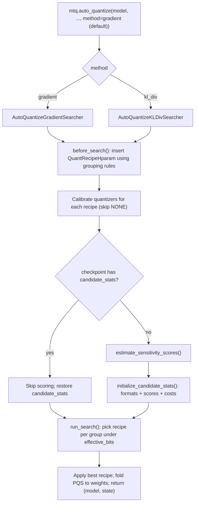
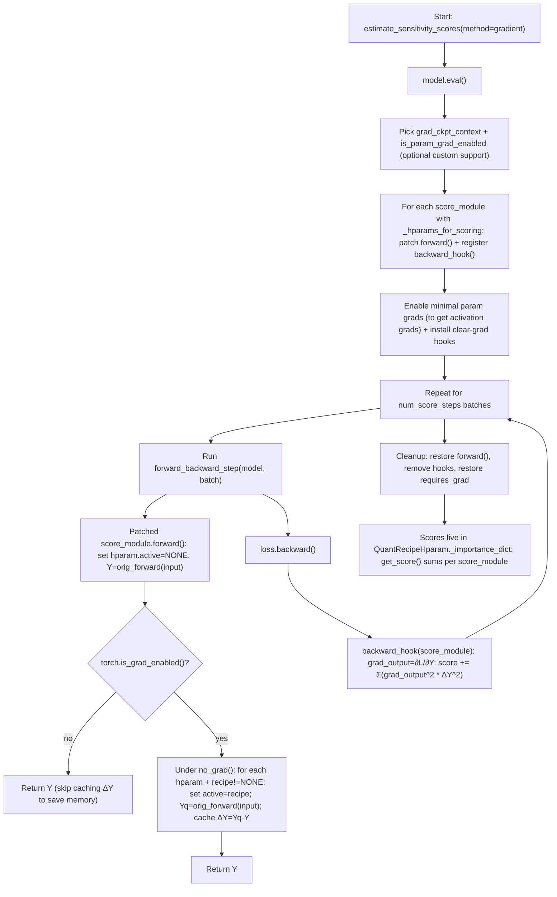
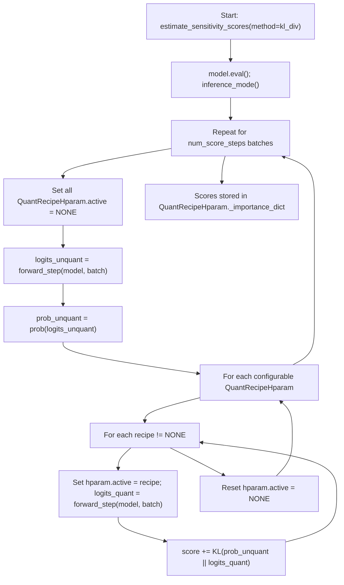

About: ModelOpt AutoQuant per-layer sensitivity scoring (default algorithm)

## HEADER
- **Purpose**: Answer “what algorithm does ModelOpt use by default for per-layer sensitivity?” and document the exact scoring formula used by `modelopt.torch.quantization.auto_quantize(method="gradient")`.
- **Status**: Draft (source-backed)
- **Date**: 2025-12-16
- **Owner**: AI assistant (Codex CLI)
- **Source**:
  - ModelOpt source (this repo checkout): `extern/TensorRT-Model-Optimizer/modelopt/torch/quantization/model_quant.py`, `extern/TensorRT-Model-Optimizer/modelopt/torch/quantization/algorithms.py`
  - Upstream (pinned to local checkout commit `5a4242faf4147fb0688bb73e10ca30b8ad3aabb3`):
    - https://github.com/NVIDIA/TensorRT-Model-Optimizer/blob/5a4242faf4147fb0688bb73e10ca30b8ad3aabb3/modelopt/torch/quantization/model_quant.py
    - https://github.com/NVIDIA/TensorRT-Model-Optimizer/blob/5a4242faf4147fb0688bb73e10ca30b8ad3aabb3/modelopt/torch/quantization/algorithms.py
  - ModelOpt docs (API): https://nvidia.github.io/TensorRT-Model-Optimizer/reference/generated/modelopt.torch.quantization.model_quant.html

## 1. The default algorithm (short answer)

When you call `modelopt.torch.quantization.auto_quantize(...)` without specifying `method=...`, ModelOpt defaults to:

- `method="gradient"` (gradient-based sensitivity scoring), implemented by `AutoQuantizeGradientSearcher`

This is explicit in the API signature and method selection logic:

- `extern/TensorRT-Model-Optimizer/modelopt/torch/quantization/model_quant.py` (`auto_quantize(..., method: str = "gradient", ...)` and the `if method == "gradient": searcher = AutoQuantizeGradientSearcher()` branch)

## 2. What “gradient” sensitivity means in ModelOpt (the actual score)

ModelOpt’s gradient method estimates per-layer “sensitivity” as an approximation of loss increase caused by quantizing that layer, using a 2nd-order Taylor expansion around the unquantized output and substituting Fisher information for the Hessian (see `AutoQuantizeGradientSearcher` docstring in `algorithms.py`).

### 2.1 Math (KaTeX notation)

Let:
- each scoring sample (batch) $b$ contain model inputs $x^{(b)}$ and targets $y^{(b)}$ (for example, token IDs for language modeling, or class labels for classification).
- $L^{(b)}$ be the scalar objective used for sensitivity scoring, defined as:

$$
L^{(b)} \;=\; \ell\!\left(f(x^{(b)}),\, y^{(b)}\right)
$$

where $f(\cdot)$ denotes the model prediction used by the task (typically logits), and $\ell(\cdot,\cdot)$ is a differentiable task loss.

Examples of $\ell$ used in common ModelOpt workflows:
- **Causal language modeling (LLM PTQ flow)**: next-token negative log-likelihood / cross-entropy (the standard LM training loss). For a token sequence $t_1,\dots,t_T$ and predicted distributions $p_\theta(\cdot \mid t_{\le k})$:

$$
L^{(b)} \;=\; -\frac{1}{T-1}\sum_{k=1}^{T-1} \log p_\theta\!\left(t_{k+1} \mid t_{\le k}\right)
$$

> Source (LLM PTQ example): `extern/TensorRT-Model-Optimizer/examples/llm_ptq/hf_ptq.py:128` uses the model-provided causal-LM objective for scoring; the calibration dataloader constructs token labels from the input tokens (masking padding) in `extern/TensorRT-Model-Optimizer/modelopt/torch/utils/dataset_utils.py:278` so Hugging Face computes the standard next-token cross-entropy internally.

- **Image classification (vision auto-quant example)**: multiclass cross-entropy. For logits $z \in \mathbb{R}^C$ and ground-truth class $y$:

$$
L^{(b)} \;=\; -z_y + \log\sum_{c=1}^{C} e^{z_c}
$$

> Source (vision auto-quant example): `extern/TensorRT-Model-Optimizer/examples/onnx_ptq/torch_quant_to_onnx.py:116` uses multiclass cross-entropy as the scoring objective.

Other supervised losses are also valid (e.g., mean-squared error for regression), as long as they produce a single scalar objective that is differentiable w.r.t. the model’s intermediate activations being scored.
- $Y$ be the (unquantized) output tensor of the chosen score module for a given batch.
- $Y_r$ be the output tensor when the same module is evaluated under a candidate quantization recipe $r$.
- $\Delta Y_r = Y_r - Y$ be the output perturbation introduced by recipe $r$.
- $G^{(b)} = \frac{\partial L^{(b)}}{\partial Y^{(b)}}$ be the gradient of the objective w.r.t. the chosen score-module output for batch $b$ (this is score-module-specific; different score modules generally have different gradients).

ModelOpt’s gradient-based per-batch score for recipe $r$ is the elementwise squared product, summed over all tensor elements:

$$
s_r \;=\; \sum_i \left(G_i\right)^2 \left(\Delta Y_{r,i}\right)^2
$$

> Source (score implementation): `extern/TensorRT-Model-Optimizer/modelopt/torch/quantization/algorithms.py` defines `_get_auto_quantize_score(grad_output, output_diff)`:
>
> ```python
> def _get_auto_quantize_score(grad_output, output_diff):
>     return ((grad_output.float() ** 2) * (output_diff.float() ** 2)).sum()
> ```

Note: The derivatives (and the Taylor/Fisher “Hessian” approximation) here are with respect to the score-module output $Y$ (an activation), not the layer weights. ModelOpt does not use $\,\partial L / \partial W\,$ or a weight-space Hessian for sensitivity scoring; weight quantization affects the score only through the induced activation/output perturbation $\Delta Y_r$.

> Source (ModelOpt intent): `extern/TensorRT-Model-Optimizer/modelopt/torch/quantization/algorithms.py:806` (“AutoQuantize only needs activation gradients to be computed (not weight gradients).”)

Across `num_score_steps` batches, ModelOpt accumulates:

$$
S_r \;=\; \sum_{b=1}^{B} \sum_i \left(G^{(b)}_i\right)^2 \left(\Delta Y^{(b)}_{r,i}\right)^2
$$

Connection to the docstring (“Taylor expansion + Fisher for Hessian”): a standard 2nd-order approximation is

$$
\Delta L \;\approx\; \frac{1}{2}\,\Delta Y_r^\top H\,\Delta Y_r
$$

and for log-likelihood losses ModelOpt’s docstring motivates approximating $H$ with Fisher information $\mathcal{I}$, then (implicitly) taking a diagonal approximation:

$$
H \;\approx\; \mathcal{I} \;\approx\; \mathbb{E}[G G^\top]
\quad\Rightarrow\quad
\Delta L \;\approx\; \frac{1}{2}\sum_i \mathbb{E}\!\left[G_i^2\right]\left(\Delta Y_{r,i}\right)^2
$$

The implementation uses a finite-sample estimate and drops constant factors, yielding the practical scoring rule “larger $S_r$ ⇒ more sensitive”.

## 2.2 Implementation correspondence (ModelOpt variable names)

ModelOpt implements the per-recipe score in `_get_auto_quantize_score(grad_output, output_diff)` (see the citation directly under the $s_r$ equation above).

Symbol mapping:
- $G^{(b)} = \frac{\partial L^{(b)}}{\partial Y^{(b)}}$ corresponds to `grad_output` in the backward hook.
- $\Delta Y_r$ corresponds to `output_diff`, cached as “quantized output minus unquantized output” for each candidate recipe $r$.

Source locations:
- Score formula: `extern/TensorRT-Model-Optimizer/modelopt/torch/quantization/algorithms.py` (`_get_auto_quantize_score`)
- Reference losses used in ModelOpt example workflows:
  - LLM PTQ flow uses the model’s built-in causal-LM cross-entropy: `extern/TensorRT-Model-Optimizer/examples/llm_ptq/hf_ptq.py`
  - Vision example uses multiclass cross-entropy: `extern/TensorRT-Model-Optimizer/examples/onnx_ptq/torch_quant_to_onnx.py`

## 3. How the score is computed (what ModelOpt actually does)

In `AutoQuantizeGradientSearcher._estimate_auto_quantize_scores(...)`:

1. For each “score module” (typically a quantizable Linear/Conv), ModelOpt monkey-patches `module.forward` to:
   - Force “no quantization” for the scored hparams and run the normal forward to produce `Y`
   - Under `torch.no_grad()`, temporarily enable each candidate recipe and re-run the forward to compute and cache `ΔY = Q(Y) - Y` for that recipe
2. It runs your `forward_backward_step` (or `forward_step` + `loss_func`) for `num_score_steps` batches.
3. A backward hook receives `grad_output = ∂L/∂Y` and accumulates `sum(grad_output^2 * ΔY^2)` into an internal per-layer-per-recipe importance dict.

Important implications:
- **This default method requires a backward pass**, so you must provide labels (via `loss_func`) or implement a `forward_backward_step`.
- Sensitivity is measured in **activation/output space** (gradients w.r.t. a score-module output), not in weight space (no $\,\partial L / \partial W\,$ is used for scoring).
- “Higher score” means “more sensitive to quantization” for that layer/recipe.

## 3.1 Mermaid: AutoQuantize end-to-end flow (calibrate → score → search)



Notes (source):
- Calibration loop is in `extern/TensorRT-Model-Optimizer/modelopt/torch/quantization/algorithms.py` (`_AutoQuantizeBaseSearcher.before_search()`).
- Sensitivity scoring is `AutoQuantizeGradientSearcher.estimate_sensitivity_scores()` / `AutoQuantizeKLDivSearcher.estimate_sensitivity_scores()`.
- Search differs by method: gradient uses an LP solver; KLDiv uses a threshold-based binary search (see `run_search_with_stats` in each searcher).

## 3.2 Mermaid: Gradient (“Taylor/Fisher”) sensitivity scoring mechanics



Key modelopt details reflected above (source-backed):
- Score modules are not always the quantized modules: ModelOpt can estimate a group’s sensitivity at a higher-level “score module” (e.g., MoE MLP output) via `score_module_rules`; the hparam attaches itself to `score_module._hparams_for_scoring` (see `QuantRecipeHparam.__init__` and `_AutoQuantizeBaseSearcher.insert_hparams_after_merge_rules()` in `extern/TensorRT-Model-Optimizer/modelopt/torch/quantization/algorithms.py`).
- The exact score function is `sum((grad_output^2) * (ΔY^2))` (`_get_auto_quantize_score` in `extern/TensorRT-Model-Optimizer/modelopt/torch/quantization/algorithms.py`).

## 4. Alternative algorithm: `method="kl_div"` (label-free)

ModelOpt also supports `method="kl_div"`:
- It measures sensitivity via **KL divergence** between unquantized and quantized model outputs (logits), and does not require labels/backward.
- It uses a different search strategy (threshold-based binary search) than the gradient method (linear programming).

See:
- `extern/TensorRT-Model-Optimizer/modelopt/torch/quantization/model_quant.py` (method selection)
- `extern/TensorRT-Model-Optimizer/modelopt/torch/quantization/algorithms.py` (`AutoQuantizeKLDivSearcher`)

## 4.1 Mermaid: KL-divergence sensitivity scoring mechanics (label-free)



## 4.2 Pseudocode (matches ModelOpt source structure)

### 4.2.1 High-level: `auto_quantize(...)` selects the scoring algorithm

```text
function AUTO_QUANTIZE(model, quantization_formats, data_loader, forward_step, loss_func?, forward_backward_step?, method="gradient"):
    model = apply_mode(model, "auto_quantize")  # inserts modelopt hparam machinery
    disable_all_quantizers(model)               # AutoQuantize enables as-needed

    if method == "gradient":
        searcher = AutoQuantizeGradientSearcher()
    else if method == "kl_div":
        searcher = AutoQuantizeKLDivSearcher()
    else:
        error("Invalid method")

    searcher.before_search():
        search_recipes = quantization_formats + [NONE]
        attach QuantRecipeHparam to quant_modules (grouped by quant_grouping_rules) and to score_modules (via score_module_rules)
        for each recipe != NONE:
            set all hparams active = recipe
            calibrate_quantizers(model, algorithm=recipe.algorithm, num_calib_steps)
        if checkpoint had candidate_stats:
            skip scoring
        else:
            searcher.estimate_sensitivity_scores()
            searcher.initialize_candidate_stats()  # formats / scores / costs per hparam

    searcher.run_search(): pick best recipe per hparam under effective_bits constraint
    fold_pre_quant_scale_to_weights(model)
    return model, searcher.state_dict()
```

### 4.2.2 Gradient scoring: `score += Σ (∂L/∂Y)^2 * (ΔY)^2`

```text
function ESTIMATE_SENSITIVITY_SCORES_GRADIENT(model, data_loader, forward_step, loss_func or forward_backward_step, num_score_steps):
    model.eval()

    (grad_ckpt_context, is_param_grad_enabled) = maybe_select_custom_support(model)

    with grad_ckpt_context(model) if provided:
        score_modules = { m | m has _hparams_for_scoring and some hparam is configurable }

        for each score_module in score_modules:
            patch score_module.forward(input):
                for hparam in score_module._hparams_for_scoring:
                    if hparam.configurable:
                        hparam.active = NONE
                Y = original_forward(input)
                if torch.is_grad_enabled() is false:
                    return Y
                for hparam in score_module._hparams_for_scoring:
                    for recipe in hparam.choices where recipe != NONE:
                        hparam.active = recipe
                        Yq = original_forward(input)
                        cache ΔY[hparam][recipe] = (Yq - Y)  # handle tuple outputs by subtracting first element
                    hparam.active = NONE
                return Y

            register backward_hook(score_module, grad_output):
                for each (hparam, recipe) in cached ΔY:
                    importance[hparam][recipe][score_module] += sum((grad_output^2) * (ΔY[hparam][recipe]^2))

        for each parameter p in model.parameters:
            p.requires_grad = is_param_grad_enabled(p.name, model)  # often only enough to enable embeddings
            install hook to clear p.grad ASAP

        repeat num_score_steps:
            run forward_backward_step(model, batch)  # or forward_step + loss_func + loss.backward()

        restore original forwards, remove hooks, restore parameter requires_grad
```

### 4.2.3 KL-div scoring: `score += KL(p_unquant || p_quant)`

```text
function ESTIMATE_SENSITIVITY_SCORES_KLDIV(model, data_loader, forward_step, num_score_steps):
    model.eval()
    for batch in first num_score_steps batches:
        set all QuantRecipeHparam.active = NONE
        logits_u = forward_step(model, batch)          # must return logits
        prob_u = PROB(logits_u)                        # ModelOpt uses helper to handle LM head / TP cases
        for each configurable hparam:
            for recipe in hparam.choices where recipe != NONE:
                hparam.active = recipe
                logits_q = forward_step(model, batch)
                importance[hparam][recipe][score_module0] += KL(prob_u || logits_q)
            hparam.active = NONE
```

## 5. Minimal usage snippet (explicitly pin the method)

```python
import modelopt.torch.quantization as mtq

quantized_model, state = mtq.auto_quantize(
    model,
    constraints={"effective_bits": 4.8},
    quantization_formats=[mtq.NVFP4_AWQ_LITE_CFG, mtq.FP8_DEFAULT_CFG],
    data_loader=calib_loader,
    forward_step=forward_step,
    loss_func=loss_func,     # required for method="gradient"
    num_calib_steps=512,
    num_score_steps=128,
    method="gradient",       # default; set explicitly for reproducibility
)
```

If you need label-free scoring (logits only):

```python
quantized_model, state = mtq.auto_quantize(
    model,
    constraints={"effective_bits": 4.8},
    quantization_formats=[mtq.NVFP4_AWQ_LITE_CFG, mtq.FP8_DEFAULT_CFG],
    data_loader=calib_loader,
    forward_step=forward_step,  # must return logits
    num_calib_steps=512,
    num_score_steps=128,
    method="kl_div",
)
```
