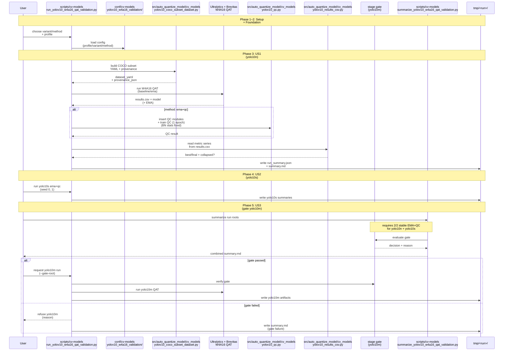
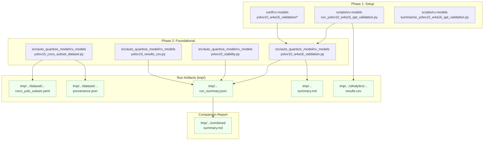
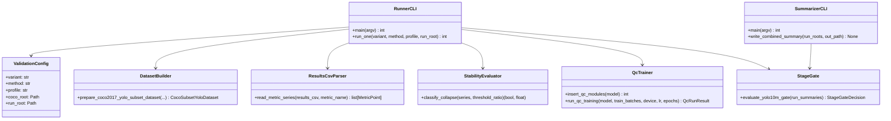
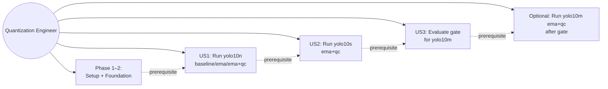
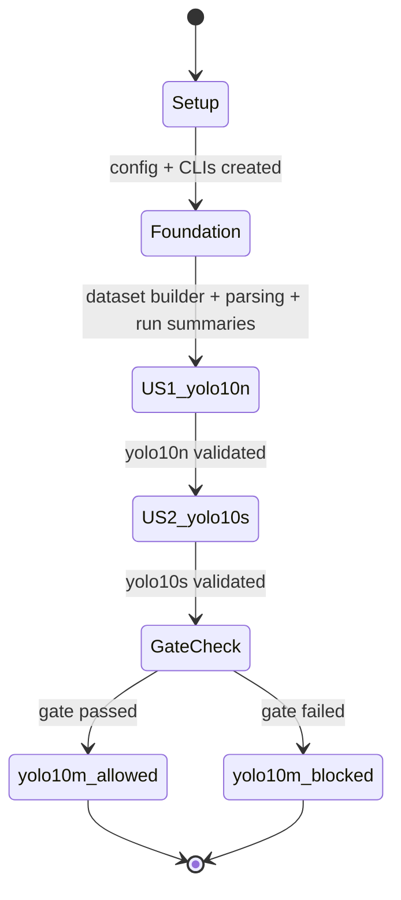

# Phase Integration Guide: Validate YOLOv10 W4A16 QAT Stability (EMA + QC)

**Feature**: `001-yolov10-qat-validation` | **Phases**: 6

## Overview

This feature builds a reproducible validation ladder for the WACV’24 stabilization method (EMA + post-hoc QC) under W4A16 QAT, prioritizing fast correctness checks on `yolo10n` and `yolo10s`. It produces standardized run artifacts (`run_summary.json`, `summary.md`) and a comparison report, and it enforces a stage gate that blocks `yolo10m` until the smaller variants pass stability and repeatability criteria.

The implementation is structured so core logic lives in `src/auto_quantize_model/cv_models/` and user-facing orchestration is via scripts under `scripts/cv-models/`, with all commands executed in Pixi `cu128`.

## Phase Flow

**End-to-End Sequence Diagram**



## Artifact Flow Between Phases



## System Architecture



## Use Cases



## Activity Flow



## Inter-Phase Dependencies

### Phase 1 → Phase 2

**Artifacts**

- `conf/cv-models/yolov10_w4a16_validation/*` created in Phase 1 are read by Phase 2/3 code.
- `scripts/cv-models/run_yolov10_w4a16_qat_validation.py` exists so Phase 2 can wire config and artifact writers into a real entrypoint.

**Code Dependencies**

```python
# scripts/cv-models/run_yolov10_w4a16_qat_validation.py uses Phase-2 helpers.
from auto_quantize_model.cv_models.yolov10_w4a16_validation import load_validation_config
```

### Phase 2 → Phase 3 (US1)

**Artifacts**

- Dataset builder outputs used by training:
  - `tmp/<run>/dataset/.../coco_yolo_subset.yaml`
  - `tmp/<run>/dataset/.../provenance.json`

**Code Dependencies**

```python
from auto_quantize_model.cv_models.yolov10_coco_subset_dataset import prepare_coco2017_yolo_subset_dataset
from auto_quantize_model.cv_models.yolov10_results_csv import read_metric_series
from auto_quantize_model.cv_models.yolov10_stability import classify_collapse
```

### Phase 3 → Phase 4 (US2)

**Artifacts**

- yolo10n run roots under `tmp/` containing:
  - `run_summary.json`
  - `summary.md`

These are inputs for the combined summarizer used in Phase 4 and the gate used in Phase 5.

### Phase 4 → Phase 5 (US3)

**Artifacts**

- yolo10s EMA+QC run roots (two seeds) with `run_summary.json`.
- Combined report may be written to a chosen `tmp/.../combined/summary.md`.

## Integration Testing

```bash
# Core unit + integration tests (no GPU training).
pixi run -e cu128 pytest tests/unit/
pixi run -e cu128 pytest tests/integration/

# Optional: run the full manual workflow on GPU.
pixi run -e cu128 python tests/manual/yolov10_w4a16_ema_qc_validation/README.md
```

## Critical Integration Points

1. **Dataset comparability**
   - Runs must record dataset selection/provenance in `run_summary.json` so the summarizer and gate can reject non-comparable runs.
2. **Metric parsing correctness**
   - `results.csv` parsing must be robust (duplicate rows, missing values) so collapse decisions are stable and reproducible.
3. **BN handling during QC**
   - QC must keep BN running statistics fixed, otherwise QC can chase moving stats and mask oscillation issues.
4. **Gate enforcement UX**
   - yolo10m must be refused with a clear reason, and that reason must be recorded in `summary.md` for reviewability.

## References

- Individual phase guides: `context/tasks/001-yolov10-qat-validation/impl-phase-*.md`
- Spec: `specs/001-yolov10-qat-validation/spec.md`
- Tasks: `specs/001-yolov10-qat-validation/tasks.md`
- Data model: `specs/001-yolov10-qat-validation/data-model.md`
- Contracts: `specs/001-yolov10-qat-validation/contracts/`
