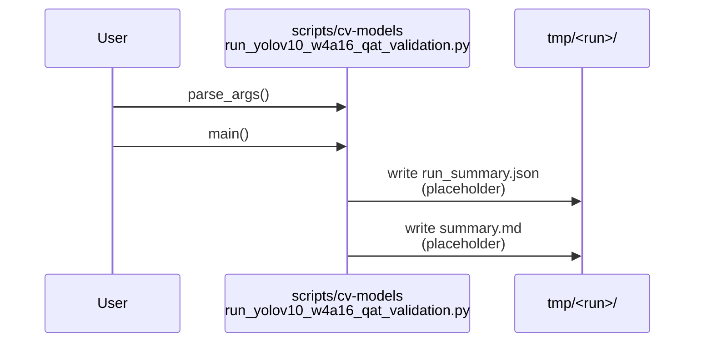
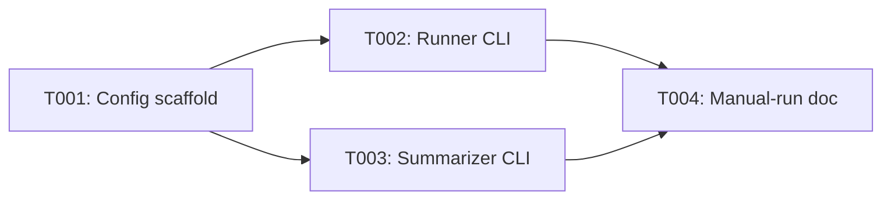

# Implementation Guide: Phase 1 — Setup (Shared Infrastructure)

**Phase**: 1 | **Feature**: Validate YOLOv10 W4A16 QAT Stability (EMA + QC) | **Tasks**: T001–T004

## Goal

Create the minimal scaffolding (configs, CLI entrypoints, and manual-run docs) so later phases can focus on implementing the algorithm and producing reproducible artifacts under Pixi `cu128`.

## Public APIs

### T002: Runner CLI skeleton

Defines the user-facing CLI contract for launching a single run (variant + method + profile) and writing `run_summary.json` and `summary.md`.

```python
# scripts/cv-models/run_yolov10_w4a16_qat_validation.py

from __future__ import annotations

import argparse
from pathlib import Path


def parse_args(argv: list[str] | None = None) -> argparse.Namespace:
    """Parse CLI args for a single QAT validation run."""


def main(argv: list[str] | None = None) -> int:
    """Run a single validation experiment and write run artifacts under --run-root."""
    args = parse_args(argv)
    run_root = Path(args.run_root)
    run_root.mkdir(parents=True, exist_ok=True)
    # Phase 2+ implements the actual logic.
    return 0
```

**Usage Flow**:



### T003: Summarizer CLI skeleton

Defines the CLI contract for collecting multiple run roots and producing a comparison `summary.md`.

```python
# scripts/cv-models/summarize_yolov10_w4a16_qat_validation.py

from __future__ import annotations

import argparse
from pathlib import Path


def parse_args(argv: list[str] | None = None) -> argparse.Namespace:
    """Parse CLI args for summarizing multiple run roots."""


def main(argv: list[str] | None = None) -> int:
    """Read run_summary.json files and write a comparison summary.md."""
    args = parse_args(argv)
    out_path = Path(args.out_path)
    out_path.parent.mkdir(parents=True, exist_ok=True)
    return 0
```

## Phase Integration



## Testing

### Test Input

- No dataset or GPU required for Phase 1.
- Only repository checkout and Pixi `cu128` environment are assumed.

### Test Procedure

```bash
# Syntax sanity (no execution of training in Phase 1).
pixi run -e cu128 python -m compileall scripts/cv-models/run_yolov10_w4a16_qat_validation.py
pixi run -e cu128 python -m compileall scripts/cv-models/summarize_yolov10_w4a16_qat_validation.py
```

### Test Output

- No syntax errors.

## References

- Spec: `specs/001-yolov10-qat-validation/spec.md`
- Tasks: `specs/001-yolov10-qat-validation/tasks.md`
- Contracts: `specs/001-yolov10-qat-validation/contracts/`

## Implementation Summary

- Added Hydra-style config scaffold under `conf/cv-models/yolov10_w4a16_validation/` (defaults + profile/variant/method groups).
- Added CLI entrypoints `scripts/cv-models/run_yolov10_w4a16_qat_validation.py` and `scripts/cv-models/summarize_yolov10_w4a16_qat_validation.py` (argparse, contract-compatible flags).
- Added manual-run guide at `tests/manual/yolov10_w4a16_ema_qc_validation/README.md` using `pixi run -e cu128 ...`.
