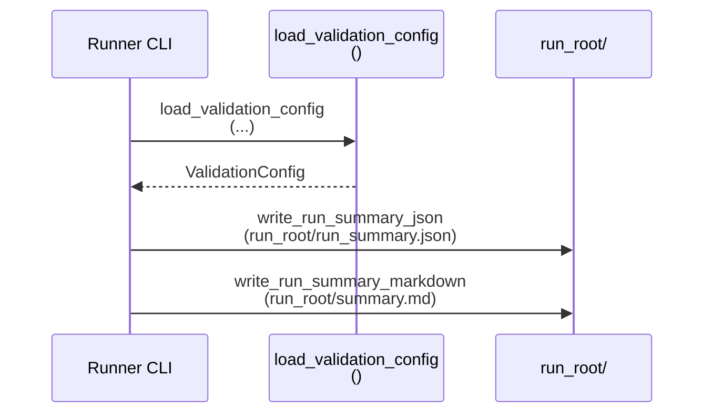

# Implementation Guide: Phase 2 — Foundational (Blocking Prerequisites)

**Phase**: 2 | **Feature**: Validate YOLOv10 W4A16 QAT Stability (EMA + QC) | **Tasks**: T005–T014

## Goal

Implement the shared building blocks required by all user stories:

- deterministic dataset selection and provenance,
- robust parsing of Ultralytics `results.csv`,
- stability/collapse classification,
- standardized run artifacts (`run_summary.json`, `summary.md`).

## Public APIs

### T005/T009: Validation config + run summary types

Defines the configuration surface and the run artifact writers used by the runner and summarizer CLIs.

```python
# src/auto_quantize_model/cv_models/yolov10_w4a16_validation.py

from __future__ import annotations

from dataclasses import dataclass
from pathlib import Path
from typing import Any


@dataclass(frozen=True)
class ValidationConfig:
    """Resolved config for one validation run (variant + method + profile)."""

    variant: str
    method: str
    profile: str
    coco_root: Path
    run_root: Path
    imgsz: int
    epochs: int
    batch: int
    device: str
    workers: int
    seed: int
    amp: bool


@dataclass(frozen=True)
class RunMetricsSummary:
    """Primary metric values used for stability checks."""

    primary_name: str
    best_value: float
    final_value: float


@dataclass(frozen=True)
class RunStability:
    """Collapse detection outputs."""

    collapse_threshold_ratio: float
    final_over_best_ratio: float
    collapsed: bool


def load_validation_config(*, config_dir: Path, overrides: dict[str, Any]) -> ValidationConfig:
    """Load and resolve configs from `conf/cv-models/yolov10_w4a16_validation/`."""


def write_run_summary_json(*, out_path: Path, payload: dict[str, Any]) -> None:
    """Write `run_summary.json` to disk."""


def write_run_summary_markdown(*, out_path: Path, payload: dict[str, Any]) -> None:
    """Write a human-readable `summary.md` describing stability and key metrics."""
```

**Usage Flow**:



### T006: Deterministic COCO subset dataset builder

Produces a run-local YOLO dataset YAML and provenance so runs are comparable.

```python
# src/auto_quantize_model/cv_models/yolov10_coco_subset_dataset.py

from __future__ import annotations

from dataclasses import dataclass
from pathlib import Path


@dataclass(frozen=True)
class CocoSubsetYoloDataset:
    dataset_root: Path
    dataset_yaml: Path
    provenance_json: Path
    train_images: int
    val_images: int


def prepare_coco2017_yolo_subset_dataset(
    *,
    repo_root: Path,
    coco_root: Path,
    out_dir: Path,
    train_list: Path | None,
    train_max_images: int | None,
    val_max_images: int,
    seed: int,
    selection: str,
) -> CocoSubsetYoloDataset:
    """Build a deterministic YOLO-format COCO subset dataset for fast QAT validation."""
```

### T007: Ultralytics `results.csv` parser

Extracts a stable primary metric series even if `results.csv` has duplicated rows or formatting oddities.

```python
# src/auto_quantize_model/cv_models/yolov10_results_csv.py

from __future__ import annotations

from dataclasses import dataclass
from pathlib import Path


@dataclass(frozen=True)
class MetricPoint:
    epoch: int
    value: float


def read_metric_series(*, results_csv: Path, metric_name: str) -> list[MetricPoint]:
    """Return a per-epoch metric series for a named column (e.g. metrics/mAP50-95(B))."""
```

### T008: Stability (collapse) classification

Encodes the spec-defined collapse rule: collapsed if `final < 0.5 * best`.

```python
# src/auto_quantize_model/cv_models/yolov10_stability.py

from __future__ import annotations

from auto_quantize_model.cv_models.yolov10_results_csv import MetricPoint


def summarize_series(series: list[MetricPoint]) -> tuple[float, float]:
    """Return (best_value, final_value) from a metric series."""


def classify_collapse(
    *,
    series: list[MetricPoint],
    threshold_ratio: float = 0.5,
) -> tuple[bool, float]:
    """Return (collapsed, final_over_best_ratio)."""
```

## Phase Integration

```mermaid
graph TD
    A[T006: Dataset subset] --> B[Ultralytics training<br/>produces results.csv]
    B --> C[T007: read_metric_series<br/>()]
    C --> D[T008: classify_collapse<br/>()]
    D --> E[T009: write run_summary.json<br/>+ summary.md]
```

## Testing

### Test Input

- CSV fixtures:
  - `tests/unit/cv_models/fixtures/yolov10_results.csv`
- Tiny COCO fixtures:
  - `tests/unit/cv_models/fixtures/coco_instances_train.json`
  - `tests/unit/cv_models/fixtures/coco_instances_val.json`
- Temporary output directory:
  - `tmp/test-yolov10-w4a16-validation/` (created by tests)

### Test Procedure

```bash
pixi run -e cu128 pytest tests/unit/cv_models/test_yolov10_results_csv.py
pixi run -e cu128 pytest tests/unit/cv_models/test_yolov10_stability.py
pixi run -e cu128 pytest tests/unit/cv_models/test_yolov10_coco_subset_dataset.py
pixi run -e cu128 pytest tests/integration/test_yolov10_w4a16_run_summary.py
```

### Test Output

- `N passed, 0 failed`
- Optional: temporary files written under `tmp/test-yolov10-w4a16-validation/` are cleaned up by the tests.

## References

- Spec: `specs/001-yolov10-qat-validation/spec.md`
- Data model: `specs/001-yolov10-qat-validation/data-model.md`
- Contracts: `specs/001-yolov10-qat-validation/contracts/`
- Tasks: `specs/001-yolov10-qat-validation/tasks.md`

## Implementation Summary

Placeholder (fill after implementation).
