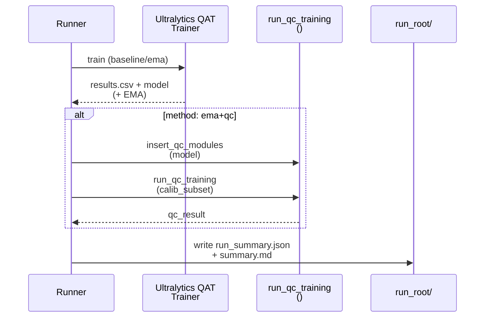
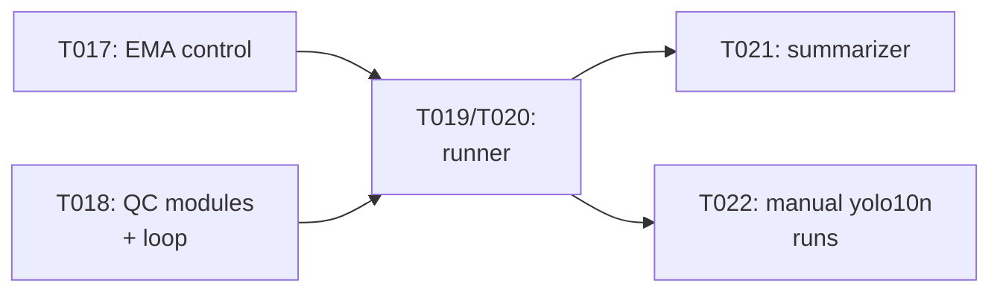

# Implementation Guide: Phase 3 — US1 (yolo10n validation)

**Phase**: 3 | **Feature**: Validate YOLOv10 W4A16 QAT Stability (EMA + QC) | **Tasks**: T015–T022

## Goal

Implement the end-to-end yolo10n validation workflow:

- W4A16 QAT for `baseline` and `ema`,
- post-hoc QC training for `ema+qc` (1 epoch, BN stats fixed),
- per-run artifacts: `run_summary.json` + `summary.md`,
- multi-run comparison `summary.md` (baseline vs EMA vs EMA+QC, multiple seeds).

## Public APIs

### T017: Method-aware EMA control (baseline vs EMA)

Expose a method-driven EMA configuration so baseline evaluation uses raw weights (or equivalently EMA decay=0).

```python
# src/auto_quantize_model/cv_models/yolov10_ultralytics_trainers.py

from __future__ import annotations

from typing import Any, Dict

from ultralytics.models.yolov10.train import YOLOv10DetectionTrainer  # type: ignore[import-not-found]


class Yolov10BrevitasW4A16Trainer(YOLOv10DetectionTrainer):
    """YOLOv10 trainer with Brevitas W4A16 fake-quant."""

    def __init__(self, *, overrides: Dict[str, Any], method_variant: str, _callbacks=None) -> None:
        """Initialize trainer with method-specific EMA behavior.

        Args:
            overrides: Ultralytics trainer overrides (data/model/epochs/etc.).
            method_variant: One of {"baseline", "ema", "ema+qc"}.
        """
        super().__init__(overrides=overrides, _callbacks=_callbacks)
        self.m_method_variant = str(method_variant)

    def _setup_train(self, world_size: int) -> None:  # type: ignore[override]
        """Customize EMA creation based on method variant (baseline vs EMA)."""
        super()._setup_train(world_size)
        # Replace self.ema with decay=0 for baseline, keep default for EMA/EMA+QC.
```

### T018: QC modules + QC training loop

Implements the WACV’24 QC step: learn per-channel scale/shift correction parameters with base weights frozen and BN running stats fixed.

```python
# src/auto_quantize_model/cv_models/yolov10_qc.py

from __future__ import annotations

from dataclasses import dataclass
from pathlib import Path
from typing import Any, Dict, Iterable

import torch
from torch import nn


class QcBatchNorm2d(nn.Module):
    """Apply a learnable affine correction before BN: x' = gamma*x + beta, then BN(x').

    Notes:
    - gamma/beta are per-output-channel parameters (broadcast over N,H,W).
    - During QC training, BN running stats are kept fixed (BN modules in eval mode).
    """

    def __init__(self, bn: nn.BatchNorm2d) -> None:
        super().__init__()
        self.m_bn = bn
        self.m_gamma = nn.Parameter(torch.ones(bn.num_features, dtype=torch.float32))
        self.m_beta = nn.Parameter(torch.zeros(bn.num_features, dtype=torch.float32))

    def forward(self, x: torch.Tensor) -> torch.Tensor:  # type: ignore[override]
        gamma = self.m_gamma.view(1, -1, 1, 1).to(dtype=x.dtype, device=x.device)
        beta = self.m_beta.view(1, -1, 1, 1).to(dtype=x.dtype, device=x.device)
        return self.m_bn(x * gamma + beta)


@dataclass(frozen=True)
class QcRunResult:
    qc_steps: int
    qc_epochs: int
    lr: float


def insert_qc_modules(model: nn.Module) -> int:
    """Replace eligible BN modules with QcBatchNorm2d wrappers and return count inserted."""


def run_qc_training(
    *,
    model: nn.Module,
    train_batches: Iterable[Dict[str, Any]],
    device: torch.device,
    lr: float,
    epochs: int,
) -> QcRunResult:
    """Train only QC parameters for `epochs`, freezing base weights and fixing BN stats."""
```

**Usage Flow**:



### T019/T020: Runner implementation for yolo10n

Orchestrates dataset subset building, trainer execution, QC (when enabled), and artifact writing.

```python
# scripts/cv-models/run_yolov10_w4a16_qat_validation.py

from __future__ import annotations

from pathlib import Path


def run_one(
    *,
    variant: str,
    method: str,
    profile: str,
    run_root: Path,
) -> int:
    """Run one experiment and write run artifacts under run_root."""
```

## Phase Integration



## Testing

### Test Input

- Unit test toy models for QC:
  - constructed inside `tests/unit/cv_models/test_yolov10_qc.py`
- Summarizer fixtures:
  - `tests/integration/fixtures/yolov10_w4a16/**/run_summary.json`
- Manual run prerequisites (GPU):
  - COCO2017 under `datasets/coco2017/source-data/`
  - yolo10n checkpoint `models/yolo10/checkpoints/yolov10n.pt`

### Test Procedure

```bash
# Automated tests (no GPU training required).
pixi run -e cu128 pytest tests/unit/cv_models/test_yolov10_qc.py
pixi run -e cu128 pytest tests/integration/test_yolov10_w4a16_summarize.py

# Manual yolo10n smoke validation (GPU + COCO required).
pixi run -e cu128 python tests/manual/yolov10_w4a16_ema_qc_validation/README.md
```

### Test Output

- Unit/integration tests: `N passed, 0 failed`.
- Manual runs: each run root contains `run_summary.json` and `summary.md`, and the comparison summary is written by the summarizer.

## References

- Spec: `specs/001-yolov10-qat-validation/spec.md`
- Research: `specs/001-yolov10-qat-validation/research.md`
- Data model: `specs/001-yolov10-qat-validation/data-model.md`
- Contracts: `specs/001-yolov10-qat-validation/contracts/`
- Tasks: `specs/001-yolov10-qat-validation/tasks.md`

## Implementation Summary

Placeholder (fill after implementation).
