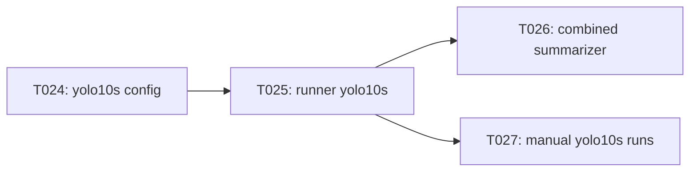

# Implementation Guide: Phase 4 — US2 (yolo10s validation)

**Phase**: 4 | **Feature**: Validate YOLOv10 W4A16 QAT Stability (EMA + QC) | **Tasks**: T023–T027

## Goal

Extend the validated yolo10n workflow to yolo10s:

- yolo10s variant defaults and profiles,
- runner support for `--variant yolo10s`,
- combined n/s comparison report.

## Public APIs

### T023: Variant resolution tests (contract for mapping)

Locks in the contract that `yolo10s` resolves to the expected checkpoint/config paths.

```python
# tests/unit/cv_models/test_yolov10_variant_resolution.py

from __future__ import annotations

from pathlib import Path


def test_resolve_yolo10s_checkpoint_exists(repo_root: Path) -> None:
    """yolo10s must resolve to models/yolo10/checkpoints/yolov10s.pt."""
```

### T024/T025: Runner support for `yolo10s`

Runner reads `variant/yolo10s.yaml` and executes the same pipeline as yolo10n.

```python
# conf/cv-models/yolov10_w4a16_validation/variant/yolo10s.yaml

# Defines:
# - checkpoint: models/yolo10/checkpoints/yolov10s.pt
# - default epochs/batch/imgsz for profile=short
```

```python
# scripts/cv-models/run_yolov10_w4a16_qat_validation.py

def resolve_variant_config(variant: str) -> dict:
    """Return resolved variant configuration for yolo10n/yolo10s/yolo10m."""
```

### T026: Combined n+s report

Summarizer produces a combined report to support the stage gate in US3.

```python
# scripts/cv-models/summarize_yolov10_w4a16_qat_validation.py

def write_combined_summary(*, run_roots: list[Path], out_path: Path) -> None:
    """Write a combined yolo10n+yolo10s summary.md from multiple run_summary.json files."""
```

## Phase Integration



## Testing

### Test Input

- Variant resolution uses repo files:
  - `models/yolo10/checkpoints/yolov10s.pt`
- Combined summarizer fixtures:
  - `tests/integration/fixtures/yolov10_w4a16/**/run_summary.json`
- Manual run prerequisites:
  - COCO2017 under `datasets/coco2017/source-data/`
  - yolo10s checkpoint `models/yolo10/checkpoints/yolov10s.pt`

### Test Procedure

```bash
pixi run -e cu128 pytest tests/unit/cv_models/test_yolov10_variant_resolution.py

# Manual yolo10s short validation (GPU + COCO required), per the README.
pixi run -e cu128 python tests/manual/yolov10_w4a16_ema_qc_validation/README.md
```

### Test Output

- Unit tests: `N passed, 0 failed`.
- Manual runs: yolo10s run roots contain `run_summary.json` + `summary.md`, and the combined report includes both yolo10n and yolo10s entries.

## References

- Spec: `specs/001-yolov10-qat-validation/spec.md`
- Tasks: `specs/001-yolov10-qat-validation/tasks.md`
- Contracts: `specs/001-yolov10-qat-validation/contracts/`

## Implementation Summary

Placeholder (fill after implementation).
