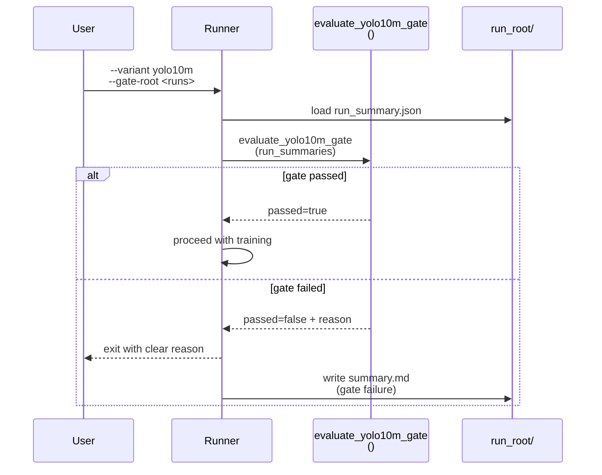
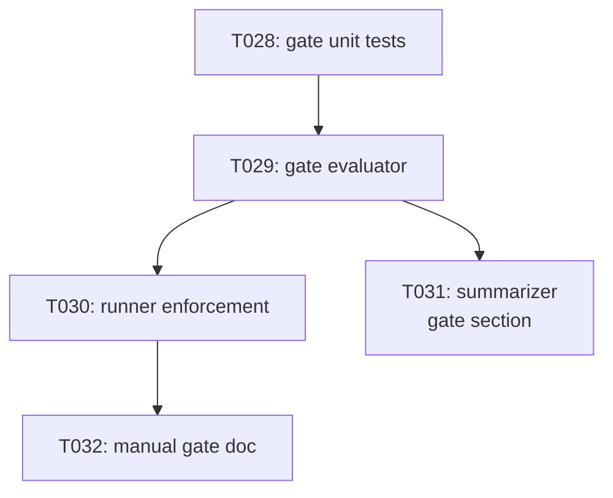

# Implementation Guide: Phase 5 — US3 (yolo10m stage gate)

**Phase**: 5 | **Feature**: Validate YOLOv10 W4A16 QAT Stability (EMA + QC) | **Tasks**: T028–T032

## Goal

Prevent expensive yolo10m runs until yolo10n and yolo10s validation passes:

- requires 2/2 non-collapsed EMA+QC runs for yolo10n,
- requires 2/2 non-collapsed EMA+QC runs for yolo10s,
- ensures runs are comparable (dataset/eval settings consistent),
- provides clear pass/fail reason and records the decision in summaries.

## Public APIs

### T029: Stage gate evaluator

Encapsulates the gating criteria from `specs/001-yolov10-qat-validation/spec.md`.

```python
# src/auto_quantize_model/cv_models/yolov10_w4a16_validation.py

from __future__ import annotations

from dataclasses import dataclass
from pathlib import Path


@dataclass(frozen=True)
class StageGateDecision:
    passed: bool
    reason: str


def evaluate_yolo10m_gate(*, run_summaries: list[dict]) -> StageGateDecision:
    """Return whether yolo10m is allowed based on yolo10n+yolo10s EMA+QC results."""


def load_run_summary(run_root: Path) -> dict:
    """Load run_root/run_summary.json."""
```

**Usage Flow**:



### T030: Gate enforcement in runner

Implements the “refuse to start yolo10m” behavior and writes a reviewer-friendly explanation.

```python
# scripts/cv-models/run_yolov10_w4a16_qat_validation.py

def require_yolo10m_gate(*, gate_root: Path) -> None:
    """Raise a user-friendly error if the yolo10m gate fails."""
```

### T031: Gate decision in summarizer

Summarizer includes the gate status in the combined report.

```python
# scripts/cv-models/summarize_yolov10_w4a16_qat_validation.py

def write_gate_section(*, out_path: Path, decision: StageGateDecision) -> None:
    """Write a yolo10m gating section into the combined summary.md."""
```

## Phase Integration



## Testing

### Test Input

- Gate fixtures:
  - `tests/unit/cv_models/test_yolov10_stage_gate.py` loads in-memory summaries or fixture JSON files.
- Optional integration artifacts for manual testing:
  - run roots created by Phase 3/4 under `tmp/yolov10-w4a16-ema-qc/<timestamp>/.../run_summary.json`

### Test Procedure

```bash
pixi run -e cu128 pytest tests/unit/cv_models/test_yolov10_stage_gate.py

# Manual: point the runner at an existing gate root.
pixi run -e cu128 python scripts/cv-models/run_yolov10_w4a16_qat_validation.py \
  --variant yolo10m --method ema+qc --profile full \
  --gate-root tmp/yolov10-w4a16-ema-qc/<timestamp> \
  --run-root tmp/yolov10-w4a16-ema-qc/<timestamp>/yolo10m/ema-qc/seed0
```

### Test Output

- Unit tests: `N passed, 0 failed`.
- Manual: either training proceeds (gate passed) or `summary.md` contains a clear “gate failed” reason (gate failed).

## References

- Spec: `specs/001-yolov10-qat-validation/spec.md`
- Data model: `specs/001-yolov10-qat-validation/data-model.md`
- Tasks: `specs/001-yolov10-qat-validation/tasks.md`

## Implementation Summary

Placeholder (fill after implementation).
