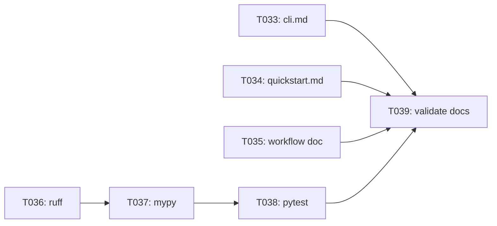

# Implementation Guide: Phase 6 — Polish & Cross-Cutting Concerns

**Phase**: 6 | **Feature**: Validate YOLOv10 W4A16 QAT Stability (EMA + QC) | **Tasks**: T033–T039

## Goal

Make the feature reviewable and reproducible:

- docs match the final CLI and artifact layout,
- quality gates pass (`ruff`, `mypy`, `pytest`) in Pixi `cu128`,
- quickstart and manual-run docs are validated end-to-end.

## Public APIs

This phase is primarily documentation and quality-gate enforcement; it should not introduce new public APIs. Any code changes should be limited to fixes required by lint/type/test failures in:

- `src/auto_quantize_model/cv_models/*.py`
- `scripts/cv-models/*.py`

## Phase Integration



## Testing

### Test Input

- Updated docs:
  - `specs/001-yolov10-qat-validation/quickstart.md`
  - `specs/001-yolov10-qat-validation/contracts/cli.md`
  - `docs/workflows/yolov10-w4a16-ema-qc-validation.md`
- Manual run inputs:
  - `datasets/coco2017/source-data/`
  - `models/yolo10/checkpoints/yolov10{n,s,m}.pt`

### Test Procedure

```bash
pixi run -e cu128 ruff check .
pixi run -e cu128 mypy .
pixi run -e cu128 pytest
```

### Test Output

- `ruff`: no violations in modified files
- `mypy`: no type errors in modified files
- `pytest`: `N passed, 0 failed`
- Manual validation: following `tests/manual/yolov10_w4a16_ema_qc_validation/README.md` produces run roots under `tmp/` with `run_summary.json` and `summary.md`.

## References

- Spec: `specs/001-yolov10-qat-validation/spec.md`
- Tasks: `specs/001-yolov10-qat-validation/tasks.md`
- Quickstart: `specs/001-yolov10-qat-validation/quickstart.md`

## Implementation Summary

Placeholder (fill after implementation).
