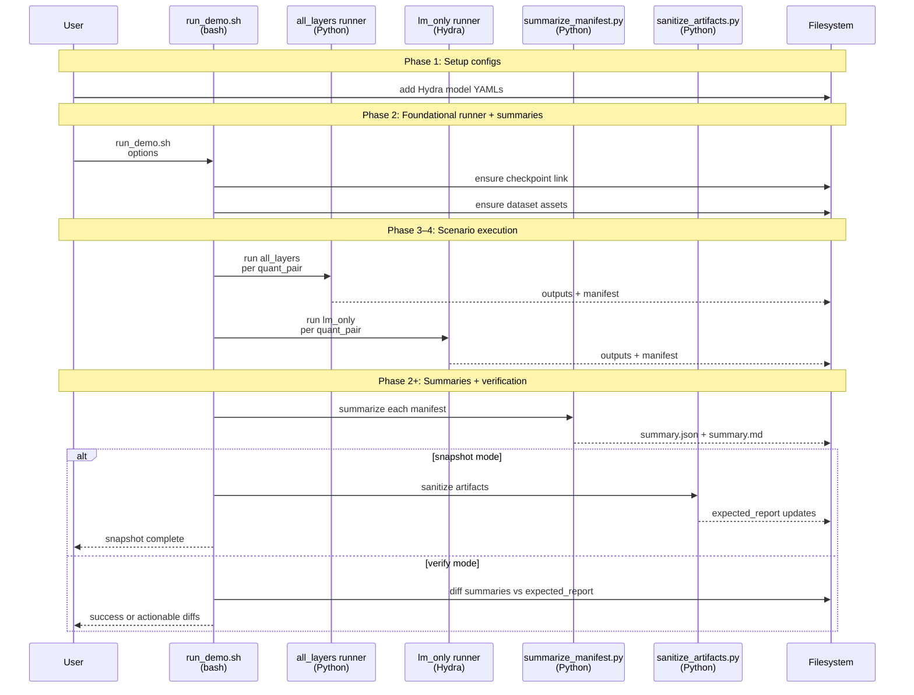
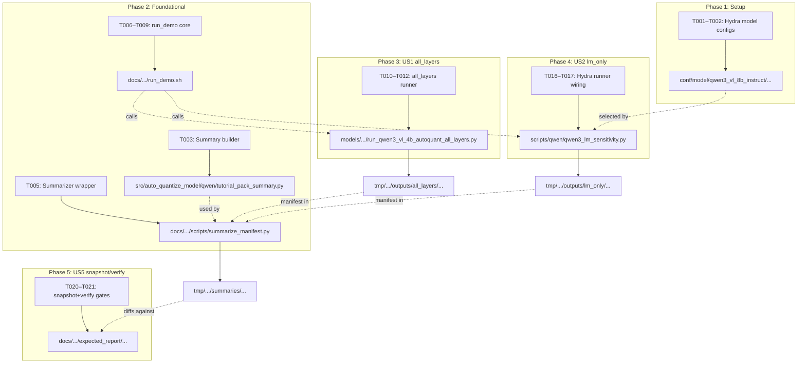
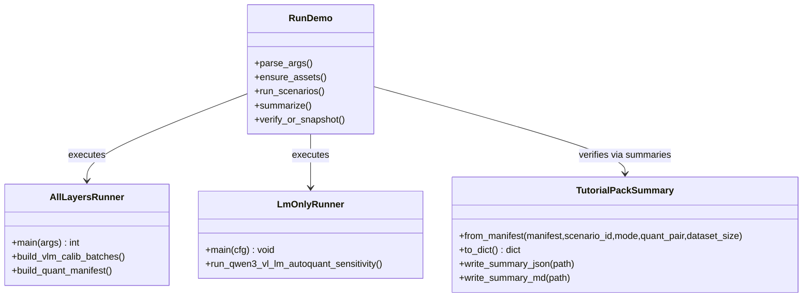
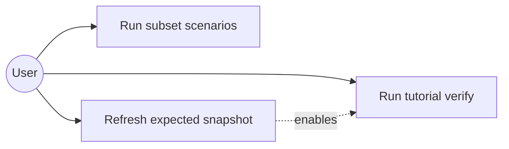
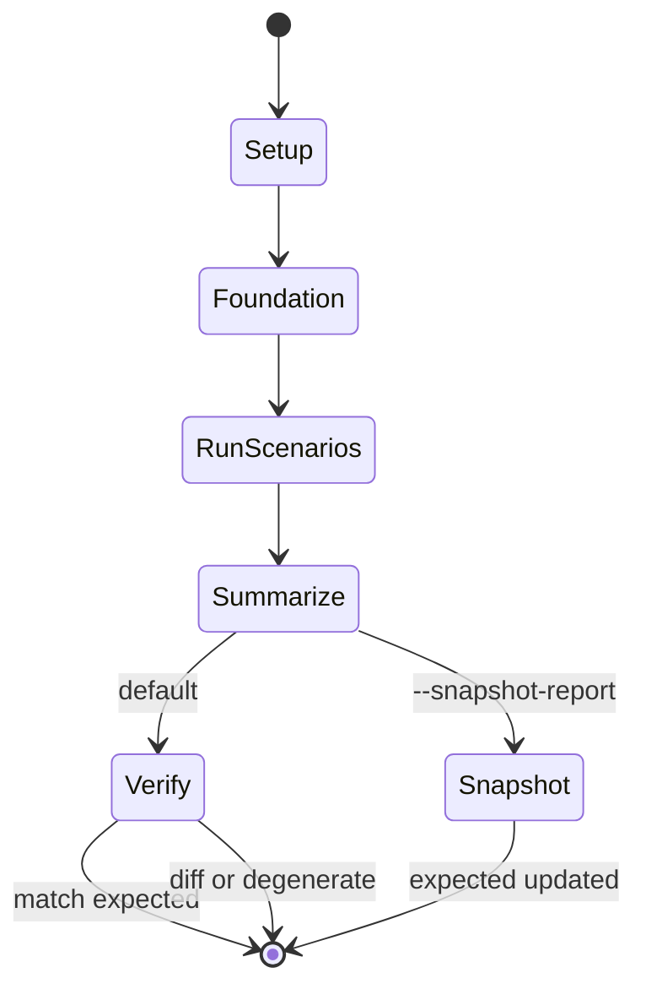

# Phase Integration Guide: Revise Qwen3-VL-8B Tutorial Pack (Introduce + Layer Sensitivity)

**Feature**: `002-revise-qwen3-vl-tutorial` | **Phases**: 6

## Overview

This feature turns the existing Qwen3-VL-8B tutorial pack into a stable, end-to-end workflow that runs **four scenarios** (2 modes × 2 quant pairs) with meaningful defaults and verifies results by diffing **only schema-locked, sanitized summaries**.

The central integration point is `docs/.../run_demo.sh`, which orchestrates scenario runs, generates summaries, and performs snapshot/verify workflows against `expected_report/`.

## Phase Flow

**MUST HAVE: End-to-End Sequence Diagram**



## Artifact Flow Between Phases



## System Architecture



## Use Cases



## Activity Flow



## Inter-Phase Dependencies

### Phase 1 → Phase 4

**Artifacts**:
- `conf/model/qwen3_vl_8b_instruct/arch/qwen3_vl_8b_instruct.default.yaml` enables selecting/overriding 8B model in Hydra runner.

**Code Dependencies**:

```python
# scripts/qwen/qwen3_lm_sensitivity.py consumes cfg.model.path / cfg.model.name
model_dir = Path(str(cfg.model.path))
```

### Phase 2 → All phases

**Artifacts**:
- `src/auto_quantize_model/qwen/tutorial_pack_summary.py` (schema-locked summaries)
- `docs/.../scripts/summarize_manifest.py` (CLI wrapper)
- `docs/.../run_demo.sh` (orchestrator)

**Critical contract**:
- Summary schema: `specs/002-revise-qwen3-vl-tutorial/contracts/summary.schema.json`

### Phase 3 & 4 → Phase 5

**Artifacts**:
- Per-scenario summaries under `<workspace>/tmp/.../summaries/<mode>/<quant_pair>/summary.{json,md}`
- Golden summaries under `docs/.../expected_report/<mode>/<quant_pair>/summary.{json,md}`

**Requirement**:
- Verification diffs only these summary files and enforces `has_nonzero_sensitivity=true`.

## Integration Testing

```bash
# Deterministic logic
pixi run pytest tests/unit/test_qwen_tutorial_pack_summary.py

# End-to-end (GPU recommended; may be slow)
bash docs/tutorial/howto/tut-qwen3-vl-8b-introduce-model-layer-sensitivity/run_demo.sh
```

## Critical Integration Points

1. **Asset gating is correct and actionable**
   - Missing checkpoint link or datasets should fail early with explicit paths and remediation commands.

2. **Scenario identity is stable**
   - `scenario_id` must stay stable across runs (e.g., `all_layers/wint4_afp16`).

3. **Summary schema is locked**
   - `summary.json` must match `specs/002-revise-qwen3-vl-tutorial/contracts/summary.schema.json`.

4. **Non-degeneracy is enforced**
   - Verification must fail when any scenario has all-zero sensitivities (exact `0.0`).

## References

- Individual phase guides:
  - `context/tasks/working/002-revise-qwen3-vl-tutorial/impl-phase-1-setup.md`
  - `context/tasks/working/002-revise-qwen3-vl-tutorial/impl-phase-2-foundational.md`
  - `context/tasks/working/002-revise-qwen3-vl-tutorial/impl-phase-3-us1-all-layers.md`
  - `context/tasks/working/002-revise-qwen3-vl-tutorial/impl-phase-4-us2-lm-only.md`
  - `context/tasks/working/002-revise-qwen3-vl-tutorial/impl-phase-5-us5-snapshot-verify.md`
  - `context/tasks/working/002-revise-qwen3-vl-tutorial/impl-phase-6-polish.md`
- Spec: `specs/002-revise-qwen3-vl-tutorial/spec.md`
- Tasks breakdown: `specs/002-revise-qwen3-vl-tutorial/tasks.md`
- Data model: `specs/002-revise-qwen3-vl-tutorial/data-model.md`
- Contracts: `specs/002-revise-qwen3-vl-tutorial/contracts/`

