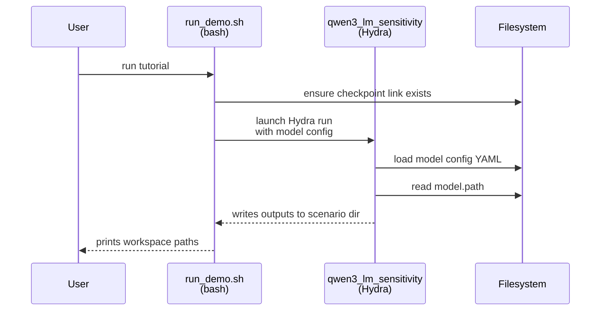
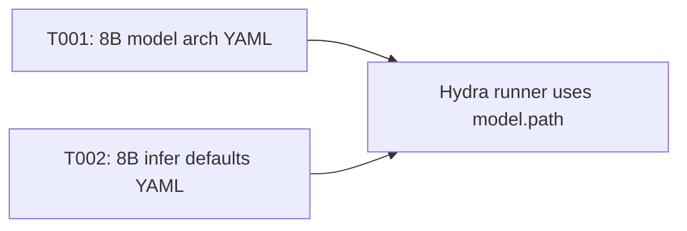

# Implementation Guide: Setup (Shared Infrastructure)

**Phase**: 1 | **Feature**: Revise Qwen3-VL-8B Tutorial Pack (Introduce + Layer Sensitivity) | **Tasks**: T001–T002

## Goal

Add Hydra model configs for **Qwen3-VL-8B-Instruct** so the tutorial pack can run LM-only scenarios via the existing Hydra runner (`scripts/qwen/qwen3_lm_sensitivity.py`) without hard-coding model paths.

## Public APIs

### T001: Add Qwen3-VL-8B Hydra model arch config

Create a new Hydra model “arch” config that mirrors the existing 4B config but points to the 8B checkpoint link.

```yaml
# conf/model/qwen3_vl_8b_instruct/arch/qwen3_vl_8b_instruct.default.yaml

# Human-readable model identifier.
name: qwen3_vl_8b_instruct

# Model family/group name (used for organization).
family: qwen

# Model variant string (helps distinguish checkpoints within a family).
variant: 3-vl-8b-instruct

# Model artifact format (e.g., "pytorch" for HF checkpoints).
format: pytorch

# Path to the Hugging Face checkpoint directory (repo-local symlink).
path: ${hydra:runtime.cwd}/models/qwen3_vl_8b_instruct/checkpoints/Qwen3-VL-8B-Instruct

# Default compute dtype for loading/execution (runner may override).
dtype: bf16
```

**Usage Flow** (Hydra runner resolves model path):



**Pseudocode** (how `run_demo.sh` should use it later):

```bash
pixi run python scripts/qwen/qwen3_lm_sensitivity.py \
  model.path="$MODEL_DIR" \
  model.name=qwen3_vl_8b_instruct
```

---

### T002: Add Qwen3-VL-8B infer defaults

Add an “infer” config file for consistency with other model configs.

```yaml
# conf/model/qwen3_vl_8b_instruct/infer/qwen3_vl_8b_instruct.default.yaml

temperature: 0.1
max_new_tokens: 512
top_p: 0.9
top_k: 50
do_sample: true
```

## Phase Integration



## Testing

### Test Input

- `models/qwen3_vl_8b_instruct/checkpoints/Qwen3-VL-8B-Instruct` exists (symlink to local snapshot).

### Test Procedure

```bash
# Sanity-check YAML is readable and contains the expected path.
pixi run python - <<'PY'
from omegaconf import OmegaConf
cfg = OmegaConf.load("conf/model/qwen3_vl_8b_instruct/arch/qwen3_vl_8b_instruct.default.yaml")
assert "Qwen3-VL-8B-Instruct" in str(cfg.path)
print("OK:", cfg.name, "->", cfg.path)
PY
```

### Test Output

- Prints `OK: qwen3_vl_8b_instruct -> .../models/qwen3_vl_8b_instruct/checkpoints/Qwen3-VL-8B-Instruct`.

## References

- Spec: `specs/002-revise-qwen3-vl-tutorial/spec.md`
- Data model: `specs/002-revise-qwen3-vl-tutorial/data-model.md`
- Contracts: `specs/002-revise-qwen3-vl-tutorial/contracts/`
- Tasks: `specs/002-revise-qwen3-vl-tutorial/tasks.md`

## Implementation Summary

TBD after implementation.

