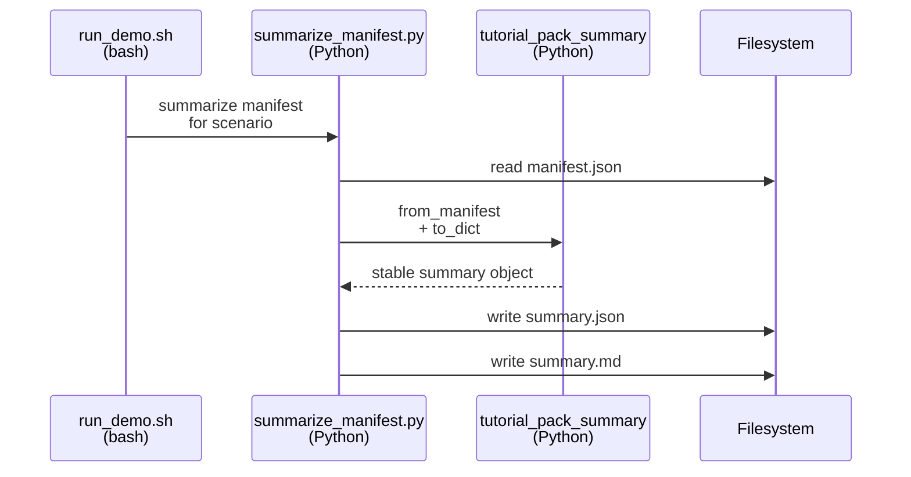
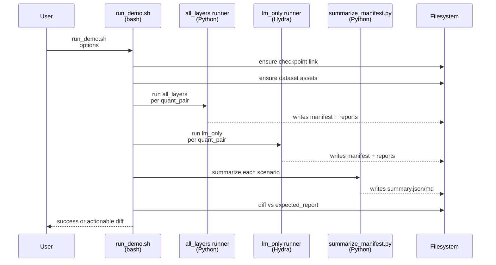
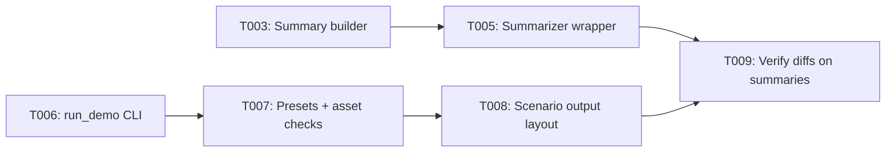

# Implementation Guide: Foundational (Blocking Prerequisites)

**Phase**: 2 | **Feature**: Revise Qwen3-VL-8B Tutorial Pack (Introduce + Layer Sensitivity) | **Tasks**: T003–T009

## Goal

Build the deterministic “glue” that makes the tutorial pack reproducible and verifiable:

- Generate schema-locked `summary.json` / `summary.md` per scenario.
- Provide a stable `run_demo.sh` CLI that can run subsets of scenarios.
- Fail fast when required assets are missing.
- Verify by diffing only sanitized summaries against `expected_report/`.

## Public APIs

### T003: Stable tutorial-pack summary builder (schema-locked)

Create a deterministic summary builder aligned to the JSON schema:

- `specs/002-revise-qwen3-vl-tutorial/contracts/summary.schema.json`

```python
# src/auto_quantize_model/qwen/tutorial_pack_summary.py
from __future__ import annotations

from dataclasses import dataclass
from pathlib import Path
from typing import Any, Mapping, Literal


Mode = Literal["all_layers", "lm_only"]
DatasetSize = Literal["small", "medium", "large"]


@dataclass(frozen=True)
class TutorialPackScenarioSummary:
    """Schema-locked summary used for tutorial verification."""

    scenario_id: str
    mode: Mode
    quant_pair: str
    dataset_size: DatasetSize

    dataset_calib_seq_len: int
    dataset_batch_size: int
    dataset_num_calib_batches: int
    dataset_num_calib_samples: int
    dataset_max_calib_samples: int

    auto_quantize_score_size: int

    has_layer_sensitivity: bool
    has_autoquant_state: bool
    has_nonzero_sensitivity: bool

    manifest_keys: list[str]

    @classmethod
    def from_manifest(
        cls,
        manifest: Mapping[str, Any],
        *,
        scenario_id: str,
        mode: Mode,
        quant_pair: str,
        dataset_size: DatasetSize,
    ) -> "TutorialPackScenarioSummary":
        """Create a stable summary from a manifest JSON object."""
        raise NotImplementedError

    def to_dict(self) -> dict[str, Any]:
        """Return a JSON-serializable dict with schema keys only."""
        raise NotImplementedError


def write_summary_json(path: Path, summary: TutorialPackScenarioSummary) -> None:
    """Write schema-locked JSON with stable ordering/newlines."""
    raise NotImplementedError


def write_summary_md(path: Path, summary: TutorialPackScenarioSummary) -> None:
    """Write a stable Markdown table for human review + diffs."""
    raise NotImplementedError
```

**Usage Flow** (summary builder is called by the tutorial summarizer script):



**Pseudocode** (non-degeneracy detection):

```python
def has_nonzero_sensitivity(manifest: Mapping[str, Any]) -> bool:
    rows = manifest.get("layer_sensitivity", [])
    for row in rows:
        # Treat only exact 0.0 as zero
        if float(row.get("sensitivity", 0.0)) != 0.0:
            return True
    return False
```

---

### T004: Unit tests for summary builder and non-degeneracy detection

Add deterministic unit tests using synthetic manifest payloads.

```python
# tests/unit/test_qwen_tutorial_pack_summary.py
from __future__ import annotations

from auto_quantize_model.qwen.tutorial_pack_summary import TutorialPackScenarioSummary


def test_summary_detects_nonzero_sensitivity() -> None:
    manifest = {
        "dataset": {
            "calib_seq_len": 512,
            "batch_size": 8,
            "num_calib_batches": 16,
            "num_calib_samples": 128,
            "max_calib_samples": 128,
        },
        "layer_sensitivity": [
            {"layer": "a", "sensitivity": 0.0, "size_cost": 1.0},
            {"layer": "b", "sensitivity": 1e-9, "size_cost": 1.0},
        ],
        "autoquant_state": {},
    }
    summary = TutorialPackScenarioSummary.from_manifest(
        manifest,
        scenario_id="lm_only/wint4_afp16",
        mode="lm_only",
        quant_pair="wint4_afp16",
        dataset_size="medium",
    )
    assert summary.has_nonzero_sensitivity is True
```

---

### T005: Update tutorial summarizer CLI wrapper

Make `docs/.../scripts/summarize_manifest.py` a thin CLI that:

- reads `*_quant_manifest.json`,
- calls `TutorialPackScenarioSummary.from_manifest(...)`,
- writes `summary.json` and `summary.md` (schema-locked).

```python
# docs/tutorial/howto/tut-qwen3-vl-8b-introduce-model-layer-sensitivity/scripts/summarize_manifest.py
def main(argv: list[str]) -> int:
    """
    Usage:
      summarize_manifest.py <manifest.json> <output_dir>
        --scenario-id <mode/quant_pair>
        --mode <all_layers|lm_only>
        --quant-pair <wint4_afp16|wint4_aint8>
        --dataset-size <small|medium|large>
    """
    raise NotImplementedError
```

---

### T006–T009: `run_demo.sh` CLI, presets, outputs, verification

Treat `run_demo.sh` as the tutorial pack’s **public API**. Implement the contract:

- `specs/002-revise-qwen3-vl-tutorial/contracts/run_demo_cli.md`

```bash
# docs/tutorial/howto/tut-qwen3-vl-8b-introduce-model-layer-sensitivity/run_demo.sh

usage() {
  cat <<EOF
Usage: $(basename "$0") [options]

Options:
  --snapshot-report
  --device <torch-device>              (default: cuda:0)
  --dataset-size <small|medium|large>  (default: medium)
  --modes <all_layers,lm_only>         (default: all_layers,lm_only)
  --quant-pairs <wint4_afp16,wint4_aint8> (default: wint4_afp16,wint4_aint8)
EOF
}
```

**Key internal “functions”** (suggested structure in bash):

```bash
parse_args() { :; }
resolve_dataset_preset() { :; }   # sets COCO_ROOT, VLM_DB, CAPTIONS_TXT, budgets
ensure_assets() { :; }            # checkpoint link + dataset assets (fail fast)
run_scenario_all_layers() { :; }  # calls all-layers runner
run_scenario_lm_only() { :; }     # calls Hydra runner
summarize_scenario() { :; }       # calls summarize_manifest.py
verify_or_snapshot() { :; }       # diff summaries or refresh expected_report
```

**Usage Flow** (run-demo end-to-end):



**Pseudocode** (dataset preset resolution, medium default):

```bash
case "$DATASET_SIZE" in
  small)
    MAX_CALIB_SAMPLES=16
    NUM_CALIB_BATCHES=2
    BATCH_SIZE=8
    ;;
  medium)
    MAX_CALIB_SAMPLES=128
    NUM_CALIB_BATCHES=16
    BATCH_SIZE=8
    ;;
  large)
    MAX_CALIB_SAMPLES=512
    NUM_CALIB_BATCHES=64
    BATCH_SIZE=8
    ;;
esac

CALIB_SEQ_LEN=512
SCORE_SIZE=128
```

## Phase Integration



## Testing

### Test Input

- Checkpoint link exists:
  - `models/qwen3_vl_8b_instruct/checkpoints/Qwen3-VL-8B-Instruct`
- Dataset assets exist:
  - `datasets/coco2017/source-data/` (symlink to COCO2017 root)
  - `datasets/vlm-quantize-calib/coco2017_vlm_calib_medium.db`
  - `datasets/vlm-quantize-calib/coco2017_captions_medium.txt`

### Test Procedure

```bash
# Unit tests for summary schema + non-degeneracy detection.
pixi run pytest tests/unit/test_qwen_tutorial_pack_summary.py

# Smoke: verify run_demo.sh parses args and prints usage.
bash docs/tutorial/howto/tut-qwen3-vl-8b-introduce-model-layer-sensitivity/run_demo.sh --help
```

### Test Output

- `pytest` reports `... passed`.
- `run_demo.sh --help` prints all contract options.

## References

- Spec: `specs/002-revise-qwen3-vl-tutorial/spec.md`
- Data model: `specs/002-revise-qwen3-vl-tutorial/data-model.md`
- Contracts: `specs/002-revise-qwen3-vl-tutorial/contracts/`
- Tasks: `specs/002-revise-qwen3-vl-tutorial/tasks.md`

## Implementation Summary

TBD after implementation.

