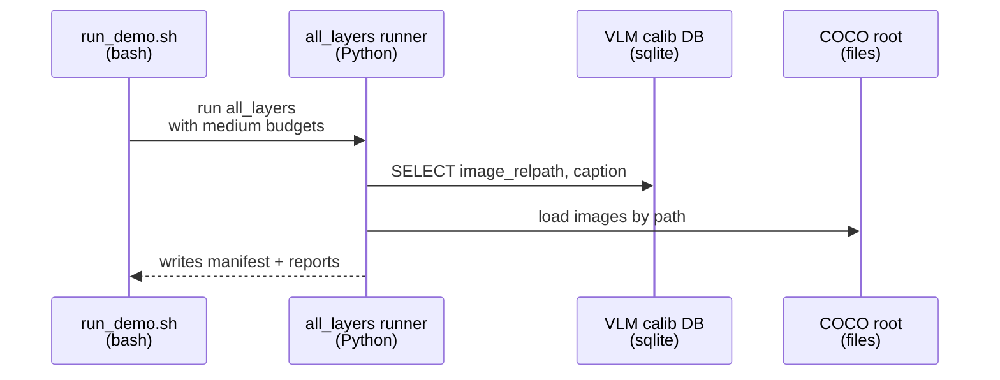
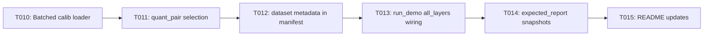

# Implementation Guide: User Story 1 — All-layers Sensitivity Demo (P1)

**Phase**: 3 | **Feature**: Revise Qwen3-VL-8B Tutorial Pack (Introduce + Layer Sensitivity) | **Tasks**: T010–T015

## Goal

Produce **all-layers** per-layer sensitivity reports for Qwen3-VL-8B across both worked quant pairs:

- `wint4_afp16` (INT4 weights + FP16 activations)
- `wint4_aint8` (INT4 weights + INT8 activations)

…using the **medium** preset (seq_len=512, batch_size=8, num_calib_batches=16, score_size=128) and emitting deterministic summaries that can be verified against `expected_report/`.

## Public APIs

### T010: Batch VLM calibration dataloader (honor batch_size + num_calib_batches)

Update the all-layers helper so “batch_size=8” actually produces batches of 8 samples (not 1-sample batches).

```python
# models/qwen3_vl_4b_instruct/helpers/qwen3_vl_4b_autoquant_all_layers/run_qwen3_vl_4b_autoquant_all_layers.py
from typing import Iterable, Mapping
import torch


def build_vlm_calib_batches(
    *,
    calib_db: Path,
    coco_root: Path,
    tokenizer: AutoTokenizer,
    processor: AutoProcessor,
    batch_size: int,
    num_calib_batches: int,
    max_length: int,
) -> list[Mapping[str, torch.Tensor]]:
    """Return a list of calibration batches for AutoQuant."""
    raise NotImplementedError
```

**Usage Flow**:



---

### T011: Add `--quant-pair` support (select INT4 worked examples)

Add a `--quant-pair` argument that maps to `conf/quant_pair/<name>.yaml` and selects:

- `quant_pair.name` (for stable naming)
- `quant_pair.format_name` (ModelOpt config key)

```python
# models/qwen3_vl_4b_instruct/helpers/qwen3_vl_4b_autoquant_all_layers/run_qwen3_vl_4b_autoquant_all_layers.py
from dataclasses import dataclass


@dataclass(frozen=True)
class QuantPairConfig:
    name: str
    weight: str
    activation: str
    format_name: str


def load_quant_pair(name: str) -> QuantPairConfig:
    """Load conf/quant_pair/<name>.yaml and return the config."""
    raise NotImplementedError
```

**Pseudocode** (scheme naming):

```python
pair = load_quant_pair(args.quant_pair)
scheme = AutoQuantSchemeConfig(
    name=f"{pair.name}_autoquant_all_layers",
    auto_quantize_bits=args.effective_bits or 8.0,
    auto_quantize_method="gradient",
    auto_quantize_score_size=args.auto_quantize_score_size or 128,
    coverage_mode="full",
    coverage_fraction=1.0,
    quant_formats=[pair.format_name],
)
```

---

### T012: Record complete dataset metadata in manifest

Ensure the manifest includes enough dataset metadata for the schema-locked summary:

```python
manifest["dataset"] = {
    "size": args.dataset_size,                    # small|medium|large
    "vlm_calib_db": str(args.vlm_calib_db),
    "coco_root": str(args.coco_root),
    "calib_seq_len": int(args.calib_seq_len),
    "batch_size": int(args.batch_size),
    "num_calib_batches": int(num_batches_used),   # len(calib_batches)
    "num_calib_samples": int(num_samples_used),   # <= max_calib_samples
    "max_calib_samples": int(args.max_calib_samples),
}
```

---

### T013: Wire all-layers scenarios in `run_demo.sh`

Run 2 scenarios for mode `all_layers` by calling the all-layers runner with:

- model dir: `models/qwen3_vl_8b_instruct/checkpoints/Qwen3-VL-8B-Instruct`
- dataset assets:
  - `datasets/coco2017/source-data`
  - `datasets/vlm-quantize-calib/coco2017_vlm_calib_<size>.db`
- medium budgets (defaults)

```bash
run_scenario_all_layers() {
  local quant_pair="$1"
  local out_dir="$2"
  pixi run python \
    models/qwen3_vl_4b_instruct/helpers/qwen3_vl_4b_autoquant_all_layers/run_qwen3_vl_4b_autoquant_all_layers.py \
    --model-dir "$MODEL_DIR" \
    --output-dir "$out_dir" \
    --quant-pair "$quant_pair" \
    --dataset-size "$DATASET_SIZE" \
    --vlm-calib-db "$VLM_DB" \
    --coco-root "$COCO_ROOT" \
    --calib-seq-len "$CALIB_SEQ_LEN" \
    --batch-size "$BATCH_SIZE" \
    --num-calib-batches "$NUM_CALIB_BATCHES" \
    --max-calib-samples "$MAX_CALIB_SAMPLES" \
    --auto-quantize-score-size "$SCORE_SIZE" \
    --device "$DEVICE"
}
```

---

### T014: Generate and commit sanitized expected snapshots for all-layers

Expected snapshot structure (tracked):

```text
docs/tutorial/howto/tut-qwen3-vl-8b-introduce-model-layer-sensitivity/expected_report/
└── all_layers/
    ├── wint4_afp16/
    │   ├── summary.json
    │   └── summary.md
    └── wint4_aint8/
        ├── summary.json
        └── summary.md
```

Snapshot mode should fill these dirs by copying sanitized artifacts from the workspace output dirs.

---

### T015: Update README all-layers docs and explain “4B helper” naming

Document:

- why the script path contains `qwen3_vl_4b...` but can run the 8B checkpoint via `--model-dir`,
- where outputs land (workspace + scenario dirs),
- how to run `--modes all_layers` only.

## Phase Integration



## Testing

### Test Input

- Checkpoint link exists:
  - `models/qwen3_vl_8b_instruct/checkpoints/Qwen3-VL-8B-Instruct`
- Dataset assets exist:
  - `datasets/coco2017/source-data/`
  - `datasets/vlm-quantize-calib/coco2017_vlm_calib_medium.db`

### Test Procedure

```bash
# Run only all-layers scenarios (both quant pairs) using medium preset.
bash docs/tutorial/howto/tut-qwen3-vl-8b-introduce-model-layer-sensitivity/run_demo.sh \
  --modes all_layers \
  --dataset-size medium \
  --quant-pairs wint4_afp16,wint4_aint8
```

### Test Output

- Workspace contains:
  - `<workspace>/tmp/.../outputs/all_layers/wint4_afp16/...`
  - `<workspace>/tmp/.../outputs/all_layers/wint4_aint8/...`
  - `<workspace>/tmp/.../summaries/all_layers/wint4_afp16/summary.json`
  - `<workspace>/tmp/.../summaries/all_layers/wint4_aint8/summary.json`
- Each `summary.json` reports:
  - `mode="all_layers"`
  - `dataset_size="medium"`
  - `dataset_calib_seq_len=512`
  - `dataset_batch_size=8`
  - `dataset_num_calib_batches=16`
  - `auto_quantize_score_size=128`
  - `has_nonzero_sensitivity=true`

## References

- Spec: `specs/002-revise-qwen3-vl-tutorial/spec.md`
- Data model: `specs/002-revise-qwen3-vl-tutorial/data-model.md`
- Contracts: `specs/002-revise-qwen3-vl-tutorial/contracts/`
- Tasks: `specs/002-revise-qwen3-vl-tutorial/tasks.md`

## Implementation Summary

TBD after implementation.

