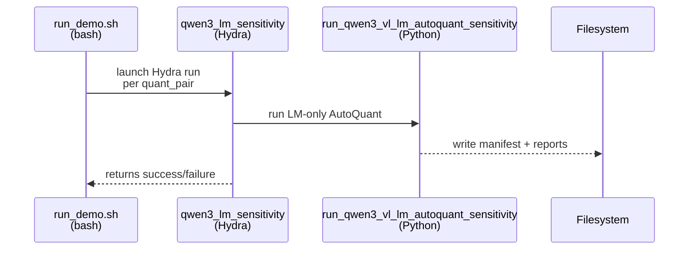
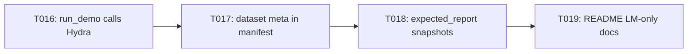

# Implementation Guide: User Story 2 — LM-only Sensitivity Demo (P2)

**Phase**: 4 | **Feature**: Revise Qwen3-VL-8B Tutorial Pack (Introduce + Layer Sensitivity) | **Tasks**: T016–T019

## Goal

Run **LM-only** sensitivity for Qwen3-VL-8B across both worked quant pairs with meaningful (non-degenerate) results, producing schema-locked summaries that verify cleanly against `expected_report/`.

## Public APIs

### T016: Run LM-only scenarios via Hydra runner from `run_demo.sh`

Use the existing Hydra runner:

- `scripts/qwen/qwen3_lm_sensitivity.py`

and execute it once per quant pair with overrides for:

- model checkpoint (8B),
- dataset preset (`small|medium|large`),
- device,
- per-scenario output directory.

```bash
run_scenario_lm_only() {
  local quant_pair="$1"
  local out_dir="$2"

  pixi run python scripts/qwen/qwen3_lm_sensitivity.py \
    model.path="$MODEL_DIR" \
    model.name=qwen3_vl_8b_instruct \
    model.variant=3-vl-8b-instruct \
    dataset.size="$DATASET_SIZE" \
    autoquant.device="$DEVICE" \
    autoquant.batch_size="$BATCH_SIZE" \
    autoquant.score_size="$SCORE_SIZE" \
    quant_pair="$quant_pair" \
    runner.output_dir="$out_dir" \
    hydra.job.chdir=false
}
```

**Usage Flow**:



---

### T017: Ensure LM-only manifests include required dataset metadata

Confirm (and if needed, enforce) that the manifest contains:

- `dataset.size`
- `dataset.calib_seq_len`
- `dataset.batch_size`
- `dataset.num_calib_batches`
- `dataset.num_calib_samples`
- `dataset.max_calib_samples`

If any are missing in some invocation paths, update:

- `scripts/qwen/qwen3_lm_sensitivity.py`

to always pass `dataset_size`, `dataset_root`, and `max_calib_samples` into:

- `auto_quantize_model.qwen.autoquant_sensitivity.run_qwen3_vl_lm_autoquant_sensitivity`

---

### T018: Generate and commit sanitized expected snapshots for LM-only

Expected snapshot structure (tracked):

```text
docs/tutorial/howto/tut-qwen3-vl-8b-introduce-model-layer-sensitivity/expected_report/
└── lm_only/
    ├── wint4_afp16/
    │   ├── summary.json
    │   └── summary.md
    └── wint4_aint8/
        ├── summary.json
        └── summary.md
```

---

### T019: Update README with LM-only explanation + remediation

Add a dedicated section explaining:

- what LM-only sensitivity measures,
- why LM-only can become “all zeros” under too-small calibration budgets,
- how the tutorial’s default medium preset avoids this,
- what to do if a user still sees degeneracy (what to change and where).

## Phase Integration



## Testing

### Test Input

- Checkpoint link exists:
  - `models/qwen3_vl_8b_instruct/checkpoints/Qwen3-VL-8B-Instruct`
- Captions file exists:
  - `datasets/vlm-quantize-calib/coco2017_captions_medium.txt`

### Test Procedure

```bash
# Run only lm-only scenarios (both quant pairs) using medium preset.
bash docs/tutorial/howto/tut-qwen3-vl-8b-introduce-model-layer-sensitivity/run_demo.sh \
  --modes lm_only \
  --dataset-size medium \
  --quant-pairs wint4_afp16,wint4_aint8
```

### Test Output

- Workspace contains:
  - `<workspace>/tmp/.../outputs/lm_only/wint4_afp16/...`
  - `<workspace>/tmp/.../outputs/lm_only/wint4_aint8/...`
  - `<workspace>/tmp/.../summaries/lm_only/wint4_afp16/summary.json`
  - `<workspace>/tmp/.../summaries/lm_only/wint4_aint8/summary.json`
- Each `summary.json` reports:
  - `mode="lm_only"`
  - `dataset_size="medium"`
  - `dataset_calib_seq_len=512`
  - `dataset_batch_size=8`
  - `dataset_num_calib_batches=16`
  - `auto_quantize_score_size=128`
  - `has_nonzero_sensitivity=true`

## References

- Spec: `specs/002-revise-qwen3-vl-tutorial/spec.md`
- Data model: `specs/002-revise-qwen3-vl-tutorial/data-model.md`
- Contracts: `specs/002-revise-qwen3-vl-tutorial/contracts/`
- Tasks: `specs/002-revise-qwen3-vl-tutorial/tasks.md`

## Implementation Summary

TBD after implementation.

