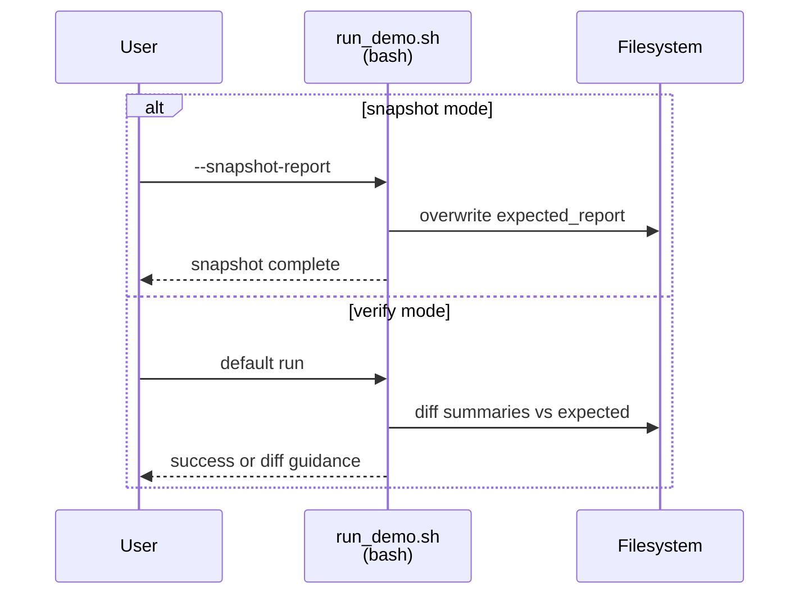
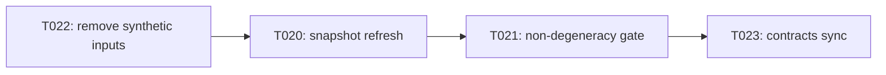

# Implementation Guide: User Story 5 — Snapshot & Verification Maintenance (P5)

**Phase**: 5 | **Feature**: Revise Qwen3-VL-8B Tutorial Pack (Introduce + Layer Sensitivity) | **Tasks**: T020–T023

## Goal

Make the tutorial pack maintainable over time by providing:

- A safe snapshot mode that refreshes `expected_report/` with sanitized artifacts.
- A strict verification mode that diffs only sanitized summaries and fails loudly on regressions.
- An explicit non-degeneracy guard: verification fails if any scenario summary indicates all-zero sensitivities.

## Public APIs

### T020: Extend snapshot mode to refresh all selected scenarios

In `run_demo.sh`, snapshot mode should:

- write `expected_report/<mode>/<quant_pair>/summary.{json,md}` for each scenario,
- copy additional sanitized artifacts (via `scripts/sanitize_artifacts.py`),
- delete stale scenario dirs under `expected_report/` when they are not selected.

```bash
snapshot_expected_report() {
  # For each scenario:
  #   rm -rf "$EXPECTED_DIR/$MODE/$PAIR"
  #   mkdir -p "$EXPECTED_DIR/$MODE/$PAIR"
  #   cp "$SUMMARY_DIR/$MODE/$PAIR/summary.json" "$EXPECTED_DIR/$MODE/$PAIR/summary.json"
  #   cp "$SUMMARY_DIR/$MODE/$PAIR/summary.md"  "$EXPECTED_DIR/$MODE/$PAIR/summary.md"
  #   pixi run python "$SANITIZER" "$OUT_DIR/$MODE/$PAIR" "$EXPECTED_DIR/$MODE/$PAIR"
  :
}
```

**Usage Flow** (snapshot vs verify):



---

### T021: Enforce non-degeneracy at verification time

Verification must explicitly fail when any scenario summary has:

- `has_nonzero_sensitivity=false`

Prefer a clear, actionable error message that points to the README LM-only section.

```bash
assert_non_degenerate() {
  local summary_json="$1"
  # Read summary_json and ensure has_nonzero_sensitivity is true.
  # If not: print guidance and exit 1.
  :
}
```

---

### T022: Remove synthetic calibration input generation

Delete the tutorial pack’s synthetic captions input file:

- `docs/tutorial/howto/tut-qwen3-vl-8b-introduce-model-layer-sensitivity/inputs/coco2017_captions_small.txt`

and ensure `run_demo.sh` uses repo dataset assets for all presets:

- captions: `datasets/vlm-quantize-calib/coco2017_captions_<size>.txt`
- VLM DB: `datasets/vlm-quantize-calib/coco2017_vlm_calib_<size>.db`
- COCO root: `datasets/coco2017/source-data`

---

### T023: Sync contracts with implementation

Update the contract docs to match the implemented behavior:

- `specs/002-revise-qwen3-vl-tutorial/contracts/run_demo_cli.md`
- `specs/002-revise-qwen3-vl-tutorial/contracts/summary.schema.json` (only if summary fields change)

## Phase Integration



## Testing

### Test Input

- Same prerequisites as US1/US2 (checkpoint link + datasets).

### Test Procedure

```bash
# Refresh expected snapshots intentionally.
bash docs/tutorial/howto/tut-qwen3-vl-8b-introduce-model-layer-sensitivity/run_demo.sh --snapshot-report

# Verify matches expected snapshots.
bash docs/tutorial/howto/tut-qwen3-vl-8b-introduce-model-layer-sensitivity/run_demo.sh
```

### Test Output

- Snapshot mode updates:
  - `docs/tutorial/howto/tut-qwen3-vl-8b-introduce-model-layer-sensitivity/expected_report/**/summary.json`
- Verify mode prints success and exits 0.
- If any scenario becomes degenerate, verify mode exits non-zero with a message referencing the README remediation section.

## References

- Spec: `specs/002-revise-qwen3-vl-tutorial/spec.md`
- Data model: `specs/002-revise-qwen3-vl-tutorial/data-model.md`
- Contracts: `specs/002-revise-qwen3-vl-tutorial/contracts/`
- Tasks: `specs/002-revise-qwen3-vl-tutorial/tasks.md`

## Implementation Summary

TBD after implementation.

