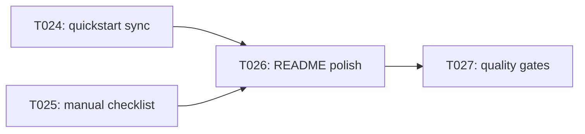

# Implementation Guide: Polish & Cross-Cutting Concerns

**Phase**: 6 | **Feature**: Revise Qwen3-VL-8B Tutorial Pack (Introduce + Layer Sensitivity) | **Tasks**: T024–T027

## Goal

Finalize documentation, add a manual validation checklist, and run repo quality gates to ensure the tutorial pack remains reproducible and maintainable.

## Public APIs

### T024: Update quickstart commands (validated)

Update:

- `specs/002-revise-qwen3-vl-tutorial/quickstart.md`

to reflect the final CLI options:

- subset runs via `--modes` / `--quant-pairs`,
- snapshot vs verify workflows,
- prerequisite setup for checkpoint link and dataset link.

---

### T025: Add manual GPU validation checklist

Create:

- `tests/manual/qwen/test_tut_qwen3_vl_8b_layer_sensitivity.md`

with a step-by-step manual validation flow, including:

- expected runtime notes,
- how to confirm outputs exist,
- how to interpret verification failures.

---

### T026: README troubleshooting and prerequisites

Update:

- `docs/tutorial/howto/tut-qwen3-vl-8b-introduce-model-layer-sensitivity/README.md`

to include:

- missing asset errors and how to fix them (checkpoint link, dataset links/files),
- CUDA vs CPU warnings,
- what to do when verification diffs occur (verify vs snapshot guidance).

---

### T027: Run quality gates and record follow-ups

Run and record outcomes (and any follow-ups) in:

- `specs/002-revise-qwen3-vl-tutorial/research.md`

Commands:

```bash
pixi run ruff check .
pixi run mypy .
pixi run pytest
```

## Phase Integration



## Testing

### Test Input

- Pixi environment installed (`pixi install`).

### Test Procedure

```bash
pixi run ruff check .
pixi run mypy .
pixi run pytest
```

### Test Output

- `ruff` returns success.
- `mypy` returns success (or follow-ups documented).
- `pytest` returns success (or follow-ups documented).

## References

- Spec: `specs/002-revise-qwen3-vl-tutorial/spec.md`
- Tasks: `specs/002-revise-qwen3-vl-tutorial/tasks.md`
- Quickstart: `specs/002-revise-qwen3-vl-tutorial/quickstart.md`

## Implementation Summary

TBD after implementation.

