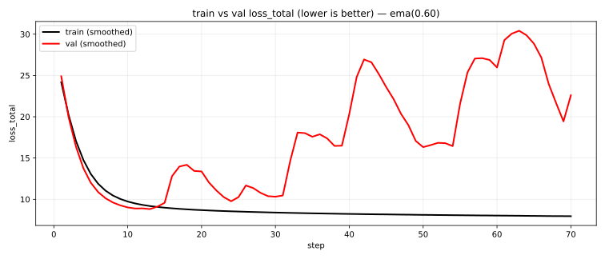

# Summary

This report captures a YOLOv10m scratch QAT (Brevitas W4A16) run and the key checkpoints copied into `models/yolo10/reports/2025-12-25-qat-w4a16/checkpoints/`.

## Scratch QAT W4A16 (Ultralytics validator)

Metrics below are from the Ultralytics in-training validator (`results.csv`, columns `metrics/*(B)`), i.e. COCO val metrics reported during training (not ONNX runtime eval/latency).

| name | checkpoint_kind | epoch | mAP_50_95(B) | mAP_50(B) | precision(B) | recall(B) | checkpoint |
|---|---|---:|---:|---:|---:|---:|---|
| yolo10m-qat-w4a16 | best | 29 | 0.2260 | 0.3605 | 0.5568 | 0.3331 | `models/yolo10/reports/2025-12-25-qat-w4a16/checkpoints/best.pt` |
| yolo10m-qat-w4a16 | last | 76 | 0.0118 | 0.0221 | 0.0062 | 0.1652 | `models/yolo10/reports/2025-12-25-qat-w4a16/checkpoints/last.pt` |

### Observed training instability (scratch QAT W4A16)

This run shows an instability pattern where validation metrics peak early (best at epoch 29) and then collapse, while the train-vs-val loss relationship becomes hard to interpret (non-monotonic/oscillatory, with poor validation behavior).

.svg)

## Combined comparison table

This table combines:

- ONNX-export + COCO evaluation results from `models/yolo10/reports/2025-12-23_16-12-40/summary.md` (latency columns omitted here; see that report for latency details).
- Ultralytics in-training validation results (`results.csv` `metrics/*(B)`) for the scratch QAT W4A16 run in this report (no ONNX eval yet).

Note: rows from different `metrics_source` are not apples-to-apples comparable.

| name | memo | epoch | metrics_source | mAP_50_95 | mAP_50 | artifact |
|---|---|---:|---|---:|---:|---|
| yolo10m-baseline-fp32 | fp32 baseline export (no quantization) | — | onnx_eval | 0.6022 | 0.7736 | `/workspace/code/auto-quantize-model/tmp/yolov10m_brevitas_w4a8_w4a16/2025-12-23_16-12-40/onnx/yolov10m-baseline-fp32.onnx` |
| yolo10m-ptq-w8a16 | Brevitas QCDQ PTQ (W8A16; no activation calibration); optimized ONNX (keep QDQ) | — | onnx_eval | 0.5983 | 0.7697 | `tmp/yolov10m_brevitas_w4a8_w4a16/2025-12-23_16-12-40/onnx/yolov10m-w8a16-qcdq-ptq-opt.onnx` |
| yolo10m-ptq-w8a8 | Brevitas QCDQ PTQ (W8A8; activations calibrated on `datasets/quantize-calib/quant100.txt`); optimized ONNX (keep QDQ) | — | onnx_eval | 0.5932 | 0.7696 | `tmp/yolov10m_brevitas_w4a8_w4a16/2025-12-23_16-12-40/onnx/yolov10m-w8a8-qcdq-ptq-opt.onnx` |
| yolo10m-ptq-w4a8 | Brevitas QCDQ PTQ (W4A8; activations calibrated on `datasets/quantize-calib/quant100.txt`); optimized ONNX (keep QDQ) | — | onnx_eval | 0.1150 | 0.2265 | `/workspace/code/auto-quantize-model/tmp/yolov10m_brevitas_w4a8_w4a16/2025-12-23_16-12-40/onnx/yolov10m-w4a8-qcdq-ptq-opt.onnx` |
| yolo10m-qat-w4a8 | Brevitas QCDQ QAT (W4A8); Ultralytics finetune from `models/yolo10/checkpoints/yolov10m.pt` (COCO subset train=100/val=20, epochs=1, amp off); optimized ONNX (keep QDQ) | — | onnx_eval | 0.2912 | 0.4949 | `tmp/yolov10m_brevitas_w4a8_w4a16/2025-12-23_16-12-40/onnx/yolov10m-w4a8-qcdq-qat-opt.onnx` |
| yolo10m-ptq-w4a16 | Brevitas QCDQ PTQ (W4A16 weight-only; no activation calibration); optimized ONNX (keep QDQ) | — | onnx_eval | 0.1277 | 0.2541 | `/workspace/code/auto-quantize-model/tmp/yolov10m_brevitas_w4a8_w4a16/2025-12-23_16-12-40/onnx/yolov10m-w4a16-qcdq-ptq-opt.onnx` |
| yolo10m-qat-w4a16 | Brevitas QAT (W4A16 weight-only); Ultralytics scratch (pretrained=false); best checkpoint | 29 | ultralytics_val | 0.2260 | 0.3605 | `models/yolo10/reports/2025-12-25-qat-w4a16/checkpoints/best.pt` |
| yolo10m-qat-w4a16 | Brevitas QAT (W4A16 weight-only); Ultralytics scratch (pretrained=false); last checkpoint | 76 | ultralytics_val | 0.0118 | 0.0221 | `models/yolo10/reports/2025-12-25-qat-w4a16/checkpoints/last.pt` |

## Checkpoints

- Directory: `models/yolo10/reports/2025-12-25-qat-w4a16/checkpoints/`
- Periodic snapshots (every 5 epochs): `epoch005.pt` … `epoch075.pt`
- Best/last snapshots: `best.pt` (epoch 29), `last.pt` (epoch 76)

## References

- Training configuration snapshot: `models/yolo10/reports/2025-12-25-qat-w4a16/training-config.yaml`
- TensorBoard-derived plots: `models/yolo10/reports/2025-12-25-qat-w4a16/train-logs/figures/`
- Prior comparison table (PTQ/QAT/latency, ONNX eval): `models/yolo10/reports/2025-12-23_16-12-40/summary.md`
